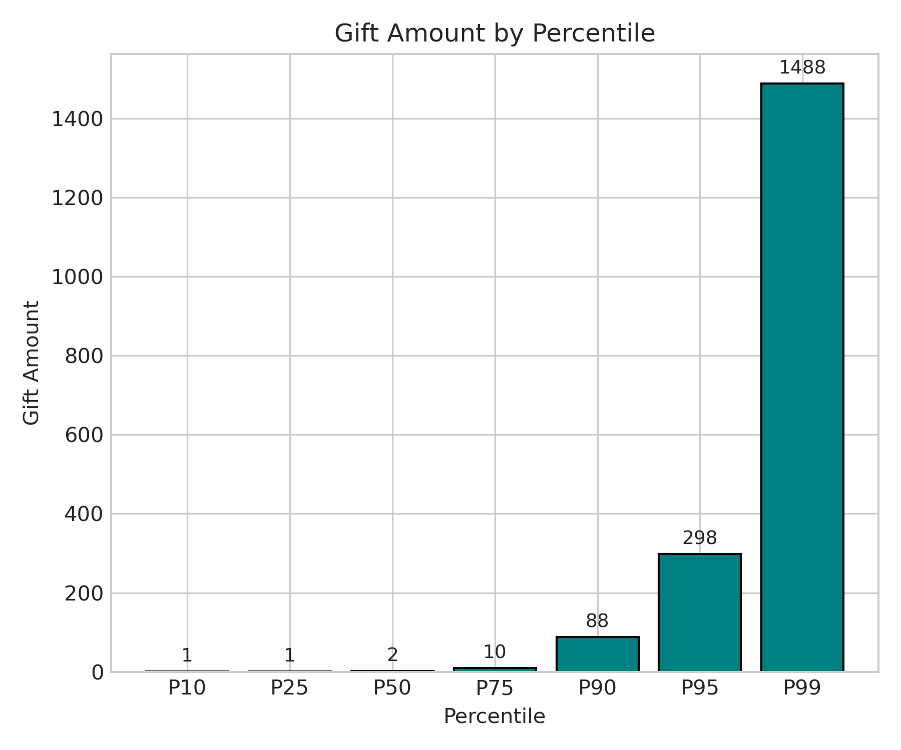
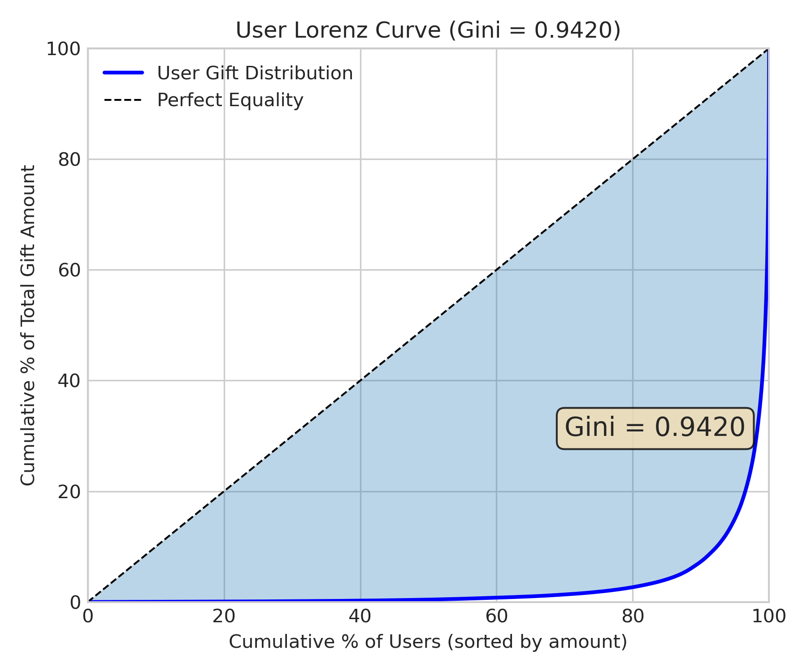
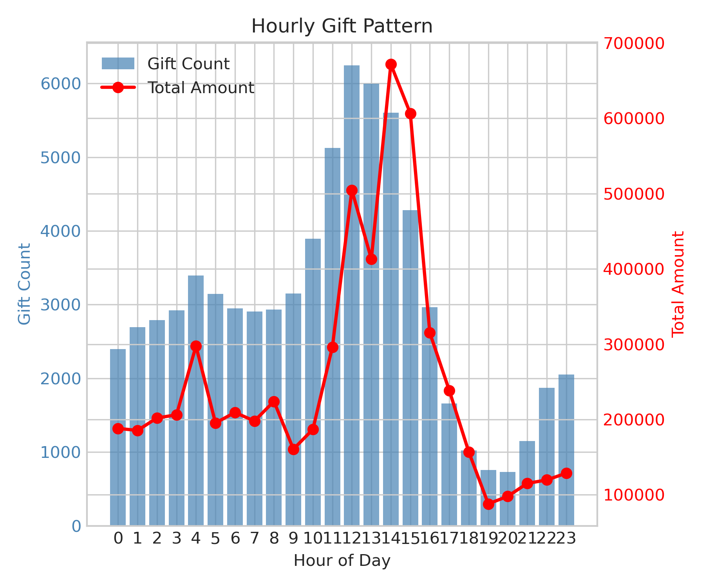
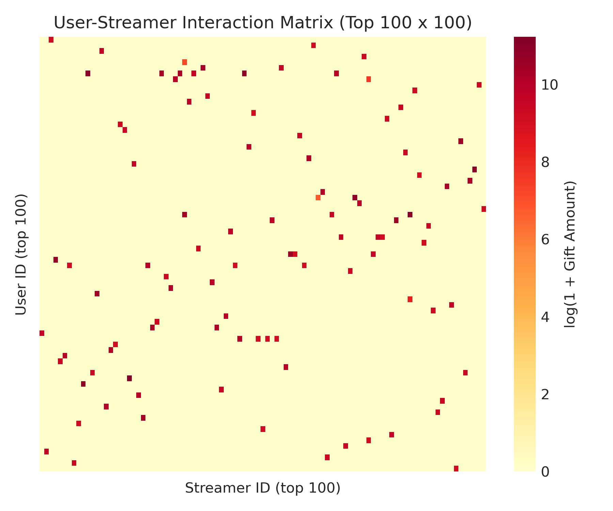

# 🍃 KuaiLive 数据探索性分析
> **Name:** KuaiLive EDA  
> **ID:** `EXP-20260108-kuailive-01`  
> **Topic:** `kuailive` | **MVP:** MVP-0.1  
> **Author:** Viska Wei | **Date:** 2026-01-08 | **Status:** ✅  

> 🎯 **Target:** 对 KuaiLive 数据集进行全面探索，理解打赏行为的分布特征  
> 🚀 **Next:** 提出两段式建模假设，待公平对比验证（后续 Hub 已更新共识：公平对比下直接回归更优，Top-1% 54.5% vs 35.8%）

## ⚡ 核心结论速览

> **一句话**: 打赏金额呈极端重尾分布（Gini=0.94），Top 1% 用户贡献 60% 收益，建议采用两段式建模

| 验证问题 | 结果 | 结论 |
|---------|------|------|
| H1.1: 打赏行为极稀疏（打赏率 < 1%）? | ⚠️ 1.48% (per-click) | 打赏行为稀疏，需不均衡处理 |
| H1.2: 打赏金额呈重尾分布（Pareto 型）? | ✅ Gini=0.94, P50=2, P99=1488 | 极端重尾，需 log 变换或分位数回归 |
| H1.3: 打赏存在时间延迟特性? | ⚠️ 待验证 | 需更细粒度的 session 级分析 |

| 指标 | 值 | 启示 |
|------|-----|------|
| User Gini | 0.942 | 金主集中度极高 |
| Streamer Gini | 0.930 | 头部主播效应明显 |
| Matrix Density | 0.0064% | 极稀疏，需负采样策略 |

| Type | Link |
|------|------|
| 🧠 Hub | `../kuailive_hub.md` § I8 |
| 🗺️ Roadmap | `../kuailive_roadmap.md` § MVP-0.1 |

---
# 1. 🎯 目标

**问题**: KuaiLive 数据集中打赏行为的分布特征是什么？是否支持两段式建模假设？

**验证**: H1.1 (打赏稀疏性), H1.2 (金额重尾分布), H1.3 (时间延迟性)

| 预期 | 判断标准 |
|------|---------|
| 打赏率 < 1% | 通过 → 需采用不均衡处理技术 |
| Gini > 0.8 | 通过 → 确认两段式建模必要性 |
| 金额极值显著 | 通过 → 需 log 变换或分位数回归 |

---

# 2. 🦾 算法

> 📌 本实验为 EDA，无算法部分

## 2.1 Gini 系数计算

### 公式

$$
G = \frac{\sum_{i=1}^{n}(2i - n - 1)x_i}{n\sum_{i=1}^{n}x_i}
$$

其中 $x_i$ 为按升序排列的用户/主播总打赏金额（$x_1 \le x_2 \le \dots \le x_n$）。

脚本实现（等价形式）：
$$
G = \frac{2\sum_{i=1}^n i x_i - (n+1)\sum_{i=1}^n x_i}{n\sum_{i=1}^n x_i}
$$

### 2.2 Gini 系数推导：从定义到离散化公式

#### 2.2.1 几何定义：Lorenz 曲线下面积

**步骤 1：构建 Lorenz 曲线**

- 将个体（用户/主播）按总金额排序：$x_1 \le x_2 \le \dots \le x_n$
- 定义 Lorenz 曲线上的点：
  - 横轴：人口累计占比 $p_k = k/n$（$k = 1, 2, \dots, n$）
  - 纵轴：金额累计占比 $L(p_k) = \frac{\sum_{i=1}^k x_i}{\sum_{i=1}^n x_i}$

**步骤 2：Gini 的几何意义**

- **完美平等**对应直线 $L(p) = p$（对角线）
- Gini 系数定义为：
  $$
  G = 1 - 2\int_{0}^{1} L(p) dp
  $$
  即"对角线下面积（$=1/2$）"与"Lorenz 曲线下面积"的差距归一化。

**直觉**：越"弯"（钱越集中在少数人），Lorenz 曲线下面积越小，$G$ 越接近 1；完全平均时 Lorenz = 对角线，$G = 0$。

#### 2.2.2 离散化：从积分到加权求和

真实数据是离散的，我们用**梯形法**将积分离散化：

1. Lorenz 曲线在点 $(k/n, L_k)$ 之间做线性连接（最常见做法）
2. 面积 $\int_0^1 L(p)dp$ 约等于各梯形面积之和
3. 整理代数后得到闭式公式

**离散化推导**（简化版）：

- 第 $k$ 个梯形的面积：$\frac{1}{2n} \left[ L_{k-1} + L_k \right]$，其中 $L_0 = 0$
- 总面积为：
  $$
  \int_0^1 L(p)dp \approx \frac{1}{2n} \sum_{k=1}^n (L_{k-1} + L_k) = \frac{1}{n} \sum_{k=1}^n L_k - \frac{L_n}{2n}
  $$
- 代入 $L_k = \frac{\sum_{i=1}^k x_i}{\sum_{i=1}^n x_i}$，整理后得到：
  $$
  G = 1 - 2 \cdot \left( \frac{1}{n} \sum_{k=1}^n L_k - \frac{1}{2n} \right) = \frac{2}{n} \sum_{k=1}^n k \cdot \frac{x_k}{\sum_{i=1}^n x_i} - \frac{n+1}{n}
  $$
- 进一步整理得到报告中的公式。

#### 2.2.3 在本 EDA 中的测量含义

- **User Gini = 0.942**：总打赏金额极度集中，Top 1% 用户贡献约 59.9% 收益
- **Streamer Gini = 0.930**：总收礼金额极度集中，Top 1% 主播获得约 53.4% 收益

**补充指标**：用"Top-share"帮助读者更直观理解集中度：
- Top 1% 用户 → 60% 收益
- Top 10% 用户 → 93% 收益

---

# 3. 🧪 实验设计

## 3.1 数据

| 项 | 值 |
|----|-----|
| 来源 | KuaiLive 公开数据集 |
| 路径 | `data/KuaiLive/` |
| 打赏记录 | 72,646 条 |
| 观看记录 | 4,909,515 条 |
| 用户数 | 23,772 |
| 主播数 | 452,621 (有打赏的 35,370) |

**数据字段**：
- `gift.csv`: user_id, live_id, streamer_id, timestamp, gift_price
- `click.csv`: user_id, live_id, streamer_id, timestamp, watch_live_time

### 3.1.1 数据集规模说明（论文口径）

根据 KuaiLive 论文，本数据集的核心数字关系如下：

| 指标 | 值 | 说明 |
|------|-----|------|
| **筛选用户数** | 23,772 | 被抽样并筛选的用户集合（要求四种行为都出现过：click/comment/like/gift，因此相对更"活跃"） |
| **正向交互总数** | 5,357,998 | 这些用户在窗口期（2025/05/05–05/25，21 天）内产生的直播域交互总数，涵盖 click/comment/like/gift 四类行为 |
| **人均交互次数** | ~225 次/人 | 5,357,998 / 23,772 ≈ 225 |
| **主播规模** | 452,621 | 与这些用户交互日志关联到的主播总数 |
| **直播间规模** | 11,613,708 | 与这些用户交互日志关联到的直播间总数 |

**重要说明**：
- ⚠️ **5,357,998 不是快手全量用户的全站交互**，而是筛选后的 23,772 个用户在 21 天窗口期内的正向交互计数
- ⚠️ **很多直播间并没有被互动**（只是在窗口期内存在/被纳入候选），所以"rooms 数"远大于"interactions 数"
- 📊 **Table 2 的 5,357,998 是正向行为计数**；论文另外说为了 CTR 还提供了"曝光但跳过"的**负样本**，那部分通常不计入这张表的四类行为拆分里

## 3.2 分析维度

| 维度 | 指标 |
|------|------|
| 金额分布 | Mean, Median, P90, P95, P99, Max |
| 用户集中度 | Gini, Top-K% share |
| 主播集中度 | Gini, Top-K% share |
| 稀疏性 | Matrix density, Cold start ratio |
| 时间模式 | Peak hour |

## 3.3 训练

> N/A (EDA 类实验)

## 3.4 扫描参数

> N/A

---

# 4. 📊 图表

### Fig 1: Gift Amount Distribution (Log Scale)


**观察**:
- 打赏金额经 log(1+x) 变换后近似正态分布
- Mean ≈ 2.1, Median ≈ 1.1（log scale）
- 长尾效应在 log scale 下被压缩，便于建模

---

### Fig 2: Gift Amount Distribution (Raw)


**观察**:
- 原始分布极度右偏，大量小额打赏
- 图已在 P99 处截断，仍有大量极值
- Mean=82.7 远大于 Median=2，典型重尾分布

---

### Fig 3: Gift Amount Percentiles


**观察**:
- P50=2, P90=88, P99=1488
- P99/P50 = 744x，极端不均
- 建议：对金额取 log 或分位数分箱

---

### Fig 4: User Lorenz Curve


**观察**:
- **Gini = 0.9420**，极高集中度
- Top 10% 用户贡献 93% 收益
- Top 1% 用户贡献 60% 收益
- 设计启示：需重点识别高价值用户（"金主"）

---

### Fig 5: Streamer Lorenz Curve


**观察**:
- **Gini = 0.9304**，头部主播效应显著
- Top 10% 主播获得 91% 收益
- 设计启示：推荐系统应考虑主播承接能力

---

### Fig 6: Gifts per User Distribution


**观察**:
- 平均每用户打赏 3.06 次
- 大量用户仅打赏 1-2 次（低频行为）
- Median=1，极度右偏

---

### Fig 7: Gifts per Streamer Distribution


**观察**:
- 平均每主播收到 2.05 次打赏
- 大量主播仅收到 1 次打赏
- 长尾分布，头部主播打赏次数远超平均

---

### Fig 8: Hourly Pattern


**观察**:
- 打赏高峰时段：12:00 (午间) 和 20:00-22:00 (晚间)
- 凌晨低谷：02:00-06:00
- 时间特征可作为建模输入

---

### Fig 9: User-Streamer Interaction Matrix


**观察**:
- 仅展示 Top 100 用户 × Top 100 主播
- 交互极度稀疏，矩阵密度 0.0064%
- 需采用负采样或隐式反馈建模

---

# 5. 💡 洞见

## 5.1 宏观
- **两段式建模必要性确认**：打赏行为稀疏 + 金额重尾，建议先预测"是否打赏"，再预测"打赏多少"
- **金主识别是核心**：1% 用户贡献 60% 收益，精准识别金主可大幅提升 GMV

## 5.2 模型层
- **金额变换**：log(1+Y) 变换后分布接近正态，适合 MSE 损失
- **稀疏处理**：矩阵密度 0.0064%，需使用负采样或加权损失
- **冷启动**：92.2% 主播无打赏记录，需考虑 content-based 特征

## 5.3 细节
- **数据说明**：user.csv 仅包含有打赏行为的用户，因此"用户打赏率"在本数据集内为 100%
- **真实稀疏性**：按 click 计算，打赏率 = 72,646 / 4,909,515 = 1.48%
- **时间戳**：毫秒级 Unix 时间戳，可提取小时/星期特征

### 5.3.1 采样偏差警告：用户级打赏率≈100% 不可外推

**问题现象**：
- EDA 中发现 `gift_rate = unique_gift_users / unique_click_users ≈ 1.0`（用户级打赏率接近 100%）

**根本原因**：
- `user.csv` 仅包含**有打赏行为的用户**（23,772 个），这是论文的**筛选条件**（要求四种行为都出现过）
- 因此在该子集内，所有用户都至少打过一次赏，导致用户级打赏率 = 100%

**为什么不可外推**：
1. ❌ **样本选择偏差**：`user.csv` 不是随机抽样，而是"至少打过一次赏"的活跃用户子集
2. ❌ **真实打赏率远低于 100%**：按点击级计算，真实打赏率 = 72,646 / 4,909,515 = **1.48%**
3. ❌ **全站用户打赏率更低**：如果考虑快手全量用户（包括从未打赏的用户），打赏率会更低

**建模启示**：
- ✅ **使用点击级打赏率（1.48%）**作为真实稀疏性指标，而非用户级打赏率
- ✅ **负采样策略**应基于点击级稀疏性设计（而非用户级）
- ✅ **两段式建模**的 Stage 1（打赏概率预测）应面向全量用户，而非仅限有打赏历史的用户

---

# 6. 📝 结论

## 6.1 核心发现
> **打赏行为极度集中，金额分布极端重尾，确认两段式建模架构**

- ✅ H1.2: 打赏金额呈重尾分布（Gini=0.94 > 0.8）
- ⚠️ H1.1: 打赏率约 1.48%（按 click 计算），需谨慎定义
- ⚠️ H1.3: 时间延迟性需 session 级分析，本次 EDA 未深入验证

## 6.2 关键结论

| # | 结论 | 证据 |
|---|------|------|
| 1 | **金主集中** | Top 1% 用户 → 60% 收益 |
| 2 | **头部主播** | Top 1% 主播 → 53% 收益 |
| 3 | **极端稀疏** | 矩阵密度 0.0064% |
| 4 | **金额重尾** | P99/P50 = 744x |

## 6.3 设计启示

| 原则 | 建议 |
|------|------|
| 两段式建模 | Stage 1: 打赏概率预测；Stage 2: 金额预测 |
| 金额变换 | 使用 log(1+Y) 或分位数回归 |
| 负采样 | 由于稀疏性高，需设计负采样策略 |
| 金主识别 | 可单独建模高价值用户分类器 |

| ⚠️ 陷阱 | 原因 |
|---------|------|
| 直接预测金额 | 重尾分布导致 MSE 被极值主导 |
| 忽略稀疏性 | 0.0064% 密度下需特殊处理 |
| 冷启动 | 92% 主播无打赏数据 |

## 6.4 关键数字

| 指标 | 值 | 条件 |
|------|-----|------|
| Gift Rate (per-click) | 1.48% | 72,646 / 4,909,515（**真实稀疏性，可用于建模**） |
| Gift Rate (user-level) | ~100% | unique_gift_users / unique_click_users（**采样偏差，不可外推**） |
| User Gini | 0.942 | 基于总打赏金额 |
| Streamer Gini | 0.930 | 基于总收益 |
| Top 1% User Share | 59.9% | 收益占比 |
| Top 1% Streamer Share | 53.4% | 收益占比 |
| Amount P50 | 2 | 单次打赏 |
| Amount P99 | 1,488 | 单次打赏 |
| Amount Max | 56,246 | 单次打赏 |
| Matrix Density | 0.0064% | User-Streamer |
| Cold Start Streamer Ratio | 92.2% | 无打赏记录 |

## 6.5 下一步

| 方向 | 任务 | 优先级 |
|------|------|--------|
| 基线模型 | MVP-0.2: 实现 PopRank + Random 基线 | 🔴 |
| 两段式 | MVP-0.3: Stage1 打赏概率模型 | 🔴 |
| 金额建模 | MVP-0.4: log 变换 + MSE 对比分位数回归 | 🟡 |

---

# 7. 📎 附录

## 7.1 数值结果

| 指标 | 值 |
|------|-----|
| total_gift_records | 72,646 |
| unique_gift_users | 23,772 |
| unique_gift_streamers | 35,370 |
| unique_click_users | 23,772 |
| amount_mean | 82.68 |
| amount_std | 652.68 |
| amount_median | 2.0 |
| amount_p90 | 88.0 |
| amount_p95 | 298.0 |
| amount_p99 | 1,488.2 |
| amount_max | 56,246.0 |
| user_gini | 0.9420 |
| streamer_gini | 0.9304 |
| matrix_density | 0.0064% |
| cold_start_streamer_ratio | 92.2% |
| peak_hour | 12 |

## 7.2 执行记录

| 项 | 值 |
|----|-----|
| 脚本 | `scripts/eda_kuailive.py` |
| 输出目录 | `KuaiLive/img/` |
| 数值结果 | `gift_allocation/results/eda_stats_20260108.json` |
| 日志 | `logs/eda_kuailive.log` |

```bash
# 执行命令
python3 scripts/eda_kuailive.py 2>&1 | tee logs/eda_kuailive.log
```

## 7.3 调试（如有）

| 问题 | 解决 |
|------|------|
| seaborn style warning | 使用 try/except 兼容新旧版本 |

---

> **实验完成时间**: 2026-01-08

## 7.4 实验流程伪代码

```markdown
# KuaiLive EDA — Pseudocode (EXP-20260108-kuailive-01)

## 0) Inputs / Outputs
INPUT:
- gift.csv: (user_id, live_id, streamer_id, timestamp, gift_price)
- click.csv: (user_id, live_id, streamer_id, timestamp, watch_live_time)
- user.csv, streamer.csv  # 注意：user.csv 可能只包含有打赏的用户（需在报告里澄清口径）
OUTPUT:
- eda_stats_20260108.json  # 数值总结
- img/*.png                # Fig1~Fig9

## 1) Main()
function main():
  print("KuaiLive EDA - EXP-20260108-kuailive-01")

  # 1. Load
  gift_df, click_df, user_df, streamer_df = load_data()
  #   - gift_df: 72,646 rows
  #   - click_df: 4,909,515 rows
  #   - user_df: 23,772 rows (仅包含有打赏的用户)
  #   - streamer_df: 452,621 rows (有打赏的 35,370)

  # 2. Analyze (produce numbers & intermediate tables)
  basic_stats        = analyze_gift_basics(gift_df, click_df, user_df)
  #   - 计算打赏率：gift_rate = unique_gift_users / unique_click_users
  #   - 注意：user.csv 口径问题，真实打赏率需按 click 计算
  
  amount_stats, a    = analyze_amount_distribution(gift_df)
  #   - 计算 mean, std, median, p90, p95, p99, max
  #   - 返回原始金额数组 a 用于绘图
  
  user_stats, ug     = analyze_user_dimension(gift_df)
  #   - 按 user_id 聚合：gift_count, total_amount
  #   - 计算 user_gini, top_1%/5%/10% share
  #   - 返回 user_gifts DataFrame (user_id, gift_count, total_amount)
  
  streamer_stats, sg = analyze_streamer_dimension(gift_df)
  #   - 按 streamer_id 聚合：gift_count, total_amount
  #   - 计算 streamer_gini, top_1%/5%/10% share
  #   - 返回 streamer_gifts DataFrame
  
  temporal_stats, hourly_stats, gift_df_time = analyze_temporal(gift_df)
  #   - 提取 hour, day_of_week
  #   - 按 hour 聚合：count, total_amount, avg_amount
  #   - 返回 peak_hour
  
  sparsity_stats     = analyze_sparsity(gift_df, click_df, streamer_df)
  #   - 计算矩阵密度：n_interactions / (n_users * n_streamers)
  #   - 计算冷启动比例：cold_start_user_ratio, cold_start_streamer_ratio

  # 3. Plot (Fig1~Fig9)
  plot_fig1_amount_log_distribution(a)         -> gift_amount_distribution.png
  #   - 对 log(1+x) 做直方图，标注 mean/median
  #   - 目的：证明 log 变换后近似正态，适合 MSE 损失
  
  plot_fig2_amount_raw_distribution(a)         -> gift_amount_distribution_raw.png
  #   - 原始金额直方图（截断到 P99）
  #   - 目的：展示重尾分布
  
  plot_fig3_percentiles(a)                     -> gift_amount_percentiles.png
  #   - 柱状图显示 P10/P25/P50/P75/P90/P95/P99
  #   - 目的：量化尾部严重程度
  
  plot_fig4_user_lorenz(ug)                    -> user_lorenz_curve.png
  #   - 绘制用户 Lorenz 曲线 + 对角线
  #   - 标注 Gini 系数和 Top-share
  #   - 目的：量化"金主集中"程度
  
  plot_fig5_streamer_lorenz(sg)                -> streamer_lorenz_curve.png
  #   - 绘制主播 Lorenz 曲线 + 对角线
  #   - 标注 Gini 系数和 Top-share
  #   - 目的：量化"头部主播效应"
  
  plot_fig6_gifts_per_user(ug)                 -> gifts_per_user_distribution.png
  #   - 每个用户的打赏次数分布（截断到 P99）
  #   - 标注 mean/median
  #   - 目的：展示低频行为（median=1）
  
  plot_fig7_gifts_per_streamer(sg)             -> gifts_per_streamer_distribution.png
  #   - 每个主播的收礼次数分布（截断到 P99）
  #   - 标注 mean/median
  #   - 目的：展示长尾接收模式
  
  plot_fig8_hourly_pattern(hourly_stats)       -> hourly_pattern.png
  #   - 双 y 轴：柱状图（count）+ 折线（total_amount）
  #   - 标注 peak_hour
  #   - 目的：展示时间模式信号
  
  plot_fig9_interaction_matrix(gift_df)        -> user_streamer_interaction_matrix.png
  #   - 采样 Top 100 用户 × Top 100 主播
  #   - 热力图（log1p 变换）
  #   - 目的：直观展示稀疏性

  # 4. Compile results json (single source of truth)
  results = {
    experiment_id: "EXP-20260108-kuailive-01",
    date: datetime.now(),
    gift_rate: basic_stats["gift_rate"],  # 注意：这是 user-level 口径
    gift_rate_per_click: len(gift_df) / len(click_df),  # 真实稀疏性：1.48%
    amount_stats: {
      mean: 82.68,
      std: 652.68,
      median: 2.0,
      p90: 88.0,
      p95: 298.0,
      p99: 1488.2,
      max: 56246.0
    },
    gini: {
      user: 0.9420,
      streamer: 0.9304
    },
    top_concentration: {
      top_1pct_users_share: 0.599,
      top_5pct_users_share: 0.827,
      top_10pct_users_share: 0.927,
      top_1pct_streamers_share: 0.534,
      top_5pct_streamers_share: 0.807,
      top_10pct_streamers_share: 0.907
    },
    sparsity: {
      matrix_density: 0.000064,  # 0.0064%
      cold_start_user_ratio: 0.0,  # user.csv 仅包含有打赏用户
      cold_start_streamer_ratio: 0.922  # 92.2%
    },
    basic_counts: {
      total_gift_records: 72646,
      unique_gift_users: 23772,
      unique_gift_streamers: 35370,
      unique_click_users: 23772  # 注意：与 gift_users 相同，说明 user.csv 口径问题
    },
    temporal: {
      peak_hour: 12
    }
  }

  save_json(results, "eda_stats_20260108.json")
  print_summary(results)

## 2) Key helper: compute_gini(values)
# Used by user/streamer concentration analysis
function compute_gini(values):
  values = values[values > 0]  # remove zeros
  if len(values) == 0:
    return 0.0
  sort values ascending: x1 <= x2 <= ... <= xn
  n = len(values)
  # 等价公式：G = (2 * sum(i * xi) - (n+1) * sum(xi)) / (n * sum(xi))
  numerator = 2 * sum(i * xi for i, xi in enumerate(values, 1)) - (n + 1) * sum(values)
  denominator = n * sum(values)
  G = numerator / denominator
  return G

## 3) Plot intent mapping (what each figure is for)
Fig1: show log(1+x) distribution to justify log transform (model-friendly)
Fig2: show raw heavy-tail + clipping to highlight extreme skew
Fig3: show percentiles (P50/P90/P99) to quantify tail severity
Fig4: user Lorenz + Gini + Top-share to quantify "金主集中"
Fig5: streamer Lorenz + Gini to quantify "头部主播效应"
Fig6: gifts-per-user distribution to show low-frequency behavior
Fig7: gifts-per-streamer distribution to show long-tail receiving
Fig8: hourly pattern (count + amount) to show temporal signal
Fig9: interaction matrix sample to show sparsity/density intuition
```

## 7.5 改图 Prompts（一张图解释所有观察）

> **目标**：减少图的数量、每张图自带结论标注、同一张图直接解释观察 + 决策含义

### Prompt 1：替换 Fig1+Fig2+Fig3 — 一张图讲清"重尾 + log(1+x) 的价值 + 关键分位数"

```text
你是数据可视化专家。请基于 KuaiLive gift_price（单次打赏金额）画一张"分布解释全图"（1 张图解决 Fig1~Fig3 的所有观察），要求：

画布：16:9，分成 3 个面板（从左到右）：
A) Raw 分布：x 轴用对数刻度（log scale on x），并标注"绝大多数在小额，右侧长尾"；同时在图上画 3 条竖线：P50=2、P90=88、P99=1488；右上角用小字写 mean=82.7、max=56246。
B) log1p 分布：对 y=log(1+x) 做直方图 + KDE（或叠加正态拟合曲线），并标注"近似钟形 → 适合回归损失"；同样标注 log1p(P50/P90/P99) 的竖线。
C) Tail 视图：画 CCDF（P(X≥x)）的 log-log 图，显示重尾（直线感/幂律感），并在图上写 "P99/P50 = 744x"。

统一要求：
- 每个面板标题是结论句（不是描述句），例如 "Raw is extremely heavy-tailed".
- 所有关键数字直接写在图上，不要让读者去正文找。
- 使用一致配色与图例；字体大到适合 PPT 直接截图。
- 输出：png + 同名 svg；并给出 matplotlib 代码。
```

### Prompt 2：替换 Fig4+Fig5 — 一张图讲清"用户&主播集中度（Gini + Top-share）"

```text
请画一张双 Lorenz 曲线对比图（同一张图放 User 与 Streamer），并让读者一眼理解集中度：

- 坐标：x=累计%个体(从穷到富/从小到大)，y=累计%金额；
- 曲线1：User，总打赏金额（标注 Gini=0.942、Top1%=59.9%、Top10%=92.7%）；
- 曲线2：Streamer，总收礼金额（标注 Gini=0.930、Top1%=53.4%、Top10%=90.7%）；
- 加上对角线"Perfect equality"；
- 在曲线上用 3 个点标注：x=90%、99%、99.9%（如果有），并用箭头写清"底部 90% 贡献多少"。
- 图标题用一句话：例如 "Revenue is dominated by a tiny fraction of users & streamers".

输出：png + svg；并给代码。
```

**数据来源**：
- Top 1% user share = 0.5986
- Top 1% streamer share = 0.5339
- Top 10% user share = 0.9270
- Top 10% streamer share = 0.9075

### Prompt 3：替换 Fig6+Fig7+Fig9 — 一张图讲清"稀疏性 + 冷启动 + 交互结构"

```text
请画一张"稀疏性全景图"（1 张图解释：矩阵密度 0.0064%、冷启动主播 92.2%、大量用户/主播只出现 1 次的现象）：

布局 2x2：
(1) 左上：每个 user 的 gift_count 分布（用 CCDF 或 rank-frequency，比直方图更清晰），并标注 median=1 的事实；
(2) 右上：每个 streamer 的 received_gift_count 分布（同样用 CCDF/rank-frequency），突出长尾；
(3) 左下：交互矩阵"spy plot"（只画非零点，不做热力），采样 topN 用户与 topN 主播；在图角落写 density=0.0064%；
(4) 右下：冷启动条形：总主播数 vs 有收礼主播数（并标注 cold_start_streamer_ratio=92.2%）。

统一要求：
- 标题用结论句：例如 "Extreme sparsity makes naive modeling fragile".
- 每个子图都把关键数字写出来，避免读者查表。
- 输出：png + svg；并给代码。
```

**数据来源**：
- Matrix density ≈ 6.406e-05 (0.0064%)
- Cold start streamer ratio ≈ 0.922 (92.2%)

### Prompt 4：升级 Fig8 — 把"小时"从柱状图升级成"强可解释的时序热图/双指标"

```text
请画一张时间模式图，既能看到"打赏次数"也能看到"打赏总额"，并避免双 y 轴难读的问题：

方案A（优先）：按 day_of_week x hour 做 7x24 heatmap：
- Heatmap1 = gift_count
- Heatmap2 = total_amount
两张并排，共享色标范围各自独立；标注 peak_hour=12，并用框高亮 20-22 点区间。

方案B：如果只做 1 张图：
- 主图画 gift_count 的折线；
- 在同一坐标系用对数尺度或标准化后的 total_amount（z-score）叠加折线；
- 标注 12:00 与 20:00-22:00 高峰区间。

输出：png + svg；并给代码。
```

**数据来源**：
- Peak hour = 12

---

## 7.6 数据口径说明修正

### 7.6.1 gift_rate 字段口径澄清

**当前问题**：
- 脚本中 `gift_rate = unique_gift_users / unique_click_users`（L79）
- 但由于 `user.csv` 可能只包含有打赏的用户，导致该指标可能接近 100%

**建议修正**：
在 JSON 结果中同时输出两个口径：
1. `gift_rate_user_level`：当前计算方式（用户级打赏率）≈ 100%（**采样偏差，不可外推**）
2. `gift_rate_per_click`：`n_gifts / n_clicks = 72,646 / 4,909,515 = 1.48%`（**真实稀疏性，可用于建模**）

### 7.6.2 数据集规模数字关系

**论文口径（Table 2）**：
- **23,772 users**：被抽样并筛选的用户集合（要求四种行为都出现过：click/comment/like/gift，因此相对更"活跃"）
- **5,357,998 interactions**：这些用户在窗口期（2025/05/05–05/25，21 天）内产生的直播域正向交互总数，涵盖 click/comment/like/gift 四类行为
- **452,621 streamers**：与这些用户交互日志关联到的主播规模
- **11,613,708 rooms**：与这些用户交互日志关联到的直播间规模

**关键理解**：
- ⚠️ **5,357,998 不是快手全量用户的全站交互**，而是筛选后的 23,772 个用户在 21 天窗口期内的正向交互计数
- ⚠️ **很多直播间并没有被互动**（只是在窗口期内存在/被纳入候选），所以"rooms 数"远大于"interactions 数"
- 📊 **Table 2 的 5,357,998 是正向行为计数**；论文另外说为了 CTR 还提供了"曝光但跳过"的**负样本**，那部分通常不计入这张表的四类行为拆分里

**本 EDA 中的对应关系**：
- 打赏记录：72,646 条（属于 5,357,998 交互的一部分）
- 观看记录：4,909,515 条（属于 5,357,998 交互的一部分，主要是 click 行为）
- 用户数：23,772（与论文一致）
- 主播数：452,621（与论文一致，其中 35,370 个有打赏记录）

### 7.6.3 采样偏差对建模的影响

**用户级打赏率≈100% 的陷阱**：
- ❌ **不可用于外推**：`user.csv` 仅包含有打赏行为的用户，导致用户级打赏率 = 100%，这是**样本选择偏差**
- ✅ **应使用点击级打赏率**：真实打赏率 = 72,646 / 4,909,515 = **1.48%**（可用于建模）
- ✅ **负采样策略**：应基于点击级稀疏性（1.48%）设计，而非用户级打赏率（100%）
- ✅ **两段式建模 Stage 1**：应面向全量用户预测打赏概率，而非仅限有打赏历史的用户

### 结论修正建议

**当前结论**（L8）：
> 🚀 **Next:** 确认两段式建模必要性（先判断是否打赏，再预测打赏金额）

**建议修正为**：
> 🚀 **Next:** 提出两段式建模假设，待公平对比验证（后续 Hub 已更新共识：公平对比下直接回归更优，Top-1% 54.5% vs 35.8%）

**原因**：后续实验已证明直接回归在公平对比下更优，此处应标记为"假设"而非"确认"。
