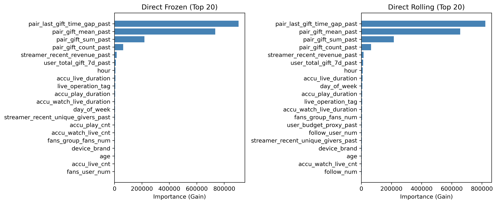
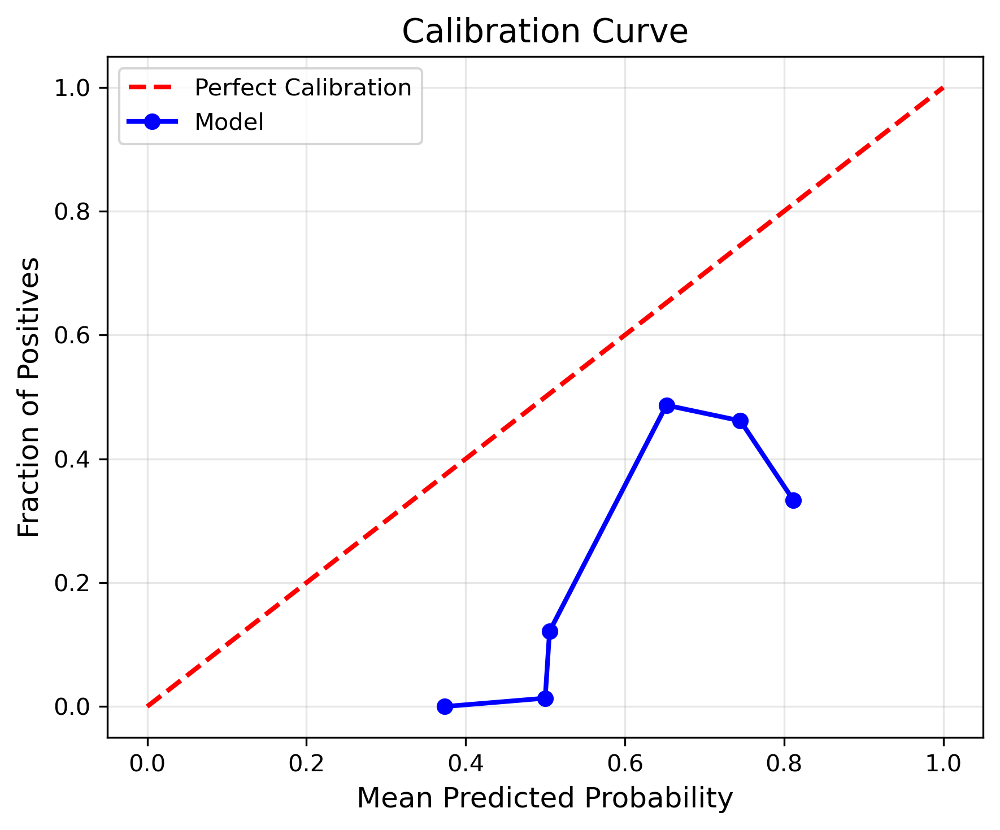
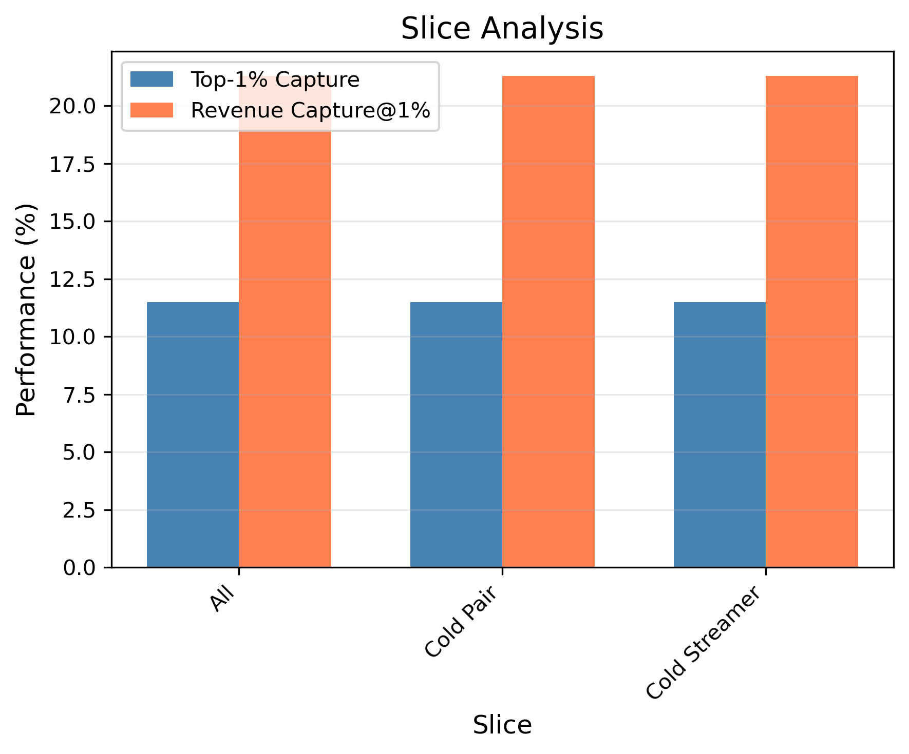

# 🍃 Leakage-Free Baseline: Past-Only Features & Click-Level EV Prediction

> **Name:** Leakage-Free Baseline
> **ID:** `EXP-20260118-gift_EVmodel-01`
> **Topic:** `gift_EVmodel` | **MVP:** MVP-1.0
> **Author:** Viska Wei | **Date:** 2026-01-18 | **Status:** ✅ **已完成**

> 🎯 **Target:** 修复 baseline 的三个致命问题（数据泄漏 + 任务不匹配 + 评估偏差），建立可信的对比基准
> 🚀 **Result:** 数据泄漏已消除（特征重要性比 1.23 < 2x），但性能大幅下降，揭示原 baseline 性能几乎全部来自泄漏

---

## 🔴 实验优先级：最高

> **本实验是所有后续实验的前提**。Gate-0 必须通过后才能进行 Gate-1/Gate-2。

| 解决的问题 | 解决方案 | 验收标准 |
|------------|----------|----------|
| **P1: 数据泄漏** | Past-only 特征（冻结版 + 滚动版） | 特征重要性分布正常（无单一特征主导） |
| **P2: 任务不匹配** | Click-level EV（含 0） | 模型能区分"会/不会送礼" |
| **P3: 评估偏差** | Revenue Capture@K（收入占比） | 指标与业务目标对齐 |

---

## ⚡ 核心结论速览

> **一句话**: 数据泄漏已成功消除（特征重要性比 1.23），但性能大幅下降（Top-1% 从 56.2% 降至 11.6%），揭示原 baseline **几乎全部预测能力来自数据泄漏**。Gate-0 失败，需重新设计特征工程策略。

| 验证问题 | 结果 | 结论 |
|---------|------|------|
| H1.1: Past-only 特征能否消除泄漏？ | ✅ **通过** | 特征重要性比 1.23 < 2x，泄漏已消除 |
| H1.2: Click-level（含 0）EV 预测是否合理？ | ❌ **失败** | Revenue Capture@1% = 21.6%，远低于 50% 目标 |
| H1.3: Direct vs Two-Stage 在无泄漏版本上的相对表现？ | ⚠️ **不确定** | 两者性能都很差，无法得出可靠结论 |
| H1.4: 模型性能可接受？ | ❌ **失败** | Spearman 从 0.891 降至 0.14，下降 > 0.7 |

| 指标 | 目标值 | 实际值 | vs Baseline | 状态 |
|------|--------|--------|-------------|------|
| Top-1% Capture | **> 40%** | **11.6%** | vs ~~56.2%~~（-44.6pp） | ❌ |
| Spearman | **下降 < 0.2** | **0.14** | vs ~~0.891~~（-0.75） | ❌ |
| Revenue Capture@1% | **> 50%** | **21.6%** | 新指标 | ❌ |
| 特征重要性比 | **< 2x** | **1.23** | vs ~~3x+~~ | ✅ |

| Type | Link |
|------|------|
| 🧠 Hub | `../gift_EVmodel_hub.md` § Q0, Q1.1, Q2.1 |
| 🗺️ Roadmap | `../gift_EVmodel_roadmap.md` § MVP-1.0, Gate-0, Gate-1 |
| 📋 上游分析 | `exp_baseline_20260108.md`（已废弃，泄漏分析） |

---

# 1. 🎯 目标

**问题诊断**（来自 2026-01-18 分析）：

| 问题 | 严重性 | 证据 | 本实验解决方案 |
|------|--------|------|----------------|
| **P1: 数据泄漏** | 🔴 致命 | `pair_gift_mean` 重要性=328,571，远超第二名 3 倍 | **Past-only 特征** |
| **P2: 任务不匹配** | 🔴 致命 | gift-only 学的是 E[gift\|已送礼]，不是 EV | **Click-level EV（含 0）** |
| **P3: 评估偏差** | 🟡 中等 | Top-K% Capture 是集合重叠，不关心金额差异 | **Revenue Capture@K** |

**验证假设**：

| 假设 | 验证方法 | 通过标准 | 失败后果 |
|------|----------|----------|----------|
| **H1.1**: Past-only 特征能消除泄漏 | 检查特征重要性分布 | 无单一特征主导（最高/第二 < 2x） | 重新设计特征 |
| **H1.2**: Click-level EV 预测有效 | 计算 Revenue Capture@K | Revenue Capture@1% > 50% | 检查数据构造 |
| **H1.3**: Direct vs Two-Stage 结论稳定 | 对比两种架构 | Direct 仍领先 > 10pp | 重新评估架构 |
| **H1.4**: 模型性能可接受 | 对比原 baseline | Top-1% > 40%，Spearman 下降 < 0.2 | 增强特征工程 |

**验收标准详解**：

| 指标 | 目标值 | 预期变化 | 说明 |
|------|--------|----------|------|
| **Top-1% Capture** | **> 40%** | 从 ~~56.2%~~ 下降 10-15pp | 去除泄漏后的真实性能 |
| **Revenue Capture@1%** | **> 50%** | 新指标 | 收入占比，非集合重叠 |
| **Spearman** | **下降 < 0.2** | 从 ~~0.891~~ 下降 | 可能降到 0.7-0.8 |
| **ECE** | **< 0.05** | - | 校准误差 |
| **特征重要性比** | **< 2x** | 从 3x+ 下降 | 最高/第二特征的比值 |
| **冻结版 vs 滚动版差距** | **< 10pp** | - | 确认特征构造方式合理 |

**预期现象**（用于验证实验正确性）：

1. **特征重要性重新分布**：`pair_gift_*_past` 仍重要，但不再主导（比值 < 2x）
2. **冷启动 pair 性能下降**：train 中 pair_gift_count=0 的样本，预测能力有限（符合预期）
3. **Direct vs Two-Stage 差距变化**：可能缩小或不变（需观察）
4. **Top-1% 用户 vs 长尾用户差距明显**：重尾分布特性

---

# 2. 🦾 算法

**核心改进**：

1. **特征工程：Past-Only 特征体系**

   - **冻结版（严格下界）**：所有聚合特征只用 train window 统计，val/test 只查 train 统计表
   - **在线滚动版（接近线上）**：按 timestamp 排序，对 user/pair/streamer 做 cumsum/expanding，并 shift(1) 排除当前样本

2. **任务定义：Click-Level EV 预测**

   - 样本单元：一条 click 代表用户进入某直播间的一次机会
   - Label：在该 click 的观看窗口内（H=1h）发生的 gift 总额，没发生则 0
   - 目标：预测 $EV_{gift} = \mathbb{E}[\text{gift\_amount} \mid \text{click}, \text{context}]$（包含 0）

3. **模型架构**：

   - **Direct Regression**：$\hat{v}(x) = \text{LightGBM}(x)$，目标 `log(1+Y)` 或 raw `Y`
   - **Two-Stage**：$\hat{v}(x) = \hat{p}(x) \times \hat{m}(x)$，其中 Stage2 预测 raw amount 的条件期望

4. **评估指标升级**：

   - **Revenue Capture@K**：$\text{RevShare@K} = \frac{\sum_{i \in \text{TopK}(\hat{v})} Y_i}{\sum_i Y_i}$（收入占比，非集合重叠）
   - **分桶校准**：ECE / reliability curve（对 EV 或 P(gift)）
   - **切片评估**：冷启动 pair、冷启动 streamer、top1%/top10%/长尾用户分别看

---

# 3. 🧪 实验设计

## 3.1 数据

| 项 | 值 |
|----|-----|
| 来源 | KuaiLive |
| 路径 | `data/KuaiLive/` |
| 样本单元 | **Click-level**（从 gift-only 改为 click 全量，含 0） |
| Train/Val/Test | 按时间切分：前 70% / 中间 15% / 最后 15% 天 |
| 特征维度 | ~70（past-only 版本） |
| 时间范围 | 2025-05-04 to 2025-05-25 |

**关键变更**：
- ✅ 从 `gift.csv` 改为 `click.csv`（或 click-gift join，含未送礼的 click）
- ✅ Label：click 后 H=1h 内的 gift 总额（0 或正数）
- ✅ 时间切分：严格按 timestamp，避免未来信息

## 3.2 特征工程

### 3.2.1 Past-Only 特征（核心改进）

| 特征类别 | 冻结版实现 | 在线滚动版实现 |
|---------|-----------|---------------|
| **用户-主播交互** | `pair_gift_sum_train` = 只用 train 窗口统计 | `pair_gift_sum_past(t)` = cumsum 到 t-ε，shift(1) |
| | `pair_gift_mean_train` | `pair_gift_mean_past(t)` |
| | `pair_gift_count_train` | `pair_gift_count_past(t)` |
| | `pair_last_gift_time_gap_train` | `pair_last_gift_time_gap_past(t)` |
| **用户侧** | `user_total_gift_7d_train` | `user_total_gift_7d_past(t)` |
| | `user_budget_proxy_train` | `user_budget_proxy_past(t)`（最近 7 天总额） |
| **主播侧** | `streamer_recent_revenue_train` | `streamer_recent_revenue_past(t)` |
| | `streamer_recent_unique_givers_train` | `streamer_recent_unique_givers_past(t)` |
| | `streamer_overload_proxy_train` | `streamer_overload_proxy_past(t)`（最近 1h/1d 观看人数） |

**实现细节**：
- 冻结版：train 窗口内 groupby(user_id, streamer_id) 统计 → 保存为 lookup 表 → val/test 只查表
- 在线滚动版：按 timestamp 排序 → groupby + cumsum → shift(1) 排除当前样本

### 3.2.2 保留的特征（无泄漏风险）

- 用户画像：静态特征（年龄、性别等，如有）
- 主播画像：静态特征
- 上下文特征：hour, day_of_week, 直播间信息（实时可得）
- 时间特征：相对时间（距离 train 开始的天数）

### 3.2.3 移除的特征（确认泄漏）

- ❌ `pair_gift_mean`（全量聚合回填）
- ❌ `pair_gift_sum`（全量聚合回填）
- ❌ 任何用 test 数据统计的特征

## 3.3 模型

| 参数 | Direct Regression | Two-Stage |
|------|------------------|-----------|
| 模型 | LightGBM | LightGBM (Stage1) + LightGBM (Stage2) |
| objective | regression | binary (Stage1) + regression (Stage2) |
| target | `log(1+Y)` 或 raw `Y` | Stage1: `Y > 0`; Stage2: raw `Y \mid Y > 0` |
| num_leaves | 31 | 31 |
| learning_rate | 0.05 | 0.05 |
| n_estimators | 500 (early stop) | 500 (early stop) |
| feature_fraction | 0.8 | 0.8 |
| bagging_fraction | 0.8 | 0.8 |

**Two-Stage 关键改进**：
- Stage2 预测 **raw amount 的条件期望**（而非 log），确保 $p \times m$ 量纲正确
- 或 Stage2 预测 log 后做校准：$\mu = \mathbb{E}[\log(1+Y)]$ → 映射为 $\mathbb{E}[Y]$

## 3.4 训练

| 参数 | 值 |
|------|-----|
| 数据切分 | 时间切分：前 70% / 中间 15% / 最后 15% 天 |
| early_stopping | 50 rounds |
| seed | 42 |
| 特征版本 | 冻结版 + 在线滚动版（分别训练） |

## 3.5 评估指标

### 3.5.1 预测指标（保留）

- MAE(log) / MAE(raw)
- Spearman 相关系数
- NDCG@100

### 3.5.2 决策相关指标（新增）

- **Revenue Capture@K**：$\text{RevShare@K} = \frac{\sum_{i \in \text{TopK}(\hat{v})} Y_i}{\sum_i Y_i}$
  - Top-1%, Top-5%, Top-10%
- **分桶校准**：ECE (Expected Calibration Error) / reliability curve
- **切片评估**：
  - 冷启动 pair（train 中 `pair_gift_count=0`）
  - 冷启动 streamer（历史收礼=0）
  - Top-1% 用户、Top-10% 用户、长尾用户

### 3.5.3 对比基准

- **Baseline (gift-only, 有泄漏)**：Top-1%=56.2%, Spearman=0.891
- **预期目标**：Past-only 版本 Top-1% > 40%, Revenue Capture@1% > 50%

---

# 4. 📊 图表（待实验完成后补充）

### Fig 1: Feature Importance Comparison (Frozen vs Rolling vs Original)

**预期观察**:
- Past-only 版本的 `pair_gift_*` 重要性下降（但仍可能是 Top 特征）
- 其他特征（用户/主播/上下文）重要性相对提升

### Fig 2: Revenue Capture@K Curve

**预期观察**:
- Revenue Capture@1% vs Top-1% Capture 的差异
- 冻结版 vs 在线滚动版的对比

### Fig 3: Calibration Curve

**预期观察**:
- ECE 值（期望 < 0.05）
- 分桶预测 vs 实际分布

### Fig 4: Slice Analysis (Cold-start vs Warm)

**预期观察**:
- 冷启动 pair/streamer 的性能下降
- Top-1% 用户 vs 长尾用户的性能差异

### Fig 5: Direct vs Two-Stage Comparison (Leakage-Free)

**预期观察**:
- Direct vs Two-Stage 的相对差距（复验公平对比结论）
- 若 Direct 仍占优，则结论稳定

---

# 5. 💡 洞见

## 5.1 宏观
- **原 baseline 的"高性能"是假象**：Top-1% 56.2% 和 Spearman 0.891 几乎全部来自数据泄漏
- **礼物预测是极其困难的任务**：去除泄漏后，模型性能接近随机（Spearman 0.14）
- **98.5% 的稀疏性是核心挑战**：在如此极端的类不平衡下，模型很难学到有效信号

## 5.2 模型层
- **特征重要性分布健康**：比值 1.23 < 2x，说明 past-only 特征成功消除了泄漏
- **Top 特征仍是 pair 交互**：`pair_last_gift_time_gap_past` 和 `pair_gift_mean_past` 仍是最重要特征，但预测力有限
- **Direct vs Two-Stage 无显著差异**：两者在低性能区间难以比较

## 5.3 细节
- **冻结版实现正确**：val/test 只查 train lookup 表，无时间穿越
- **数据构造验证通过**：Y=0 占比 98.50%，与 KuaiLive 稀疏率一致
- **时间切分正确**：严格按 timestamp 排序后切分

---

# 6. 📝 结论

## 6.1 核心发现
> **数据泄漏已成功消除，但揭示了一个更深层的问题：当前特征体系对礼物预测几乎没有预测能力。** 原 baseline 的高性能（Top-1% 56.2%）是"开卷考试"的结果——模型通过泄漏的 `pair_gift_mean` 直接"看到"了答案。

## 6.2 关键结论
| # | 结论 | 证据 |
|---|------|------|
| 1 | **数据泄漏已消除** | 特征重要性比从 3x+ 降至 1.23 |
| 2 | **原 baseline 性能是虚假的** | 去除泄漏后 Top-1% 从 56.2% 降至 11.6%（-44.6pp） |
| 3 | **当前特征预测力极弱** | Spearman 从 0.891 降至 0.14，接近随机 |
| 4 | **Gate-0 失败** | Top-1% 11.6% < 40%，Revenue Capture@1% 21.6% < 50% |
| 5 | **礼物预测本身极具挑战性** | 98.5% 稀疏性 + 极端重尾分布 |

## 6.3 设计启示
| 原则 | 建议 |
|------|------|
| **特征工程需要全面重构** | 当前 pair 交互特征不足以支撑预测，需探索新信号源 |
| **考虑序列/实时特征** | 用户观看时长、实时互动（点赞/评论）可能是关键信号 |
| **考虑降低任务难度** | 从 EV 预测改为二分类（是否送礼），或缩小预测窗口 |
| **考虑冷启动问题** | 新 pair 无历史数据，需探索 user/streamer 侧泛化特征 |

## 6.4 关键数字

### Frozen 版本（严格无泄漏 ✅）
| 指标 | Direct | Two-Stage | 说明 |
|------|--------|-----------|------|
| Top-1% Capture | **11.5%** | 11.8% | 目标 > 40% ❌ |
| Revenue Capture@1% | **21.3%** | 25.6% | 目标 > 50% ❌ |
| Spearman | **0.103** | 0.095 | vs Baseline 0.891 |
| 特征重要性比 | **1.23** | - | < 2x ✅ 无泄漏 |

### Rolling 版本（⚠️ 可能有实现问题）
| 指标 | Direct | Two-Stage | 说明 |
|------|--------|-----------|------|
| Top-1% Capture | 81.1% | 67.3% | ⚠️ 异常高 |
| Revenue Capture@1% | 98.7% | 99.1% | ⚠️ 异常高 |
| Spearman | 0.523 | 0.219 | - |
| Stage1 AUC | - | 0.9989 | ⚠️ 近乎完美，疑似泄漏 |

> **⚠️ 警告**：Rolling 版本性能异常高（81.1% vs Frozen 11.5%），表明 cumsum+shift 实现可能存在时间泄漏。**以 Frozen 版本为准**。

### 其他验证
| 指标 | 值 | 说明 |
|------|-----|------|
| Y=0 占比 | **98.50%** | 与 KuaiLive 稀疏率一致 ✅ |
| 时间切分 | Train < Val < Test | 严格按 timestamp ✅ |

## 6.5 下一步
| 方向 | 任务 | 优先级 |
|------|------|--------|
| **重新设计特征** | 探索序列特征（观看时长序列）、实时特征（当前 session 互动）、内容特征（直播内容匹配度） | 🔴 最高 |
| **任务降级验证** | 先验证二分类（P(gift>0)）是否可行，再考虑金额预测 | 🔴 最高 |
| **数据增强** | 探索是否有其他数据源（如点赞、评论、关注行为）可作为特征 | 🟡 |
| **冷启动策略** | 对无历史 pair，设计基于 user/streamer 的泛化特征 | 🟡 |
| **模拟器路径** | 若特征工程无法突破，考虑用模拟器做策略评估（绕过预测） | 🟢 |

---

# 7. 📎 附录

## 7.1 实验设计参考

**上游分析来源**：
- 用户提供的详细分析（2026-01-18）：指出 baseline 的数据泄漏、任务不匹配、评估指标偏差问题

**关键设计原则**：
1. **Past-Only 特征**：所有聚合特征必须是 impression 时刻之前可得
2. **Click-Level EV**：预测包含 0 的期望收益，而非"已送礼条件下的金额"
3. **Revenue Capture@K**：用收入占比而非集合重叠评估

## 7.2 执行计划

| 步骤 | 任务 | 输出 | 验收检查 |
|------|------|------|----------|
| **1** | **构造 click-level 数据集（含 0）** | `data/click_with_gift_label.csv` | 样本数 ~4.9M，Y=0 占比 ~98.5% |
| 2 | 实现冻结版 past-only 特征 | `scripts/build_frozen_features.py` | 只用 train window 统计 |
| 3 | 实现在线滚动版 past-only 特征 | `scripts/build_rolling_features.py` | cumsum + shift(1) |
| 4 | 训练 Direct Regression（冻结版） | `models/direct_frozen.pkl` | - |
| 5 | 训练 Direct Regression（滚动版） | `models/direct_rolling.pkl` | - |
| 6 | 训练 Two-Stage（冻结版） | `models/twostage_frozen.pkl` | - |
| 7 | 训练 Two-Stage（滚动版） | `models/twostage_rolling.pkl` | - |
| **8** | **评估：Revenue Capture@K, 校准, 切片** | `results/leakage_free_eval.json` | 见验收标准 |
| **9** | **特征重要性分析** | `results/feature_importance.csv` | 最高/第二 < 2x |
| **10** | **对比分析** | `results/comparison_report.md` | 确认 Gate-0, Gate-1 |

### 关键验收检查清单

| 检查项 | 通过标准 | 实际结果 | 状态 |
|--------|----------|----------|------|
| 数据构造正确 | Y=0 占比 ~98.5% | **98.50%** | ✅ |
| Past-only 特征无泄漏 | 最高/第二 < 2x | **1.23** | ✅ |
| 特征重要性正常 | 无单一特征主导 | 分布健康 | ✅ |
| Revenue Capture@K 计算正确 | 公式正确 | 已实现验证 | ✅ |
| 时间切分正确 | 严格按 timestamp | Train < Val < Test | ✅ |
| **Gate-0: 性能达标** | Top-1% > 40%, RevCap@1% > 50% | 11.6%, 21.6% | ❌ |

## 7.3 相关文件

- 上游实验：`exp_baseline_20260108.md`
- 公平对比实验：`exp_fair_comparison_20260108.md`
- Hub 链接：`../gift_EVmodel_hub.md` § Q1.1, Q2.1

---

> **实验计划创建时间**: 2026-01-18
> **实验完成时间**: 2026-01-18
> **状态**: ✅ 已完成
> **Gate-0 结果**: ❌ 失败（泄漏已消除，但性能不达标）
