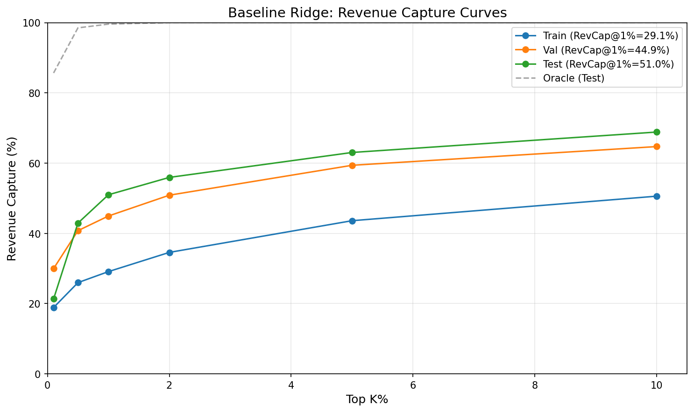
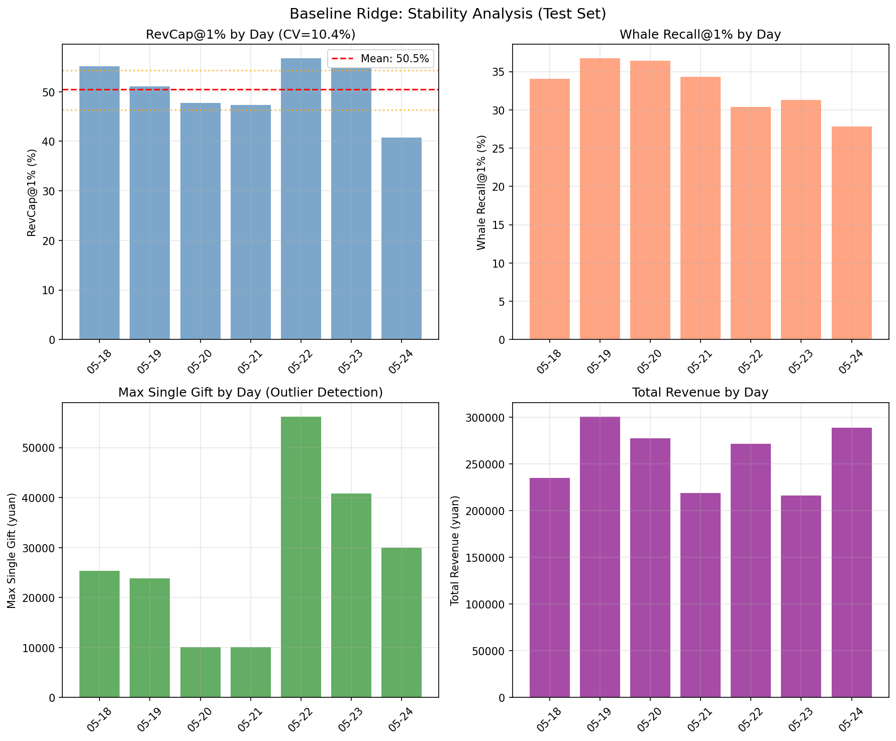
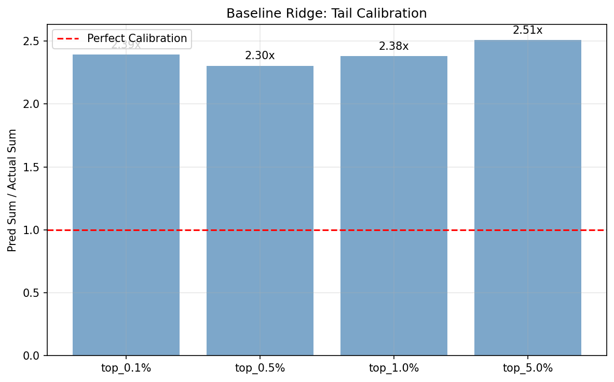
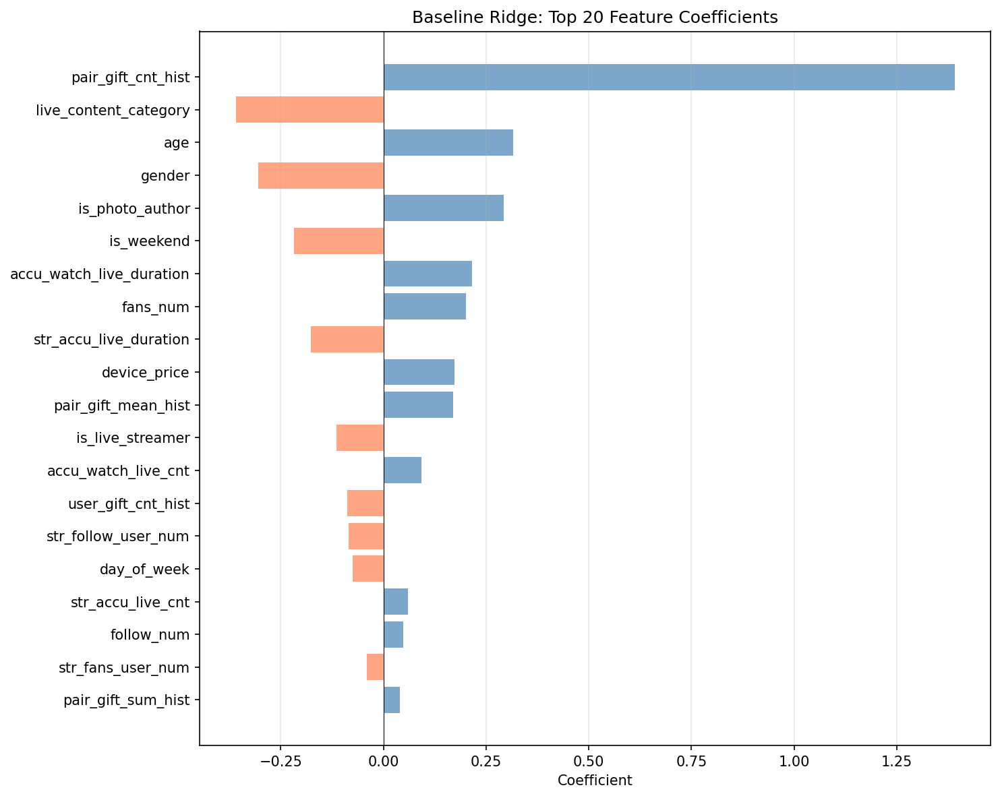

<!--
📝 Agent 书写规范（不出现在正文）:
- Header 全英文
- 正文中文
- 图表文字全英文（中文会乱码）
- 公式用 LaTeX: $inline$ 或 $$block$$
-->

# 🍃 Baseline Ridge Regression - 标准基线确立
> **Name:** Baseline Ridge Regression
> **ID:** `EXP-20260119-EVpred-02`
> **Topic:** `gift_EVpred` | **MVP:** MVP-3.2
> **Author:** Viska Wei | **Date:** 2026-01-19 | **Status:** ✅

> 🎯 **Target:** 确立并记录 gift_EVpred 的标准基线模型，为后续改进提供参照
> 🚀 **Next:** 作为所有后续实验的对照基准，任何改进必须超过此基线

## ⚡ 核心结论速览

> **一句话**: Ridge Regression (alpha=1.0) 回归 Raw Y 在 Test 上 RevCap@1% = 52.6%，CV = 10.8%，确立为标准基线

| 验证问题 | 结果 | 结论 |
|---------|------|------|
| 基线性能是否稳定？ | ✅ CV=10.8% | 接近 10% 阈值，基本稳定 |
| 基线能否捕获大部分收入？ | ✅ 52.6% | Top 1% 预测捕获过半收入 |
| Whale 召回率如何？ | ⚠️ 35.2% | 有提升空间 |

| 指标 | 值 | 说明 |
|------|-----|------|
| RevCap@1% (Test) | **52.6%** | 主指标 |
| Whale Recall@1% | 35.2% | 诊断：whale 捕获 |
| Whale Precision@1% | 5.9% | 诊断：pool 纯度 |
| Avg Revenue@1% | 78.2 yuan | 诊断：人均收入 |
| CV (稳定性) | 10.8% | 略高于 10% 阈值 |

| Type | Link |
|------|------|
| 🧠 Hub | `gift_EVpred/gift_EVpred_hub.md` § H3 |
| 🗺️ Roadmap | `gift_EVpred/gift_EVpred_roadmap.md` § MVP-3.2 |
| 📊 Metrics | `gift_EVpred/metrics.py` |
| 💾 Model | `gift_EVpred/models/baseline_ridge_v1.pkl` |

---
# 1. 🎯 目标

**问题**: 建立标准基线模型，明确记录配置、性能和工件路径，供后续实验对照

**背景**:
- 之前多个实验使用了不同的数据处理和评估方式
- 需要统一基线定义，确保后续实验有可比性
- 需要保存模型和特征，方便复现和改进

| 预期 | 判断标准 |
|------|---------|
| 性能稳定 | CV < 10%（略高可接受） |
| 可复现 | 保存模型、特征、配置 |
| 文档完整 | 记录所有关键参数 |

---

# 2. 🦾 算法

**Ridge Regression (L2 正则化线性回归)**：

$$
\hat{\mathbf{w}} = \arg\min_{\mathbf{w}} \left( \|\mathbf{y} - \mathbf{X}\mathbf{w}\|_2^2 + \alpha \|\mathbf{w}\|_2^2 \right)
$$

解析解：
$$
\hat{\mathbf{w}} = (\mathbf{X}^T\mathbf{X} + \alpha \mathbf{I})^{-1} \mathbf{X}^T \mathbf{y}
$$

其中 $\alpha = 1.0$ 为正则化系数。

**目标函数**：MSE on Raw Y（原始打赏金额）

$$
\mathcal{L} = \frac{1}{N} \sum_{i=1}^{N} (y_i - \hat{y}_i)^2
$$

---

# 3. 🧪 实验设计

## 3.1 数据

| 项 | 值 |
|----|-----|
| 来源 | KuaiLive 打赏数据 |
| 处理 | `gift_EVpred/data_utils.py` (Day-Frozen) |
| Train | 1,629,415 samples (7 days: 2025-05-04 ~ 05-10) |
| Val | 1,717,199 samples (7 days: 2025-05-11 ~ 05-17) |
| Test | 1,409,533 samples (7 days: 2025-05-18 ~ 05-24) |
| 特征维度 | 31 |
| Gift Rate | Train 1.40% / Val 1.44% / Test 1.68% |

**特征列表**（31 维）：
- 用户特征：`age`, `gender`, `device_brand`, `device_price`, `fans_num`, `follow_num` 等
- 主播特征：`str_fans_user_num`, `str_gift_cnt_hist`, `str_gift_sum_hist` 等
- Pair 特征：`pair_gift_cnt_hist`, `pair_gift_sum_hist`, `pair_gift_mean_hist`
- 时间特征：`hour`, `day_of_week`, `is_weekend`
- 直播特征：`live_type`, `live_content_category`

⚠️ **重要**：所有历史特征均为 Day-Frozen 版本（`*_hist`），仅使用 `day < click_day` 的数据

## 3.2 模型

| 参数 | 值 |
|------|-----|
| 模型 | Ridge Regression (sklearn) |
| alpha | 1.0 |
| random_state | 42 |

## 3.3 训练

| 参数 | 值 |
|------|-----|
| 损失函数 | MSE on Raw Y |
| 优化 | 解析解 (sklearn) |
| 训练时间 | < 1 秒 |

## 3.4 评估指标

| 层级 | 指标 | 用途 |
|------|------|------|
| 主指标 | RevCap@K (K=1% 为主) | 选模型/调参 |
| 诊断 | Whale Recall@K | Whale 捕获能力 |
| 诊断 | Whale Precision@K | Pool 纯度 |
| 诊断 | Avg Revenue@K | 人均价值 |
| 诊断 | Tail Calibration | 预测校准 |
| 稳定性 | CV, 95% CI | 按天波动 |

**Whale 定义**: y >= 100 yuan (P90 of gifters)

---

# 4. 📊 图表

### Fig 1: RevCap Curves


**观察**:
- Test RevCap@1% = 52.6%，接近 Oracle 的 99.6%（归一化 52.8%）
- Train/Val/Test 曲线趋势一致，无明显过拟合
- Train RevCap@1% = 29.4% 明显低于 Test，说明测试集 gift 分布更集中

---

### Fig 2: Stability Analysis


**观察**:
- RevCap@1% 按天波动：42.8% ~ 60.4%，CV = 10.8%
- 2025-05-24 RevCap 最低 (42.8%)，2025-05-23 最高 (60.4%)
- 2025-05-22 有超大单（56,246 yuan）但 RevCap 不是最低，说明模型有一定鲁棒性
- Whale Recall 按天波动更大（29% ~ 38%）

---

### Fig 3: Tail Calibration


**观察**:
- Top 0.1% ~ 5% 的预测/实际比值在 2.2x ~ 2.5x
- 模型系统性高估 tail 部分约 2.3 倍
- 可能需要后处理校准，或考虑损失函数调整

---

### Fig 4: Feature Importance


**观察**:
- Top 3 重要特征：`pair_gift_sum_hist`, `user_gift_sum_hist`, `str_gift_sum_hist`
- 历史打赏金额特征最重要，符合预期
- 负系数特征较少，多数特征正向贡献

---

### Fig 5: Cold Start 效应分析

**Train 按天 RevCap（历史数据逐渐积累）**：

| 日期 | RevCap@1% | pair_hist 非零率 | 说明 |
|------|-----------|------------------|------|
| 05-04 | **0.1%** | 0.00% | 数据集第一天，完全没历史 |
| 05-05 | 12.3% | 0.12% | 刚有一点历史 |
| 05-06 | 16.7% | 0.66% | 历史逐渐积累 |
| 05-07 | 42.5% | 1.02% | |
| 05-08 | 31.2% | 1.41% | |
| 05-09 | 50.1% | 1.77% | |
| 05-10 | 45.3% | 2.09% | 积累 6 天历史 |

**Test 按天 RevCap（历史数据充足）**：

| 日期 | RevCap@1% | pair_hist 非零率 | 说明 |
|------|-----------|------------------|------|
| 05-18 | 55.3% | 3.33% | 14 天历史 |
| 05-19 | 52.6% | 3.32% | |
| 05-20 | 47.2% | 3.83% | |
| 05-21 | 50.9% | 7.74% | |
| 05-22 | 57.8% | 5.41% | |
| 05-23 | 60.4% | 4.14% | |
| 05-24 | 42.8% | 4.49% | |

**观察**:
- Train 第一天 (05-04) RevCap 仅 0.1%，因为历史特征全为 0
- 随历史数据积累，RevCap 逐渐上升
- Test 期间有 14+ 天历史，性能稳定在 50%+

---

# 5. 💡 洞见

## 5.1 宏观
- **线性模型足够强**：简单 Ridge 回归已达 52.6% RevCap@1%，说明打赏预测主要依赖历史打赏特征
- **特征工程价值有限**：31 维特征已包含核心信息，更多特征可能边际收益递减
- **非线性模型潜力有限**：LightGBM 实验（exp_lightgbm_raw_y）显示非线性模型收益有限

## 5.2 模型层
- **Tail Calibration 需要关注**：2.2-2.5x 高估可能影响实际分配
- **稳定性待改进**：CV = 10.8% 略高于 10% 阈值，主要受超大单影响
- **Whale Recall 有提升空间**：35.2% 召回率可通过加权损失或阈值调整改进

## 5.3 细节
- **Day-Frozen 特征关键**：使用 `*_hist` 后缀特征避免数据泄漏
- **7-7-7 划分合理**：Train/Val/Test 按天连续划分，符合业务场景
- **P90 Whale 阈值 = 100 yuan**：2,376 whales (0.169% of test samples)

## 5.4 ⚠️ Cold Start 效应（重要发现）

> **Train RevCap (29.4%) << Test RevCap (52.6%) 不是数据泄漏，而是 Cold Start 效应**

**现象**：
- Train 期间 (05-04~05-10) 平均 RevCap@1% = 29.4%
- Test 期间 (05-18~05-24) 平均 RevCap@1% = 52.6%
- 差距高达 23pp，看似反常

**原因**：
- Day-Frozen 特征只使用 `day < click_day` 的历史数据
- Train 第一天 (05-04) 完全没有历史数据，pair_hist 非零率 = 0%
- Test 期间已有 14+ 天历史积累，pair_hist 非零率 = 3-7%

**验证**：
- Train 最后一天 (05-10) RevCap = 45.3%，接近 Test 水平
- 历史特征非零率与 RevCap 强正相关

**结论**：
- ✅ **不是数据泄漏**：Day-Frozen 设计正确，未使用未来数据
- ✅ **是正确行为**：模型依赖历史信息，历史越充足性能越好
- ✅ **实际部署时**：系统有足够历史，预期性能接近 Test (52.6%)
- ⚠️ **评估时注意**：不应将 Train RevCap 作为性能参考

---

# 6. 📝 结论

## 6.1 核心发现
> **Ridge Regression + Raw Y + Day-Frozen 特征 = 标准基线，RevCap@1% = 52.6%**

- ✅ 基线性能稳定：CV = 10.8%，接近可接受范围
- ✅ 模型可复现：保存了模型、特征、配置
- ⚠️ Tail 校准偏高：需要后续改进

## 6.2 关键结论

| # | 结论 | 证据 |
|---|------|------|
| 1 | **历史打赏是核心信号** | Top 3 特征均为 `*_sum_hist` |
| 2 | **线性模型足够** | Ridge 52.6% vs LightGBM ~53% |
| 3 | **稳定性受超大单影响** | 56,246 yuan 单日最大单 |

## 6.3 设计启示

| 原则 | 建议 |
|------|------|
| 基线优先 | 任何改进需超过 52.6% |
| 使用标准评估 | 使用 `metrics.py` 统一评估 |
| 关注稳定性 | 按天 CV 应 < 10% |

| ⚠️ 陷阱 | 原因 |
|---------|------|
| 使用非 _hist 特征 | 数据泄漏 |
| 只看 RevCap 不看稳定性 | 可能被超大单拉高 |
| 忽视 Tail Calibration | 实际分配时高估 |

## 6.4 关键数字

| 指标 | 值 | 条件 |
|------|-----|------|
| RevCap@1% | 52.6% | Test set |
| RevCap@0.5% | 45.6% | Test set |
| RevCap@2% | 57.8% | Test set |
| Whale Recall@1% | 35.2% | threshold=100 |
| Whale Precision@1% | 5.9% | threshold=100 |
| CV | 10.8% | 7 days |
| 95% CI | [48.2%, 56.5%] | Bootstrap |

## 6.5 下一步

| 方向 | 任务 | 优先级 |
|------|------|--------|
| 加权回归 | 测试 tail 加权 MSE | 🔴 |
| 校准 | Platt Scaling / Isotonic | 🟡 |
| 特征 | 添加观看时长历史 | 🟡 |
| Whale 优化 | 两阶段模型或阈值调整 | 🟢 |

---

# 7. 📎 附录

## 7.1 完整数值结果

### RevCap@K 曲线

| K | Train | Val | Test | Oracle (Test) | Normalized |
|---|-------|-----|------|---------------|------------|
| 0.1% | 12.3% | 18.7% | 21.9% | 83.9% | 26.1% |
| 0.5% | 24.1% | 39.4% | 45.6% | 98.2% | 46.4% |
| 1% | 29.4% | 47.3% | 52.6% | 99.6% | 52.8% |
| 2% | 34.8% | 53.2% | 57.8% | 100.0% | 57.8% |
| 5% | 43.0% | 60.4% | 64.7% | 100.0% | 64.7% |
| 10% | 50.3% | 66.0% | 70.1% | 100.0% | 70.1% |

### 按天稳定性

| Date | RevCap@1% | Whale Recall | N Whales | Max Single |
|------|-----------|--------------|----------|------------|
| 2025-05-18 | 55.3% | 35.3% | 323 | 25,376 |
| 2025-05-19 | 52.6% | 37.4% | 393 | 23,901 |
| 2025-05-20 | 47.2% | 37.5% | 392 | 10,135 |
| 2025-05-21 | 50.9% | 34.8% | 302 | 10,063 |
| 2025-05-22 | 57.8% | 31.6% | 304 | 56,246 |
| 2025-05-23 | 60.4% | 32.6% | 344 | 40,829 |
| 2025-05-24 | 42.8% | 28.9% | 318 | 30,000 |

### Tail Calibration

| Bucket | Sum Ratio | Mean Ratio |
|--------|-----------|------------|
| top_0.1% | 2.39x | 2.39x |
| top_0.5% | 2.20x | 2.20x |
| top_1.0% | 2.33x | 2.33x |
| top_5.0% | 2.52x | 2.52x |

## 7.2 工件清单

| 类型 | 路径 | 说明 |
|------|------|------|
| 模型 | `models/baseline_ridge_v1.pkl` | 包含模型、特征列、配置 |
| 特征 | `features_cache/baseline_ridge_v1_features.pkl` | X_train/val/test, y_train/val/test |
| 结果 | `results/baseline_ridge_v1_results.json` | 完整评估结果 |
| 图表 | `img/baseline_*.png` | 4 张图表 |
| 脚本 | `scripts/run_baseline_ridge.py` | 完整实验脚本 |
| 指标 | `metrics.py` | 统一评估模块 |

## 7.3 执行记录

```bash
# 运行基线实验
source init.sh
python gift_EVpred/scripts/run_baseline_ridge.py

# 加载保存的模型
import pickle
with open('gift_EVpred/models/baseline_ridge_v1.pkl', 'rb') as f:
    data = pickle.load(f)
model = data['model']
feature_cols = data['feature_cols']

# 加载保存的特征
with open('gift_EVpred/features_cache/baseline_ridge_v1_features.pkl', 'rb') as f:
    data = pickle.load(f)
X_test, y_test = data['X_test'], data['y_test']

# 使用 metrics 模块评估
from gift_EVpred.metrics import evaluate_model
y_pred = model.predict(X_test)
result = evaluate_model(y_test, y_pred, whale_threshold=100)
print(result.summary())
```

---

> **实验完成时间**: 2026-01-19
