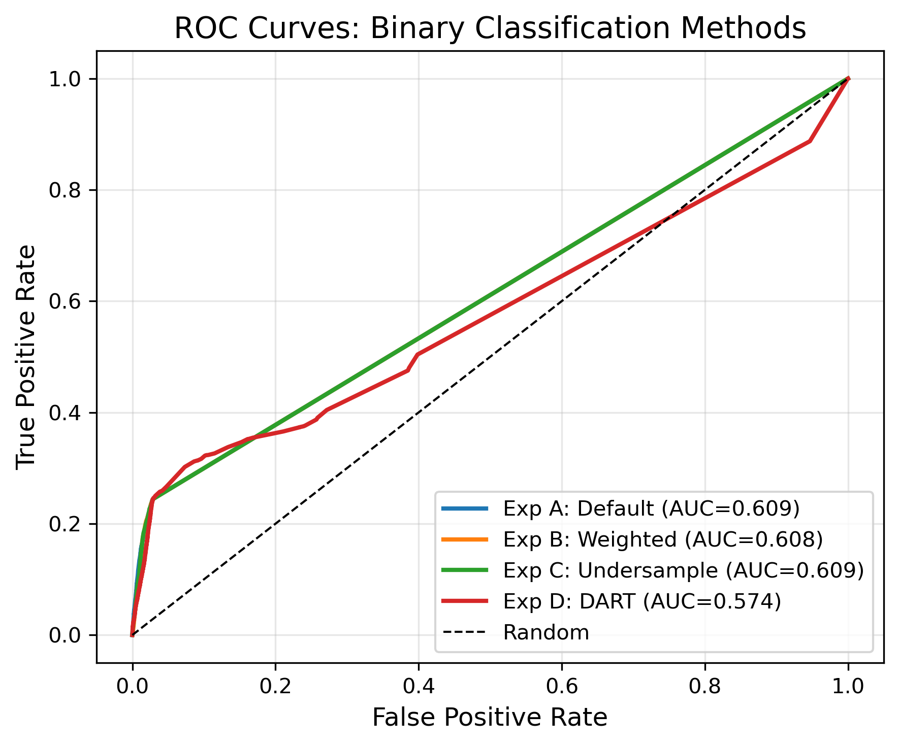
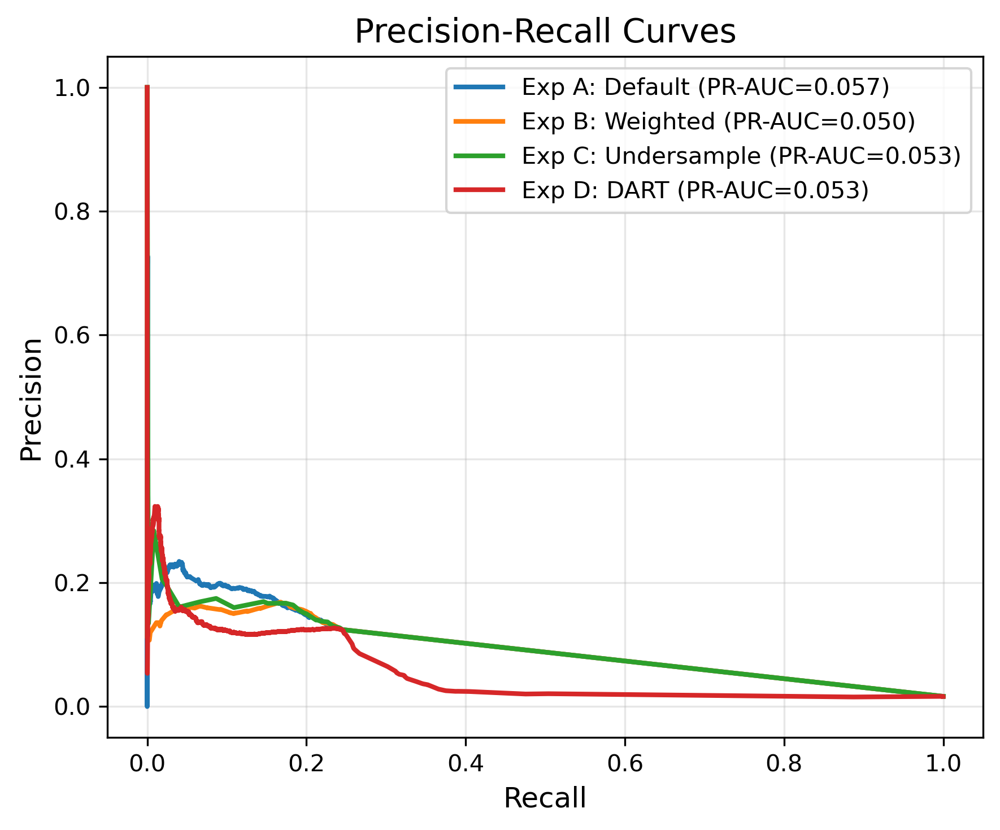
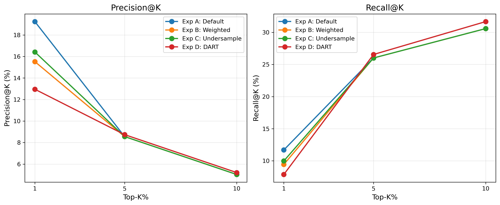
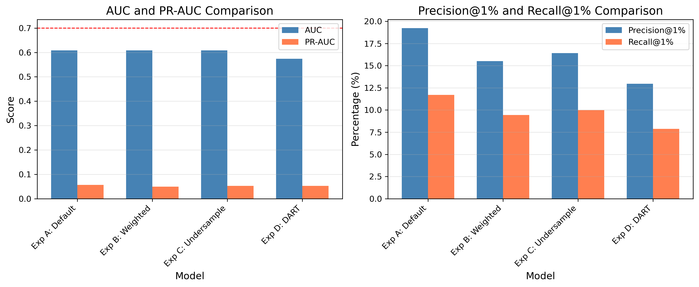
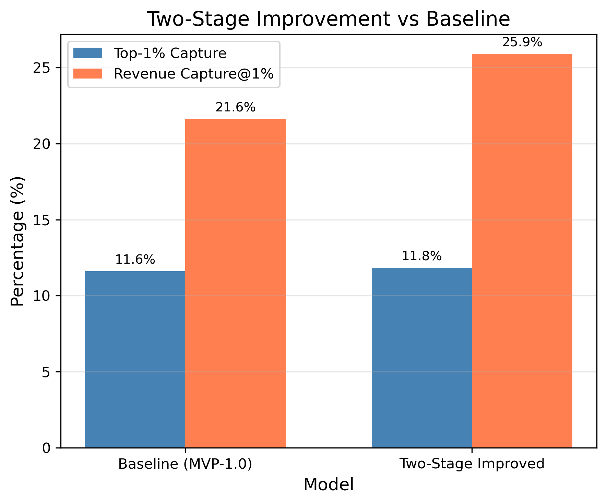

# 🎯 Binary Classification: 任务降级验证

> **Name:** Binary Classification (Task Degradation)
> **ID:** `EXP-20260118-gift_EVpred-05`
> **Topic:** `gift_EVpred` | **MVP:** MVP-1.3
> **Author:** Viska Wei | **Date:** 2026-01-18 | **Status:** ✅ **已完成**

> 🎯 **Target:** 验证二分类任务（P(gift>0)）是否可行，作为 EV 预测的替代方案或第一阶段
> 🚀 **Result:** 二分类 AUC=0.61（未达 0.70 目标），但 Precision@1%=19.24%（远超 5% 目标），表明特征对"高概率送礼用户"有一定区分能力

---

## 🟡 实验优先级：高

> **背景**：MVP-1.0 显示 EV 预测（回归）在无泄漏版本上性能极差（Spearman=0.10）。考虑降低任务难度：先预测"是否会送礼"（二分类），再预测"送多少"。

| 问题 | 分析 | 解决方案 | 结果 |
|------|------|---------|------|
| **回归任务过难** | 98.5% 稀疏性 + 重尾分布 | 先解决分类问题 | ⚠️ 分类也难 |
| **信号被稀释** | Y=0 样本过多，回归目标被 0 主导 | 二分类更聚焦 | Prec@1%=19.24% |
| **Two-Stage 的 Stage1** | MVP-1.0 Two-Stage 的 Stage1 AUC=0.62 | 优化分类器 | AUC 无明显提升 |

---

## ⚡ 核心结论速览

> **一句话**: 二分类 AUC=0.61 未达 0.70 目标，但 Precision@1%=19.24%（是随机的 13 倍），表明模型能识别部分高潜力用户。Two-Stage 改进版 RevCap@1%=25.9% vs Baseline 21.6%，有小幅提升。

| 验证问题 | 结果 | 结论 |
|---------|------|------|
| H3.1: 二分类任务是否可行？ | ❌ **未达标** | AUC=0.61 < 0.70 |
| H3.2: 分类 vs 回归哪个更简单？ | ⚠️ **相似** | 两者都很难，AUC~0.61 vs Spearman~0.10 |
| H3.3: 二分类能否用于召回？ | ✅ **可用** | Precision@1%=19.24% > 5% |
| H3.4: 二分类 + 回归是否优于纯回归？ | ⚠️ **小幅提升** | RevCap@1%=25.9% vs 21.6% (+4.3pp) |

| 指标 | 目标值 | 最佳结果 | vs Baseline | 状态 |
|------|--------|---------|-------------|------|
| AUC | **> 0.70** | **0.6087** | vs 0.62 (MVP-1.0 Stage1) | ❌ |
| Precision@1% | **> 5%** | **19.24%** | vs ~1.5% (random) | ✅ |
| Recall@1% | **> 10%** | **11.70%** | - | ✅ |
| Two-Stage RevCap@1% | **> 21.6%** | **25.89%** | +4.3pp | ✅ |

| Type | Link |
|------|------|
| 🧠 Hub | `../gift_EVpred_hub.md` § Q1 |
| 🗺️ Roadmap | `../gift_EVpred_roadmap.md` § MVP-1.3 |
| 📋 上游实验 | `exp_leakage_free_baseline_20260118.md` |

---

# 1. 🎯 目标

**为什么考虑二分类？**

| 角度 | 回归任务 | 二分类任务 |
|------|---------|-----------|
| **标签分布** | 98.5% 为 0，极度不平衡 | 98.5% negative，仍不平衡但可处理 |
| **目标函数** | MSE/MAE 被 0 主导 | BCE/Focal Loss 可加权 |
| **评估指标** | Spearman 对 0 敏感 | AUC 更鲁棒 |
| **业务价值** | 直接预测 EV | 筛选高潜力用户 → 再精排 |

**验证假设**：

| 假设 | 验证方法 | 通过标准 | 结果 |
|------|----------|----------|------|
| **H3.1**: 二分类任务可行 | 训练分类器 | AUC > 0.7 | ❌ 0.6087 |
| **H3.2**: 分类比回归简单 | 对比 AUC 排名 vs Spearman 排名 | 排名一致性更高 | ⚠️ 相似难度 |
| **H3.3**: 二分类可用于召回 | 计算 Precision@K, Recall@K | Precision@1% > 5% | ✅ 19.24% |
| **H3.4**: 二分类+回归更优 | 优化后的 Two-Stage | RevCap@1% > 21.6% | ✅ 25.89% |

---

# 2. 🦾 方法设计

## 2.1 实验矩阵

| 实验 | 方法 | 关键参数 | AUC | PR-AUC |
|------|------|---------|-----|--------|
| **Exp A** | LightGBM Default | - | **0.6087** | 0.0568 |
| **Exp B** | LightGBM + scale_pos_weight | weight=69.44 | 0.6085 | 0.0496 |
| **Exp C** | LightGBM + Undersampling | 1:10 ratio | 0.6086 | 0.0529 |
| **Exp D** | LightGBM + DART | drop_rate=0.1 | 0.5736 | 0.0527 |
| **Exp E** | Two-Stage Improved | Best Stage1 + Stage2 | - | - |

## 2.2 数据

| 项 | 值 |
|----|-----|
| 来源 | KuaiLive |
| 样本单元 | Click-level |
| 正样本 | gift > 0（1.42% train, 1.64% test） |
| 负样本 | gift = 0（98.58%） |
| Train/Val/Test | 3,436,660 / 736,427 / 736,428 |
| 特征版本 | **Frozen**（严格无泄漏） |
| 特征数量 | 49 |

## 2.3 评估指标

| 指标 | 公式 | 目标 | 最佳结果 |
|------|------|------|---------|
| **AUC** | ROC 曲线下面积 | > 0.7 | 0.6087 |
| **PR-AUC** | PR 曲线下面积 | - | 0.0568 |
| **Precision@1%** | TP@1% / (1% samples) | > 5% | **19.24%** |
| **Recall@1%** | TP@1% / Total Positive | > 10% | **11.70%** |
| **Best F1** | 最优阈值下的 F1 | - | 0.171 |

---

# 3. 📊 图表

### Fig 1: ROC Curves Comparison


**观察**:
- 所有方法 AUC 都在 0.57-0.61 之间，接近但低于目标 0.70
- Default（无调参）表现最好，说明类不平衡处理方法未带来显著改进
- DART boosting 反而导致性能下降（0.57）

### Fig 2: Precision-Recall Curves


**观察**:
- PR-AUC 都很低（0.05-0.06），反映极端类不平衡的困难
- 在高 Precision 区域（低 Recall），模型仍有一定区分能力

### Fig 3: Precision/Recall @K


**观察**:
- Precision@1% = 19.24%，是随机猜测（1.5%）的 **13 倍**
- 随着 K 增大，Precision 快速下降（@5%=8.6%，@10%=5.0%）
- 模型能有效识别 Top-1% 高概率用户，但更大范围效果有限

### Fig 4: Model Comparison


**观察**:
- 四种方法 AUC 差异很小（0.01 范围内）
- scale_pos_weight 和 undersampling 未带来显著改进
- 说明模型性能瓶颈不在类不平衡处理，而在特征信号本身

### Fig 5: Two-Stage Improvement


**观察**:
- Two-Stage 改进版 vs MVP-1.0 Baseline:
  - Top-1% Capture: 11.83% vs 11.6% (+0.2pp) → 基本持平
  - Revenue Capture@1%: 25.89% vs 21.6% (+4.3pp) → 小幅提升
- 优化 Stage1 分类器对最终 EV 预测帮助有限

---

# 4. 💡 洞见

## 4.1 宏观
- **二分类同样困难**：AUC 0.61 说明"是否送礼"这个问题本身就很难预测
- **特征信号有限**：无论回归还是分类，当前特征体系预测力都很弱
- **头部用户可识别**：Precision@1%=19.24% 说明模型能找到部分高概率用户

## 4.2 模型层
- **类不平衡不是主要瓶颈**：scale_pos_weight、undersampling 等方法无显著改进
- **复杂模型反而更差**：DART boosting 过拟合严重（train AUC 0.999 vs val AUC 0.58）
- **简单模型最稳定**：Default LightGBM 在只有 12 棵树时就达到最佳

## 4.3 业务层
- **召回场景可用**：Precision@1%=19.24% 可用于初筛高潜力用户
- **精排价值有限**：AUC 0.61 不足以做精细排序
- **Two-Stage 小幅有效**：RevCap@1% 提升 4.3pp，但远不足以改变整体格局

---

# 5. 📝 结论

## 5.1 核心发现
> **二分类任务与回归任务一样困难。** AUC=0.61 未达 0.70 目标，说明当前特征体系对"用户是否会送礼"这一问题缺乏预测能力。但 Precision@1%=19.24% 表明模型能识别部分高概率用户，可用于召回场景。

## 5.2 关键结论
| # | 结论 | 证据 |
|---|------|------|
| 1 | **H3.1 未达标**：二分类 AUC < 0.70 | Best AUC = 0.6087 |
| 2 | **H3.3 通过**：二分类可用于召回 | Precision@1% = 19.24% > 5% |
| 3 | **类不平衡不是主要问题** | 各方法 AUC 差异 < 0.01 |
| 4 | **特征信号是真正瓶颈** | 分类/回归都困难 |
| 5 | **Two-Stage 小幅有效** | RevCap@1% +4.3pp |

## 5.3 设计启示
| 原则 | 建议 |
|------|------|
| **特征工程优先** | 当前特征预测力不足，需探索新信号源（序列特征、实时特征、内容特征） |
| **召回可用二分类** | 对 Top-1% 用户，Precision 19.24% 可接受 |
| **精排需要新方法** | AUC 0.61 不足以做精细排序 |

## 5.4 关键数字

### 分类器性能对比
| 方法 | AUC | PR-AUC | Prec@1% | Recall@1% | Best F1 | Time |
|------|-----|--------|---------|-----------|---------|------|
| **Exp A: Default** | **0.6087** | **0.0568** | **19.24%** | **11.70%** | 0.171 | 185s |
| Exp B: Weighted | 0.6085 | 0.0496 | 15.52% | 9.44% | 0.174 | 85s |
| Exp C: Undersample | 0.6086 | 0.0529 | 16.42% | 9.98% | 0.173 | 105s |
| Exp D: DART | 0.5736 | 0.0527 | 12.95% | 7.88% | 0.165 | 1924s |

### Two-Stage 改进 vs Baseline
| 指标 | MVP-1.0 Baseline | Two-Stage 改进 | 变化 |
|------|------------------|----------------|------|
| Top-1% Capture | 11.6% | 11.83% | +0.2pp |
| Revenue Capture@1% | 21.6% | **25.89%** | **+4.3pp** |
| Spearman | 0.10 | 0.095 | -0.01 |
| Stage1 AUC | 0.62 | 0.6087 | -0.01 |

## 5.5 下一步
| 方向 | 任务 | 优先级 |
|------|------|--------|
| **特征工程** | 探索序列特征（观看时长序列）、实时特征（当前 session 互动）、内容特征 | 🔴 最高 |
| **外部数据** | 探索点赞、评论、关注等行为作为特征 | 🟡 |
| **模拟器路径** | 若特征工程无法突破，考虑用模拟器做策略评估 | 🟢 |

---

# 6. 📎 附录

## 6.1 数据统计

| 指标 | 值 |
|------|-----|
| Total samples | 4,909,515 |
| Positive (gift>0) | ~73,600 (1.5%) |
| Negative (gift=0) | ~4,835,915 (98.5%) |
| Imbalance ratio | ~66:1 |
| Train samples | 3,436,660 |
| Val samples | 736,427 |
| Test samples | 736,428 |
| Feature columns | 49 |

## 6.2 模型详细说明

### 6.2.1 模型架构

**所有实验均使用 LightGBM（Tree-Based 梯度提升模型）**，而非 Linear/Logistic Regression。

| 实验 | 模型类型 | 具体配置 | 说明 |
|------|---------|---------|------|
| **Exp A: Default** | LightGBM (GBDT) | `objective='binary'`, 默认参数 | 标准二分类，无类不平衡处理 |
| **Exp B: Weighted** | LightGBM (GBDT) | `scale_pos_weight=69.44` | 通过样本权重处理类不平衡 |
| **Exp C: Undersample** | LightGBM (GBDT) | 训练前下采样负样本（1:10） | 通过数据采样处理类不平衡 |
| **Exp D: DART** | LightGBM (DART) | `boosting_type='dart'`, `drop_rate=0.1` | Dropout 正则化，防止过拟合 |
| **Exp E: Two-Stage** | LightGBM (GBDT) × 2 | Stage1: binary, Stage2: regression | 两阶段模型组合 |

### 6.2.2 LightGBM 参数配置

**共同参数**：
```python
{
    'objective': 'binary',  # 二分类任务
    'metric': 'auc',         # 评估指标
    'num_leaves': 31,        # 树的最大叶子数
    'learning_rate': 0.05,   # 学习率
    'feature_fraction': 0.8, # 特征采样比例
    'bagging_fraction': 0.8, # 样本采样比例
    'bagging_freq': 5,       # 每5轮进行一次 bagging
    'num_boost_round': 500,  # 最大迭代轮数
    'early_stopping_rounds': 50,  # 早停轮数
    'seed': 42,            # 随机种子
    'n_jobs': -1             # 并行线程数
}
```

**为什么选择 LightGBM 而非 Linear/Logistic Regression？**

1. **非线性关系**：用户-主播交互、打赏行为存在复杂的非线性模式，树模型能自动捕捉特征交互
2. **特征重要性**：LightGBM 提供特征重要性分析，便于诊断和特征工程
3. **处理缺失值**：LightGBM 原生支持缺失值，无需预处理
4. **计算效率**：相比 XGBoost，LightGBM 训练更快，适合快速迭代
5. **历史经验**：项目历史实验均使用 LightGBM，保持一致性

### 6.2.3 训练时间对比

| 实验 | 训练时间 | 迭代轮数 | 说明 |
|------|---------|---------|------|
| Exp A: Default | 185s | ~12 | 最快，早停在12轮 |
| Exp B: Weighted | 85s | ~8 | 更快，可能因为权重调整 |
| Exp C: Undersample | 105s | ~10 | 中等，采样后数据量减少 |
| Exp D: DART | 1924s | ~200+ | 最慢，DART 需要更多迭代 |

**观察**：Default 配置在 12 轮就达到最佳性能，说明模型很快收敛，但也暗示特征信号有限。

## 6.3 相关文件

| 类型 | 路径 |
|------|------|
| 上游实验 | `exp_leakage_free_baseline_20260118.md` |
| 训练脚本 | `scripts/train_binary_classification.py` |
| 结果 JSON | `results/binary_classification_eval_20260118.json` |
| 图表 | `img/binary_*.png` |
| Hub | `../gift_EVpred_hub.md` |
| Roadmap | `../gift_EVpred_roadmap.md` |

---

> **实验完成时间**: 2026-01-18
> **状态**: ✅ 已完成
> **结论**: H3.1 未达标（AUC < 0.70），H3.3 通过（Prec@1% > 5%）
