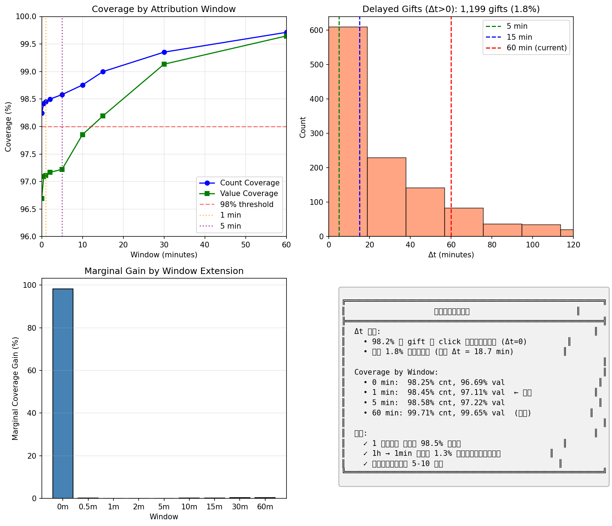

# 归因窗口分析实验

> **实验 ID**: label_window_analysis_20260119
> **作者**: Viska Wei
> **日期**: 2026-01-19
> **状态**: Completed

---

## 1. 背景与动机

当前 `data_utils.py` 使用 **1 小时 (1h) 的归因窗口**，即 gift 发生在 click 后 1 小时内就归因给该 click。但这个窗口长度是「工程默认值」，没有经过数据验证。

**问题**：
- 平均观看时长只有 ~4 秒，1h 窗口是否太长？
- 窗口越长，越容易把「后来发生的打赏」错误归到很早的 click 上，带来归因噪声

**目标**：
- 分析 Δt = t_gift - t_click(last-touch) 的真实分布
- 用数据选择合理的归因窗口

---

## 2. 方法

### 2.1 数据说明

- **click**: 进入直播间的行为（不是点击礼物按钮）
- **gift**: 打赏行为
- **归因模型**: Last-Touch（每个 gift 归因给最近的一条满足条件的 click）

### 2.2 分析指标

1. **Δt 分布**: 计算每个 gift 到其归因 click 的时间差
2. **Coverage(W)**: 窗口 W 内能覆盖的 gift 比例
3. **Value Coverage**: 按金额加权的覆盖率

---

## 3. 核心发现

### 3.1 Δt 分布

| 分位数 | Δt (秒) | Δt (分钟) |
|--------|---------|-----------|
| P50 | 0.0 | 0.0 |
| P75 | 0.0 | 0.0 |
| P90 | 0.0 | 0.0 |
| P95 | 0.0 | 0.0 |
| P99 | 901.1 | 15.0 |
| P99.5 | 2471.7 | 41.2 |
| Mean | 37.0 | 0.6 |

**关键发现**: **98.2% 的 gift 在 click 的同一毫秒内发生（Δt=0）**

### 3.2 Coverage by Window

| 窗口 | Count Coverage | Value Coverage | 边际增益 |
|------|---------------|----------------|----------|
| 0 min | 98.25% | 96.69% | — |
| 1 min | 98.45% | 97.11% | +0.20% |
| 2 min | 98.50% | 97.17% | +0.05% |
| 5 min | 98.58% | 97.22% | +0.08% |
| 10 min | 98.75% | 97.85% | +0.17% |
| 15 min | 99.00% | 98.19% | +0.25% |
| 30 min | 99.35% | 99.13% | +0.35% |
| 60 min | 99.71% | 99.65% | +0.36% |

### 3.3 即时 vs 延迟打赏

| 类型 | 数量 | 占比 | 平均金额 | 金额占比 |
|------|------|------|----------|----------|
| 即时打赏 (Δt=0) | 67,127 | 98.2% | 80.2 | 96.7% |
| 延迟打赏 (Δt>0) | 1,199 | 1.8% | 153.7 | 3.3% |

**延迟打赏特征**:
- 中位 Δt = 18.7 分钟
- 39% 涉及「多次 click」（用户多次进入同一直播间）
- 相比即时打赏（25.5% 多次 click），延迟打赏更可能是复访场景

---

## 4. 结论

### 4.1 1h 窗口确实太长

数据显示打赏是**极其即时的「进房即赏」模式**：
- 用户进入直播间后，98.2% 的打赏在同一毫秒内发生
- 1h 窗口只比 1 分钟窗口多覆盖 1.26% 的 gift，但引入大量归因噪声

### 4.2 推荐窗口

| 场景 | 推荐窗口 | 说明 |
|------|----------|------|
| **追求最低噪声** | 1 分钟 | 已覆盖 98.45% 的打赏 |
| **平衡覆盖与噪声** | 5-10 分钟 | 覆盖 98.6-98.8% |
| **最大覆盖** | 15-30 分钟 | 覆盖 99-99.4%（P99-P99.5 边界） |

### 4.3 行动项

- [x] 将默认窗口从 1h 改为 1 分钟
- [x] 在 `data_utils.py` 中支持分钟级窗口参数
- [ ] 后续可对比不同窗口对模型性能的影响

---

## 5. 图表



---

## 6. 代码变更

### 6.1 data_utils.py 修改

```python
# 旧版（只支持小时）
def prepare_dataset(..., label_window_hours=1, ...):
    ...

# 新版（支持分钟，默认 1 分钟）
def prepare_dataset(..., label_window_minutes=1, ...):
    ...
```

### 6.2 兼容性

- 保留 `label_window_hours` 参数作为备选（内部转换为分钟）
- 缓存文件名包含窗口长度，避免混淆

---

## 7. 附录：原始数据

```
Gift: 72,646 records
Click: 4,909,515 records
Gift-Click pairs (after last-touch dedup): 68,326

即时打赏 (Δt=0): 67,127 (98.2%)
延迟打赏 (Δt>0): 1,199 (1.8%)

延迟打赏的 Δt 分布 (分钟):
  P25:    7.6 min
  P50:   18.7 min
  P75:   45.0 min
  P90:   82.8 min
  P95:  118.2 min
  P99:  201.5 min
```
