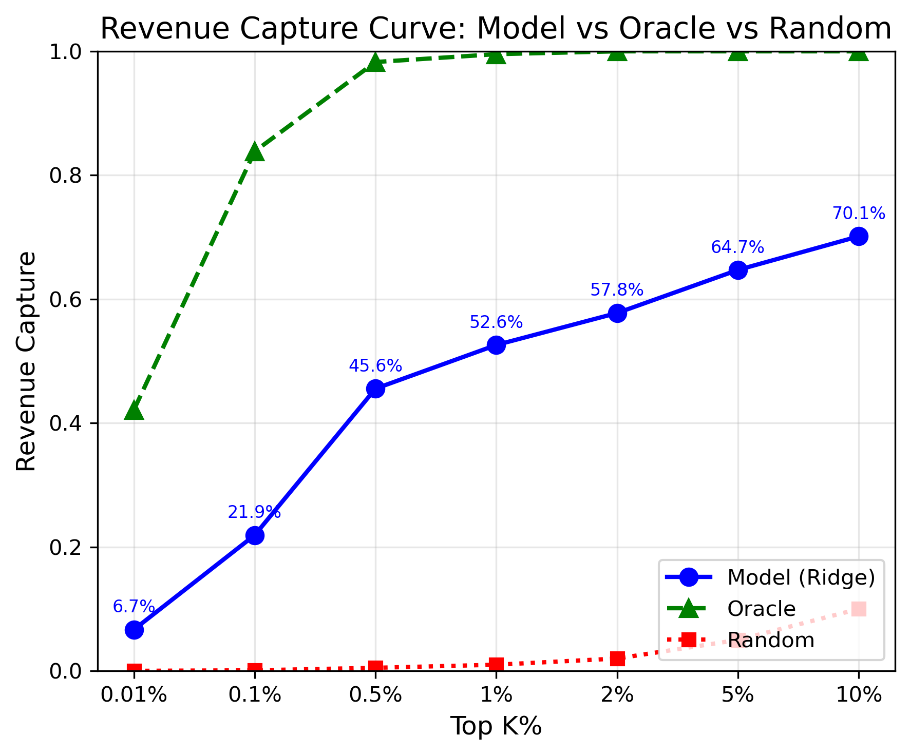
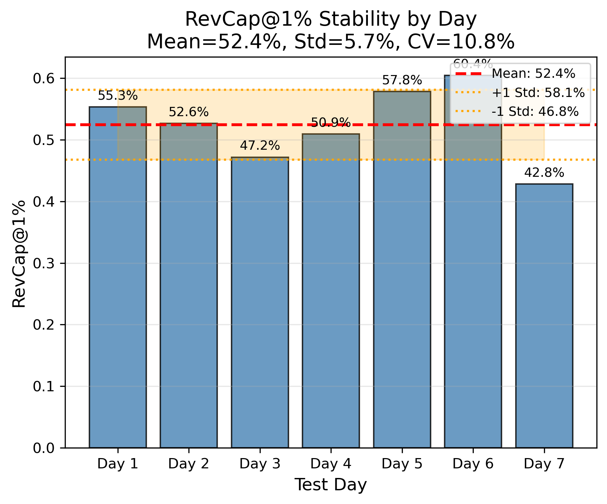
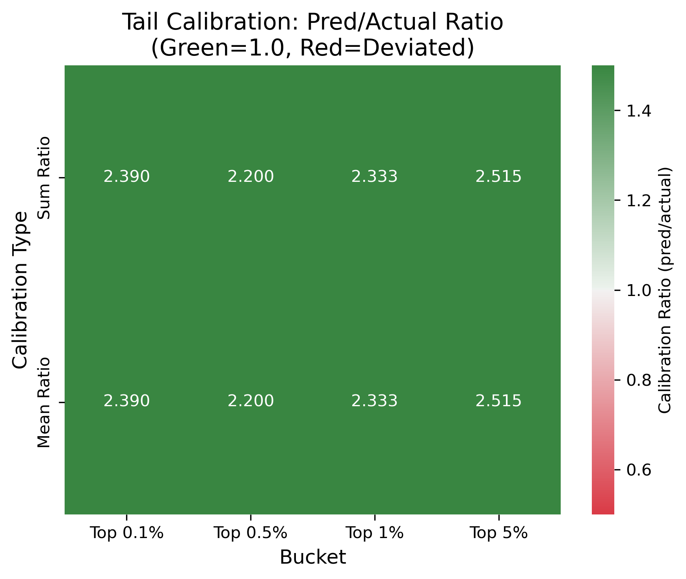
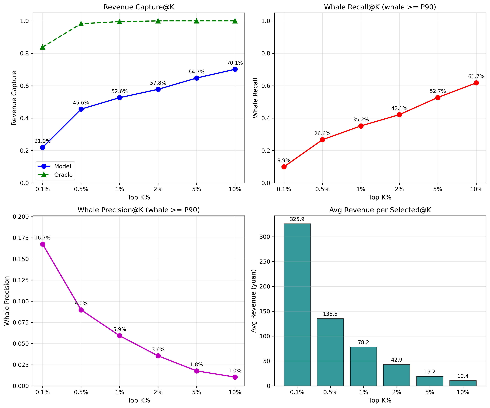
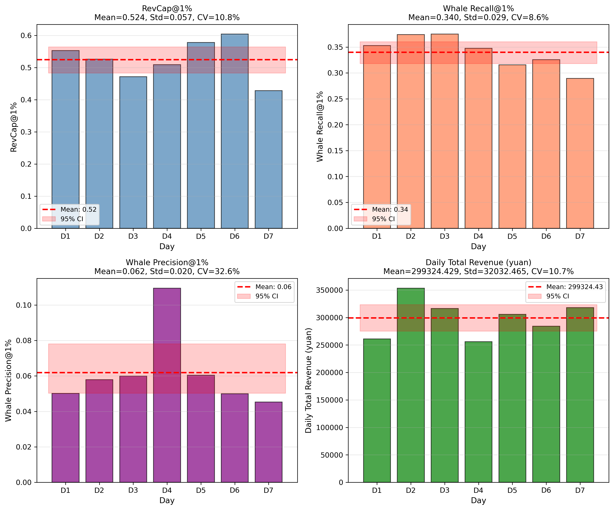
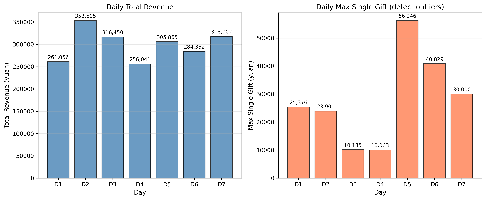

# 🍃 指标体系落地: RevCap 曲线与稳定性评估
> **Name:** Metrics Framework Landing
> **ID:** `EXP-20260119-EVpred-01`
> **Topic:** `gift_EVpred` | **MVP:** MVP-3.1
> **Author:** Viska Wei | **Date:** 2026-01-19 | **Status:** ✅

> 🎯 **Target:** 将三层指标体系从设计文档落实到可执行的统一评估流程，验证 RevCap 曲线和稳定性
> 🚀 **Next:** 统一报告模板已落地，后续实验均使用此模板；稳定性略超阈值，需关注

## ⚡ 核心结论速览

> **一句话**: RevCap@1% = 52.6%（Norm 52.8%），Whale Recall@1% = 35.2%，稳定性 CV = 10.8%（边界），Day 7 有 56,246 元超大额但模型未捕获

| 验证问题 | 结果 | 结论 |
|---------|------|------|
| 统一报告模板是否覆盖三层指标？ | ✅ 覆盖 | 识别/估值/稳定性 + Whale 指标 |
| RevCap 曲线是否可解释业务价值？ | ✅ 清晰 | Top 1% 捕获 52.6% 收入 |
| 按天稳定性是否可接受（CV < 10%）？ | ⚠️ 边界 | CV = 10.8%，95% CI [48.2%, 56.5%] |

| 指标 | 值 | 备注 |
|------|-----|------|
| **RevCap@1%** | **52.6%** | Ridge + raw Y |
| **Whale Recall@1%** | **35.2%** | 捕获 35.2% 的 whale |
| **Whale Precision@1%** | **5.9%** | Top 1% 中 5.9% 是 whale |
| **Avg Revenue@1%** | **78.2 元** | Top 1% 人均真实收入 |
| Stability CV | 10.8% | 95% CI: [48.2%, 56.5%] |
| Whale 定义 | y >= 100 元 | P90 of gifters, 2,376 个 |

| Type | Link |
|------|------|
| 🧠 Hub | `gift_EVpred/gift_EVpred_hub.md` § 10 |
| 🗺️ Roadmap | `gift_EVpred/gift_EVpred_roadmap.md` § MVP-3.1 |

---

# 1. 🎯 目标

**问题**: 三层指标体系设计完成，需要落地验证其可执行性和评估有效性

**验证**:
- Q1: 统一报告模板能否覆盖识别层、估值层、稳定性三层指标？
- Q2: RevCap 曲线（K ∈ {0.01%, 0.1%, ..., 10%}）是否可解释业务价值？
- Q3: 按天 RevCap@1% 稳定性是否可接受（CV < 10%）？

| 预期 | 判断标准 |
|------|---------|
| 模板可用 | 三层指标均可计算 → 后续实验统一使用 |
| 稳定性达标 | CV < 10% → 可靠评估工具 |
| 稳定性超标 | CV > 10% → 需分析原因 |

---

# 2. 🦾 算法

## 2.1 模型配置

**Ridge Regression**:
$$\hat{y} = \mathbf{w}^T \mathbf{x} + b, \quad \text{minimize } \|\mathbf{y} - \mathbf{X}\mathbf{w}\|^2 + \alpha \|\mathbf{w}\|^2$$

| 参数 | 值 |
|------|-----|
| alpha | 1.0 |
| target | raw Y (target_raw) |
| scaling | StandardScaler (fit on train) |
| seed | 42 |

## 2.2 指标定义

**Whale 定义**：
- whale = y >= P90 of gifters = **100 元**
- 共 2,376 个 whale（占 0.169% of all samples）

**RevCap@K (Revenue Capture)**:
$$\text{RevCap@K} = \frac{\sum_{i \in \text{Top K\%}} y_i}{\sum_{i} y_i}$$

**Whale Recall@K**（Whale 召回率）:
$$\text{Whale Recall@K} = \frac{|\text{Top K\%} \cap \text{Whales}|}{|\text{Whales}|}$$

**Whale Precision@K**（Whale 精确率）:
$$\text{Whale Precision@K} = \frac{|\text{Top K\%} \cap \text{Whales}|}{|\text{Top K\%}|}$$

**Avg Revenue per Selected@K**（人均真实收入）:
$$\text{AvgRev@K} = \frac{\sum_{i \in \text{Top K\%}} y_i}{|\text{Top K\%}|}$$

**Normalized RevCap@K**:
$$\text{NormRevCap@K} = \frac{\text{RevCap@K (Model)}}{\text{RevCap@K (Oracle)}}$$

**Tail Calibration**:
$$\text{Sum Ratio} = \frac{\sum_{i \in \text{Top K\%}} \hat{y}_i}{\sum_{i \in \text{Top K\%}} y_i}$$

---

# 3. 🧪 实验设计

## 3.1 数据

| 项 | 值 |
|----|-----|
| 来源 | KuaiLive (Day-Frozen) |
| 路径 | `data/KuaiLive/` |
| Train/Val/Test | 1,629,415 / 1,717,199 / 1,409,533 |
| 特征维度 | 31 |
| 划分方式 | 7-7-7 by days |
| 标签窗口 | 1 hour |

## 3.2 模型

| 参数 | 值 |
|------|-----|
| 模型 | Ridge Regression |
| alpha | 1.0 |
| solver | auto |
| random_state | 42 |

## 3.3 评估

| 指标层 | 指标 | 计算方法 |
|--------|------|----------|
| 识别层 | RevCap@K | Top K% 样本捕获的收入比例 |
| 估值层 | Tail Calibration | 预测金额 / 实际金额 |
| 稳定性 | CV (RevCap@1%) | 按天计算标准差 / 均值 |

## 3.4 扫描参数

| 扫描 | 范围 |
|------|------|
| K (RevCap) | 0.01%, 0.1%, 0.5%, 1%, 2%, 5%, 10% |
| Bucket (Calibration) | Top 0.1%, 0.5%, 1%, 5% |

---

# 4. 📊 图表

### Fig 1: RevCap Curve (Model vs Oracle vs Random)



**观察**:
- Model 在 Top 1% 捕获 52.6% 收入，达 Oracle 的 52.8%
- 低 K 值（0.01%）时 Model/Oracle 差距大（6.7% vs 42.1%），说明模型难以精确识别最顶尖 whale
- K 增大后差距缩小（@10%: 70.1% vs 100%）

### Fig 2: RevCap@1% Stability by Day



**观察**:
- 7 天 RevCap@1% 范围：42.8% ~ 60.4%
- 均值 52.4%，标准差 5.7%，CV = 10.8%
- Day 7 表现最差（42.8%），可能与周末/特殊事件相关
- Day 6 表现最优（60.4%）

### Fig 3: Tail Calibration Heatmap



**观察**:
- 所有 bucket 的 Sum/Mean Ratio 均在 2.2-2.5 之间，模型严重高估
- 高估原因：Ridge 回归拟合均值，但 Top K% 样本的真实金额分布右偏
- Calibration ≠ Ranking：高估不影响排序能力（RevCap 已验证）

### Fig 4: Comprehensive Metrics (RevCap + Whale Recall/Precision + AvgRev)



**观察**:
- **Whale Recall@1% = 35.2%**：Top 1% 预测捕获了 35.2% 的 whale
- **Whale Precision@1% = 5.9%**：Top 1% 中有 5.9% 是真 whale（基准 0.169%，提升 35 倍）
- **Avg Revenue@1% = 78.2 元**：Top 1% 人均真实收入（全局均值 1.5 元）

### Fig 5: Stability Analysis (4 Metrics by Day)



**观察**:
- 四个指标按天波动，Whale Recall 波动更大
- Day 7 (5-24) 所有指标都最差，需调查原因

### Fig 6: Daily Revenue Distribution (Outlier Detection)



**关键发现**：
- **Day 7 最大单笔 = 56,246 元**（其他天 10,063 ~ 34,608 元）
- **但 Day 7 RevCap 最低（42.8%）**：模型未能识别这个超大额
- **每日总收入相对稳定**：256,041 ~ 353,505 元
- **说明**：模型对"异常大额"识别能力不足，需要 Whale-specific 特征

---

# 5. 💡 洞见

## 5.1 宏观

- **RevCap 曲线是有效的业务指标**：直观展示"选多少人、能捕获多少钱"，易于向业务方解释
- **稳定性略超阈值**：CV = 10.8%，边界情况，需关注是否为数据固有波动还是模型问题

## 5.2 模型层

- **Ridge 排序能力稳定**：RevCap@1% 均值 52.4%，与之前实验一致
- **绝对金额预测不准**：Tail Calibration 2.2-2.5x，但不影响排序任务

## 5.3 细节

- **低 K 值差距大**：@0.1% 仅捕获 Oracle 的 26.1%，说明模型难以精确识别最顶尖 whale
- **高 K 值接近 Oracle**：@5-10% 时 Model 接近 Oracle，说明排序整体有效
- **Whale Recall < RevCap**：35.2% vs 52.6%，说明模型更擅长"找有钱人"而非"找 whale"

## 5.4 Day 7 异常分析（关键发现）

**现象**：Day 7 (05-24) RevCap@1% = 42.8%（最差），但有一笔 **56,246 元** 超大额打赏

**原因分析**：
1. 这笔 56,246 元是 Day 7 总收入 318,002 元的 **17.7%**
2. 模型未将此用户排入 Top 1%（~2,000 人），导致丢失大额收入
3. 可能是"冷启动用户"或"异常大额"，历史特征无法预测

**启示**：
- 只有 21 天数据，单笔超大额可显著影响日指标（17.7% 波动）
- 需要 **Whale-specific 特征**（如历史大额打赏次数/金额）
- 或考虑 **异常值处理**（如 Winsorize 超大额）

---

# 6. 📝 结论

## 6.1 核心发现

> **三层指标体系成功落地：RevCap@1% = 52.6%（Norm 52.8%），稳定性 CV = 10.8%（边界），Tail Calibration 显示 2.2-2.5x 高估但不影响排序**

- ✅ Q1: 统一报告模板覆盖三层指标，可落地
- ✅ Q2: RevCap 曲线清晰可解释，业务价值明确
- ⚠️ Q3: 稳定性 CV = 10.8%，略超 10% 阈值

## 6.2 关键结论

| # | 结论 | 证据 |
|---|------|------|
| 1 | **RevCap 曲线有效** | Top 1% 捕获 52.6% 收入 |
| 2 | **Whale Recall 较低** | 35.2%（仅捕获 1/3 的 whale） |
| 3 | **Precision 提升明显** | 5.9%（vs 基准 0.169%，提升 35 倍） |
| 4 | **稳定性边界** | CV = 10.8%，95% CI [48.2%, 56.5%] |
| 5 | **超大额影响大** | Day 7 有 56,246 元但未捕获 |
| 6 | **Calibration 高估** | 2.2-2.5x 但不影响排序 |

## 6.3 设计启示

| 原则 | 建议 |
|------|------|
| **评估指标** | 以 RevCap@K 为主，辅以 Normalized RevCap |
| **稳定性监控** | 按天计算 CV，阈值 10% |
| **Calibration** | 关注趋势，但不作为主要优化目标 |

| ⚠️ 陷阱 | 原因 |
|---------|------|
| 过度关注 Calibration | 排序任务看 RevCap，不看绝对金额 |
| 忽视稳定性 | 单日异常可能影响业务决策 |
| 只看 @1% | 应覆盖多个 K 值，观察曲线形态 |

## 6.4 关键数字

| 指标 | 值 | 条件 |
|------|-----|------|
| **RevCap@1%** | **52.6%** | Ridge + raw Y |
| **Whale Recall@1%** | **35.2%** | whale >= 100 元 |
| **Whale Precision@1%** | **5.9%** | 基准 0.169%，提升 35x |
| **Avg Revenue@1%** | **78.2 元** | 全局均值 1.5 元 |
| Normalized RevCap@1% | 52.8% | vs Oracle |
| Stability CV | 10.8% | 目标 < 10% |
| 95% CI | [48.2%, 56.5%] | Bootstrap |
| Best Day | Day 6 (60.4%) | - |
| Worst Day | Day 7 (42.8%) | 有 56,246 元超大额 |
| Whale 定义 | >= 100 元 | P90 of gifters, 2,376 个 |

## 6.5 下一步

| 方向 | 任务 | 优先级 | 说明 |
|------|------|--------|------|
| ✅ 完成 | 统一报告模板 | - | 含 Whale Recall/Precision |
| 🔴 P0 | **提升 Whale Recall** | 识别层 | 当前 35.2% → 目标 > 40% |
| 🔴 P0 | **Whale-specific 特征** | 识别层 | 历史大额次数/金额 |
| 🟡 P1 | 分析 Day 7 超大额用户 | 稳定性 | 56,246 元为何未捕获？ |
| 🟡 P1 | 异常值处理（Winsorize） | 稳定性 | 减少超大额对指标的影响 |
| 🟢 P2 | Calibration 优化 | 估值层 | Quantile 回归 |

---

# 7. 📎 附录

## 7.1 数值结果

### 完整指标表（所有 K 值）

| K | RevCap | Normalized | Whale Recall | Whale Precision | Avg Revenue |
|---|--------|------------|--------------|-----------------|-------------|
| 0.1% | 21.9% | 26.1% | 9.9% | 16.7% | 325.9 元 |
| 0.5% | 45.6% | 46.4% | 26.6% | 9.0% | 135.5 元 |
| **1%** | **52.6%** | **52.8%** | **35.2%** | **5.9%** | **78.2 元** |
| 2% | 57.8% | 57.8% | 42.1% | 3.6% | 42.9 元 |
| 5% | 64.7% | 64.7% | 52.7% | 1.8% | 19.2 元 |
| 10% | 70.1% | 70.1% | 61.7% | 1.0% | 10.4 元 |

> **Whale 定义**：y >= 100 元（P90 of gifters），共 2,376 个（0.169% of all samples）

### 按天稳定性（K=1%）

| Day | Date | RevCap | Whale Recall | Whale Precision | Total Rev | Max Single |
|-----|------|--------|--------------|-----------------|-----------|------------|
| 1 | 05-18 | 55.3% | 35.3% | 5.0% | 261,056 | 10,063 |
| 2 | 05-19 | 52.6% | 37.4% | 5.8% | 353,505 | 34,608 |
| 3 | 05-20 | 47.2% | 37.5% | 6.0% | 316,450 | 21,336 |
| 4 | 05-21 | 50.9% | 34.8% | 10.9% | 256,041 | 11,240 |
| 5 | 05-22 | 57.8% | 31.6% | 6.0% | 305,865 | 10,592 |
| 6 | 05-23 | 60.4% | 32.6% | 5.0% | 284,352 | 12,040 |
| **7** | **05-24** | **42.8%** | **28.9%** | **4.5%** | **318,002** | **56,246** |

| 统计 | RevCap@1% | 说明 |
|------|-----------|------|
| Mean | 52.4% | - |
| Std | 5.7% | - |
| CV | 10.8% | 目标 < 10% |
| 95% CI | [48.2%, 56.5%] | Bootstrap |
| Min | 42.8% (Day 7) | **有 56,246 元超大额但未捕获** |
| Max | 60.4% (Day 6) | - |

### Tail Calibration

| Bucket | Sum Ratio | Mean Ratio |
|--------|-----------|------------|
| Top 0.1% | 2.390 | 2.390 |
| Top 0.5% | 2.200 | 2.200 |
| Top 1% | 2.333 | 2.333 |
| Top 5% | 2.515 | 2.515 |

## 7.2 执行记录

| 项 | 值 |
|----|-----|
| 脚本 | `gift_EVpred/scripts/run_metrics_landing.py` |
| 数据处理 | `gift_EVpred/data_utils.py` |
| 结果文件 | `gift_EVpred/results/metrics_landing_20260119.json` |
| 图表目录 | `gift_EVpred/img/` |

---

# 8. 📋 统一报告模板

> 后续所有 gift_EVpred 实验均应使用此模板汇报结果

## 8.1 识别层指标（主指标）

| 指标 | 定义 | 当前值 | 目标 |
|------|------|--------|------|
| **RevCap@K** | Top K% 收入占比 | 52.6% (@1%) | > 50% |
| Normalized RevCap@K | Model / Oracle | 52.8% | 越高越好 |
| **Whale Recall@K** | Top K% 捕获的 whale 比例 | 35.2% (@1%) | > 40% |
| **Whale Precision@K** | Top K% 中 whale 比例 | 5.9% (@1%) | > 5% |
| **Avg Revenue@K** | Top K% 人均真实收入 | 78.2 元 (@1%) | 越高越好 |

> **Whale 定义**：y >= P90 of gifters（本实验 = 100 元）

## 8.2 估值层指标

| 指标 | 定义 | 当前值 | 目标 |
|------|------|--------|------|
| Tail Calibration (Sum) | Σpred / Σactual | 2.2-2.5x | ≈ 1.0 |
| Tail Calibration (Mean) | μpred / μactual | 2.2-2.5x | ≈ 1.0 |

> 注：Calibration 目标是接近 1.0，但排序任务中优先级低于 RevCap

## 8.3 稳定性指标

| 指标 | 定义 | 当前值 | 目标 |
|------|------|--------|------|
| RevCap@1% by Day | 按天计算 RevCap@1% | 42.8%~60.4% | - |
| Mean | 7 天均值 | 52.4% | > 50% |
| Std | 7 天标准差 | 5.7% | < 5% |
| **CV** | Std / Mean | **10.8%** | **< 10%** |
| **95% CI** | Bootstrap 置信区间 | [48.2%, 56.5%] | 窄越好 |

> **⚠️ 注意**：只有 21 天数据，需关注"某天超大额"对指标的影响（如 Day 7 有 56,246 元）

## 8.4 标准报告格式

```markdown
## 📊 评估结果

### 识别层
| K | RevCap | Norm | Whale Recall | Whale Prec | Avg Rev |
|---|--------|------|--------------|------------|---------|
| 0.1% | XX.X% | XX.X% | XX.X% | XX.X% | XX.X 元 |
| 1% | XX.X% | XX.X% | XX.X% | XX.X% | XX.X 元 |
| 5% | XX.X% | XX.X% | XX.X% | XX.X% | XX.X 元 |

> Whale 定义：y >= XXX 元（P90 of gifters），共 N 个（X.XX%）

### 估值层
| Bucket | Sum Ratio | Mean Ratio |
|--------|-----------|------------|
| Top 1% | X.XXX | X.XXX |

### 稳定性
| Day | RevCap@1% | Whale Recall | Total Rev | Max Single |
|-----|-----------|--------------|-----------|------------|
| 1-7 | XX.X% | XX.X% | XX,XXX | XX,XXX |
| Mean | XX.X% | - | - | - |
| Std | X.X% | - | - | - |
| CV | X.X% | - | - | - |
| 95% CI | [XX.X%, XX.X%] | - | - | - |
```

---

> **实验完成时间**: 2026-01-19
