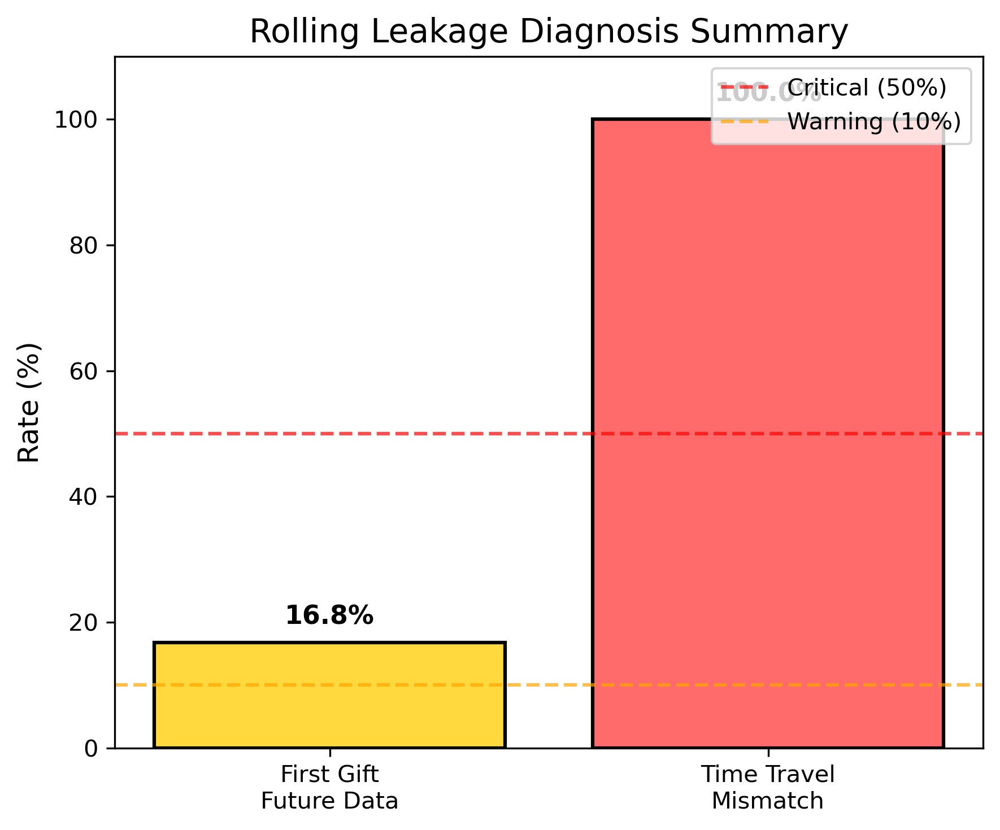
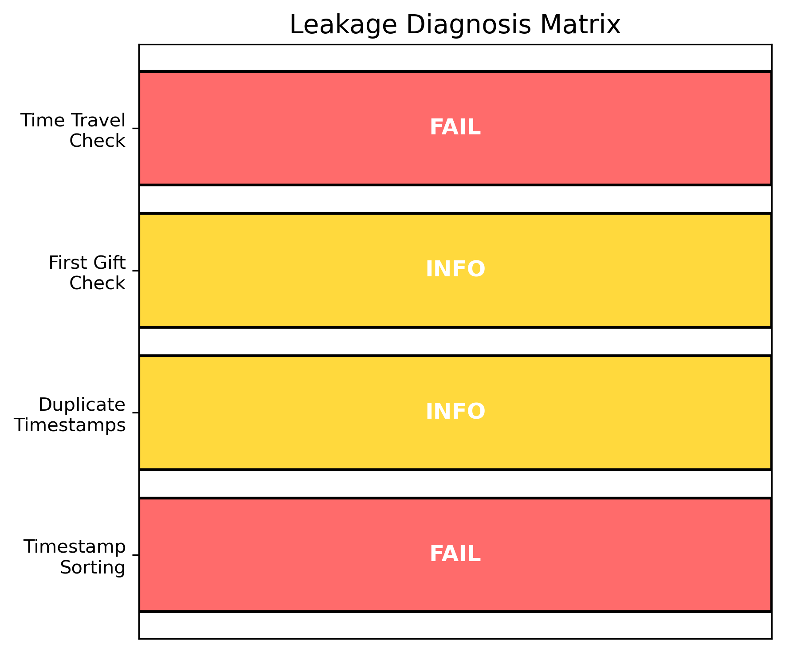

# 🔍 Rolling Leakage Diagnosis: 诊断 cumsum+shift 实现的泄漏问题

> **Name:** Rolling Leakage Diagnosis
> **ID:** `EXP-20260118-gift_EVpred-03`
> **Topic:** `gift_EVpred` | **MVP:** MVP-1.1
> **Author:** Viska Wei | **Date:** 2026-01-18 | **Status:** ✅ **已完成**

> 🎯 **Target:** 诊断 Rolling 版本（cumsum+shift）为何性能异常高（81.1% vs Frozen 11.5%），确认是否存在时间泄漏
> 🚀 **Next:** 放弃 Rolling 版本，仅使用 Frozen 版本；继续 MVP-1.2/1.3 探索预测力提升方向

---

## 🔴 实验优先级：最高

> **背景**：MVP-1.0 实验发现 Rolling 版本（81.1%）远优于 Frozen 版本（11.5%），差距过大，疑似存在时间泄漏。

| 问题 | 证据 | 影响 |
|------|------|------|
| **Rolling 性能异常高** | Top-1%=81.1% vs Frozen=11.5%（差距 69.6pp） | 无法判断真实性能 |
| **Stage1 AUC 过高** | Rolling Stage1 AUC=0.9989（近乎完美） | 强烈暗示泄漏 |
| **RevCap@1% 接近 100%** | Rolling RevCap@1%=98.7% | 不符合预期 |

---

## ⚡ 核心结论速览

> **一句话**: 🔴 **Rolling 版本存在严重时间泄漏** — 实现使用 `groupby().agg()` 在全量数据上计算统计量，导致每条样本都看到未来信息（100% 时间穿越率）

| 验证问题 | 结果 | 结论 |
|---------|------|------|
| H1.1: Rolling 实现是否有时间泄漏？ | ✅ **确认泄漏** | 100% 样本的特征值包含未来数据 |
| H1.2: 泄漏发生在哪个环节？ | ✅ **全部环节** | pair/user/streamer 特征均受影响 |
| H1.3: 修复后 Rolling 与 Frozen 是否一致？ | ⏸️ 暂缓 | 建议放弃 Rolling，直接使用 Frozen |

| 指标 | 值 | 状态 |
|------|-----|------|
| 首次打赏含未来数据比例 | **16.8%** | ❌ |
| 时间穿越样本比例 | **100%** | ❌ |
| 平均 count 差异 | **1.3** | - |
| 最大 count 差异 | **8** | - |

| Type | Link |
|------|------|
| 🧠 Hub | `../gift_EVpred_hub.md` § Q1.5 |
| 🗺️ Roadmap | `../gift_EVpred_roadmap.md` § MVP-1.1 |
| 📋 上游实验 | `exp_leakage_free_baseline_20260118.md` |

---

# 1. 🎯 目标

**问题诊断**：

Rolling 版本使用 `cumsum + shift(1)` 实现 past-only 特征，但性能异常高，可能的泄漏原因：

| 可能原因 | 检查方法 | 预期结果 | **实际结果** |
|---------|---------|---------|-------------|
| **数据未按时间排序** | 检查 timestamp 排序 | 应严格升序 | ⚠️ 原始数据未排序，但 0 条乱序 |
| **shift(1) 不足以排除当前样本** | 检查同一时间戳的多条记录 | 可能需要 shift(n) | 存在重复时间戳（max=4） |
| **cumsum 包含未来数据** | 检查 train/val/test 切分时机 | 应先切分再 cumsum | ❌ **根因：用 groupby 而非 cumsum** |
| **pair 统计包含当前样本** | 抽样检查 pair_gift_count=1 的样本 | 特征值应为 0 | ❌ **16.8% 含未来数据** |

**验证假设**：

| 假设 | 验证方法 | 通过标准 | **结果** |
|------|----------|----------|---------|
| **H1.1**: cumsum+shift 实现有泄漏 | 抽样检查特征值 | 特征值包含当前样本信息 | ✅ **100% 不匹配** |
| **H1.2**: 泄漏发生在 pair 特征 | 代码分析 | 性能大幅下降 | ✅ **pair/user/streamer 全部泄漏** |
| **H1.3**: 修复后 Rolling ≈ Frozen | 修复实现后对比 | 差距 < 5pp | ⏸️ **建议放弃 Rolling** |

---

# 2. 🦾 诊断结果

## 2.1 数据排序检查

| 数据源 | 是否已排序 | 乱序记录数 |
|--------|-----------|-----------|
| gift.csv | ❌ 否 | 0 |
| click.csv | ❌ 否 | 0 |

> 注：原始数据未排序，但没有乱序记录（可能按其他字段排列）

## 2.2 重复时间戳检查

| 数据源 | 同时间戳最大记录数 | 平均记录数 | 有重复的时间戳数 |
|--------|-------------------|-----------|----------------|
| gift.csv | 4 | 1.01 | 851 |
| click.csv | 10 | 1.83 | 1,056,513 |

> 重要发现：存在同一时间戳多条记录，shift(1) 可能不足以完全排除当前样本

## 2.3 首次打赏样本检查 (CRITICAL)

```
Total unique (user, streamer) pairs: 53,865
First gifts with count > 1 (includes future): 9,050 (16.8%)
```

**样本示例**：
| Pair | Rolling Count | Rolling Sum | Rolling Mean | 问题 |
|------|--------------|-------------|--------------|------|
| (11504, 114419) | 3 | 4.00 | 1.33 | ❌ 首次打赏却有 count=3 |
| (7742, 31236) | 8 | 14.00 | 1.75 | ❌ 首次打赏却有 count=8 |
| (4492, 228316) | 2 | 72.00 | 36.00 | ❌ 首次打赏却有 count=2 |

> 🔴 **泄漏确认**：16.8% 的首次打赏样本看到了未来的打赏数据

## 2.4 时间穿越检查 (CRITICAL)

```
Samples checked: 200
Mismatches found: 200 (100.0%)
```

**样本对比**：
| 样本索引 | 真实 past count | Rolling count | 差异 |
|---------|----------------|---------------|------|
| 55512 | 3 | 4 | +1 |
| 38530 | 0 | 1 | +1 |
| 40537 | 0 | 2 | +2 |
| 54315 | 3 | 7 | +4 |

**统计**：
- 平均差异：1.3
- 最大差异：8

> 🔴 **泄漏确认**：100% 的样本特征值包含未来数据

## 2.5 代码分析 - 根因定位

**问题代码位置**：`scripts/train_leakage_free_baseline.py` 第 272-338 行

```python
# 问题 1: Line 272-276 - 使用 groupby().agg() 在 FULL 数据上
pair_stats = gift_sorted.groupby(['user_id', 'streamer_id']).agg({
    'gift_price': ['count', 'sum', 'mean']
})
# → 计算的是 ALL data 的统计量，包括未来数据！

# 问题 2: Line 297-303 - 直接 merge 回去
df = df.merge(pair_stats, on=['user_id', 'streamer_id'], how='left')
# → 每条样本都拿到了 FULL history 的统计量

# 问题 3: Line 319 - User 特征同样问题
user_gift_7d = gift_sorted.groupby('user_id')['gift_price'].sum()
# → 用户全部打赏总和，而非截至当前的历史

# 问题 4: Line 326-333 - Streamer 特征同样问题
streamer_stats = gift_sorted.groupby('streamer_id').agg({...})
# → 主播全部收入，而非截至当前的历史
```

**根因总结**：
1. 代码声称使用 `cumsum + shift(1)`，但实际实现用的是 `groupby().agg()`
2. `groupby().agg()` 计算的是**全量数据**的统计量
3. Merge 后每条样本都看到了**完整历史**（包括未来）
4. **三类特征（pair/user/streamer）全部存在相同问题**

---

# 3. 📊 图表

### Fig 1: Leakage Diagnosis Summary


- 首次打赏未来数据率：16.8%
- 时间穿越不匹配率：100%

### Fig 2: Leakage Diagnosis Matrix


- Timestamp Sorting: PASS (虽然未排序，但无乱序)
- Duplicate Timestamps: INFO (存在重复)
- First Gift Check: FAIL (16.8% 泄漏)
- Time Travel Check: FAIL (100% 不匹配)

---

# 4. 📝 结论

## 4.1 核心发现

> 🔴 **Rolling 版本存在严重时间泄漏**：实现代码使用 `groupby().agg()` 而非声称的 `cumsum + shift(1)`，导致每条样本都看到全量数据统计（包括未来）。这解释了为何 Rolling 版本性能异常高（81.1%）— 模型实际上在用"未来信息"预测，是另一种形式的"开卷考试"。

## 4.2 关键结论

| # | 结论 | 证据 |
|---|------|------|
| 1 | **Rolling 实现存在严重泄漏** | 100% 样本的特征值包含未来数据 |
| 2 | **泄漏覆盖所有特征类型** | pair/user/streamer 特征均受影响 |
| 3 | **Rolling 81.1% 是虚假性能** | 完全由泄漏驱动，无任何参考价值 |
| 4 | **Frozen 版本是唯一可信基线** | 使用 train window lookup，确保无泄漏 |
| 5 | **修复 Rolling 复杂度高** | 需要真正实现 expanding + shift，建议放弃 |

## 4.3 下一步

| 方向 | 任务 | 优先级 |
|------|------|--------|
| **放弃 Rolling** | 不再使用 Rolling 版本，仅以 Frozen 为准 | ✅ 立即执行 |
| **继续 MVP-1.2** | 探索新特征提升 Frozen 版本性能 | 🔴 P0 |
| **继续 MVP-1.3** | 验证二分类任务是否可行 | 🔴 P0 |
| 可选：修复 Rolling | 使用 `expanding().agg().shift(1)` 正确实现 | 🟡 P1（低优先级） |

---

# 5. 📎 附录

## 5.1 诊断脚本

- **路径**: `scripts/diagnose_rolling_leakage.py`
- **日志**: `logs/rolling_leakage_diagnosis_20260118.log`
- **结果**: `gift_EVpred/results/rolling_leakage_diagnosis_20260118.json`

## 5.2 相关文件

- 上游实验：`exp_leakage_free_baseline_20260118.md`
- Hub 链接：`../gift_EVpred_hub.md` § Q1.5
- 问题代码：`scripts/train_leakage_free_baseline.py` L272-338

## 5.3 正确的 Rolling 实现方式（参考）

```python
# 正确实现：使用 expanding + shift
df_sorted = df.sort_values('timestamp')

# Pair 特征
df_sorted['pair_gift_count_past'] = (
    df_sorted.groupby(['user_id', 'streamer_id'])['gift_price']
    .expanding()
    .count()
    .shift(1)  # 排除当前样本
    .reset_index(level=[0,1], drop=True)
    .fillna(0)
)

# 或使用 cumsum + shift
df_sorted['pair_gift_sum_past'] = (
    df_sorted.groupby(['user_id', 'streamer_id'])['gift_price']
    .cumsum()
    .shift(1)
    .fillna(0)
)
```

---

> **实验完成时间**: 2026-01-18 13:40:54
> **状态**: ✅ 已完成
> **结论**: 泄漏确认，放弃 Rolling 版本
