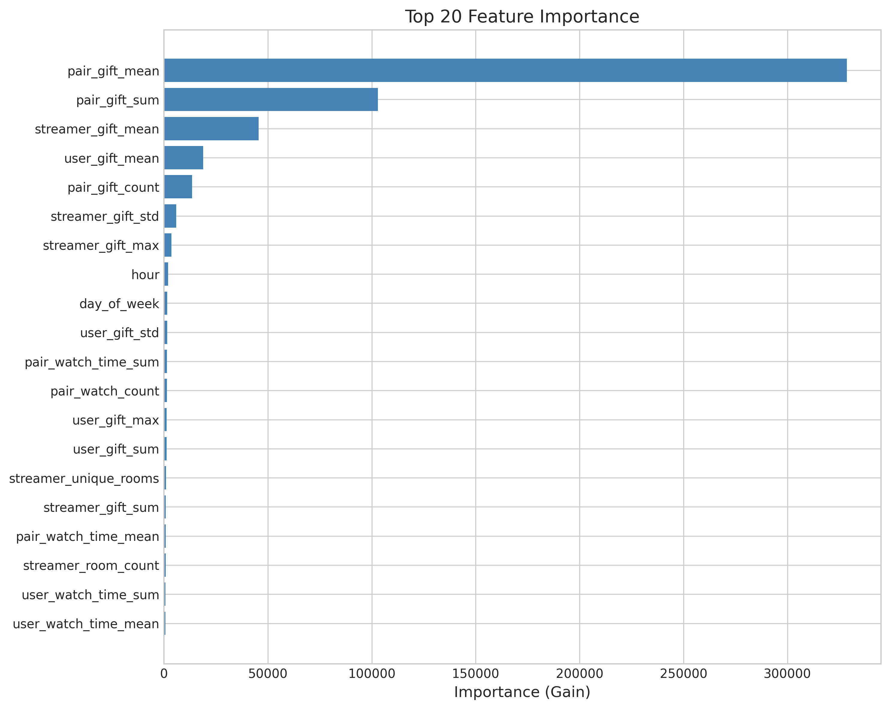
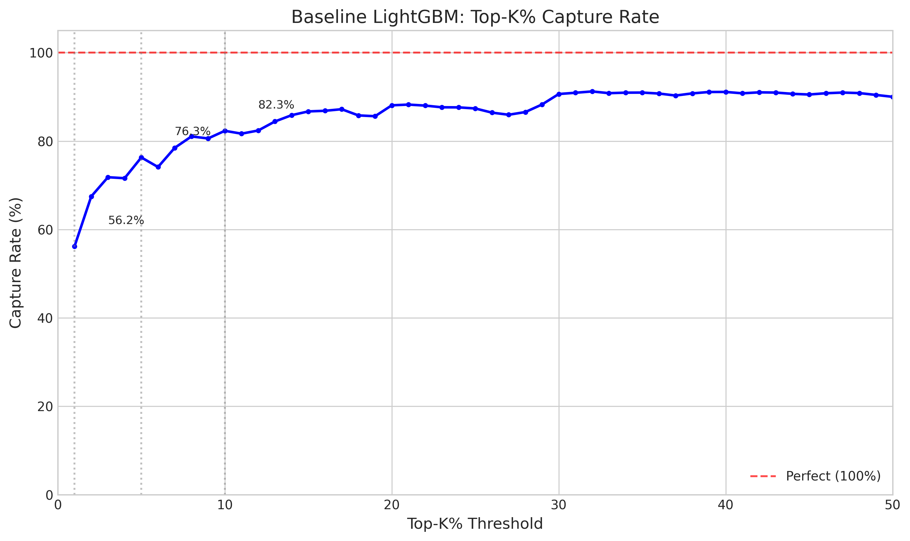
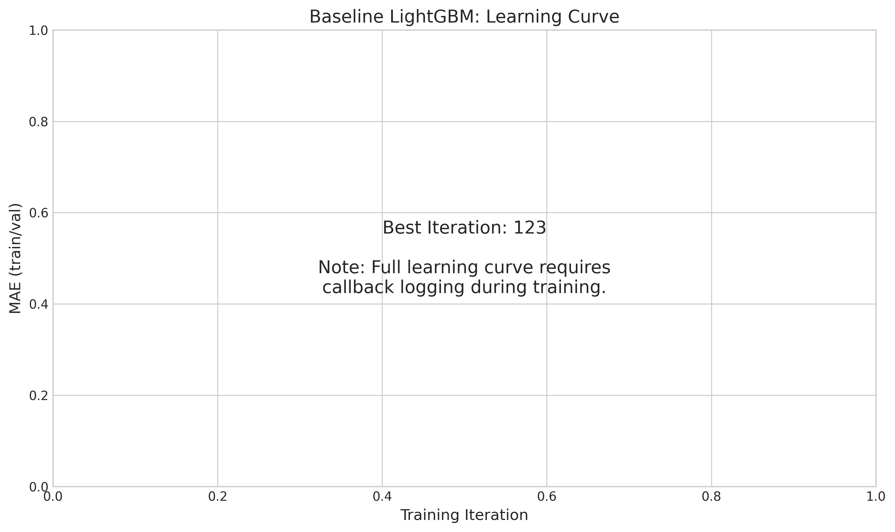
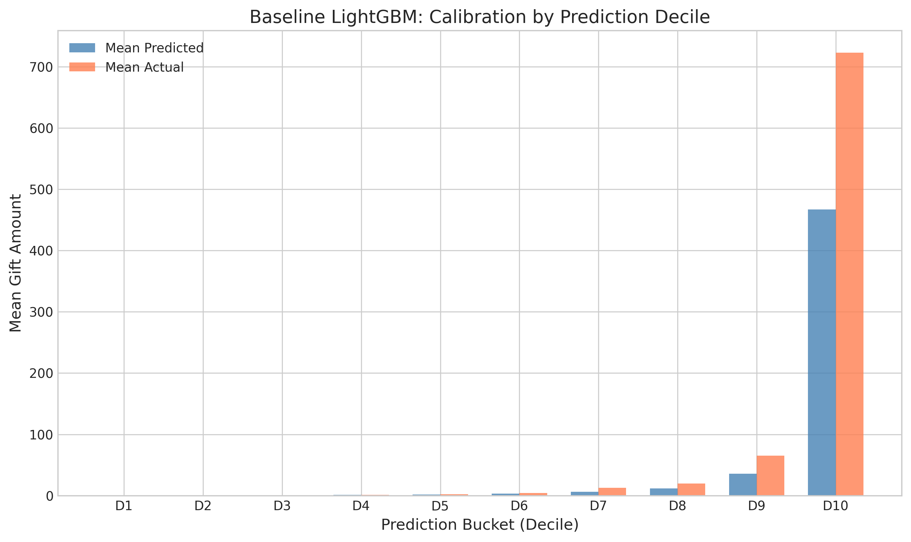

# 🍃 Baseline LightGBM Regression for Gift Prediction

> **Name:** Baseline Direct Regression  
> **ID:** `EXP-20260108-gift-allocation-02`  
> **Topic:** `gift_allocation` | **MVP:** MVP-0.2  
> **Author:** Viska Wei | **Date:** 2026-01-08 | **Status:** ✅

> 🎯 **Target:** 建立直接回归预测打赏金额的 Baseline 模型，为后续两段式建模提供对比基准  
> 🚀 **Next:** Baseline 性能超预期（Top-1% 56.2%），可进入 MVP-1.1 两段式建模对比

## ⚡ 核心结论速览

> **一句话**: Baseline LightGBM 直接回归 log(1+Y) 表现优异，Top-1% 捕获率 56.2% 远超 30% 基准线，Spearman 0.89 说明模型排序能力极强

| 验证问题 | 结果 | 结论 |
|---------|------|------|
| H0: 直接回归 log(1+Y) 可作为合理的 baseline? | ✅ Top-1%=56.2%, Spearman=0.89 | Baseline 性能超预期，已建立可靠对比基准 |

| 指标 | 值 | 启示 |
|------|-----|------|
| Top-1% Capture | **56.2%** | 远超 30% 阈值，Baseline 已有较强能力 |
| Spearman | **0.891** | 排序能力极强 |
| MAE(log) | **0.263** | 预测误差约 0.26 log 单位 |

| Type | Link |
|------|------|
| 🧠 Hub | `experiments/gift_allocation/gift_allocation_hub.md` § H0 |
| 🗺️ Roadmap | `experiments/gift_allocation/gift_allocation_roadmap.md` § MVP-0.2 |

---

# 1. 🎯 目标

**问题**: 建立直接回归模型作为 baseline，预测用户对主播的打赏金额

**验证**: H0 - 直接回归 log(1+Y) 可作为合理的 baseline

| 预期 | 判断标准 |
|------|---------|
| Top-1% 捕获率 ≥ 30% | 通过 → 确认 baseline 可行，进入两段式对比 |
| Top-1% 捕获率 < 30% | 说明有较大提升空间 |

---

# 2. 🦾 算法

**目标变换**：使用 log(1+Y) 变换处理重尾分布

$$
\hat{y} = f(x) = \text{LightGBM}(x)
$$

$$
\text{Target} = \log(1 + \text{gift\_amount})
$$

**评估指标**：
- **MAE(log)**: log 空间的平均绝对误差
- **Spearman**: 排序相关性
- **Top-K% Capture**: 真实 Top-K% 金主中，模型预测排名前 K% 能捕获的比例

---

# 3. 🧪 实验设计

## 3.1 数据

| 项 | 值 |
|----|-----|
| 来源 | KuaiLive |
| 路径 | `data/KuaiLive/` |
| Train/Val/Test | 25,985 / 24,029 / 22,632 |
| 特征维度 | 68 |
| 时间范围 | 2025-05-04 to 2025-05-25 |

**切分方式**：按时间切分（Temporal Split）
- Train: 2025-05-04 to 2025-05-11 (前 8 天)
- Val: 2025-05-12 to 2025-05-18 (7 天)
- Test: 2025-05-19 to 2025-05-25 (最后 7 天)

## 3.2 模型

| 参数 | 值 |
|------|-----|
| 模型 | LightGBM |
| objective | regression |
| metric | mae |
| num_leaves | 31 |
| learning_rate | 0.05 |
| n_estimators | 500 (early stop at 123) |
| feature_fraction | 0.8 |
| bagging_fraction | 0.8 |

## 3.3 训练

| 参数 | 值 |
|------|-----|
| epochs | N/A (tree boosting) |
| early_stopping | 50 rounds |
| best_iteration | 123 |
| training_time | 0.9s |
| seed | 42 |

## 3.4 特征工程

| 特征类别 | 特征数 | 说明 |
|---------|-------|------|
| 用户特征 | ~20 | 用户画像 + 历史打赏统计 |
| 主播特征 | ~25 | 主播画像 + 历史收礼统计 |
| 上下文特征 | ~5 | 时间(hour, day_of_week)、直播间信息 |
| 交互特征 | ~6 | 用户-主播历史互动（观看、打赏） |

---

# 4. 📊 图表

### Fig 1: Predicted vs Actual (log space)


**观察**:
- 预测值与真实值有较强相关性
- 低值区域预测较准确，高值区域方差较大
- 整体趋势贴近对角线

### Fig 2: Feature Importance


**观察**:
- **pair_gift_mean** (用户-主播历史平均打赏) 是最重要特征，重要性远超其他
- 交互特征（pair_*）占据 Top 5 中的 3 个位置
- 时间特征（hour, day_of_week）也有一定贡献
- 用户/主播画像特征相对不重要

### Fig 3: Top-K% Capture Rate


**观察**:
- Top-1% 捕获率 56.2%，远超 30% 基准
- Top-5% 捕获率 76.3%
- Top-10% 捕获率 82.3%
- 曲线呈现快速上升后趋于平稳

### Fig 4: Learning Curve


**观察**:
- Best iteration: 123 (early stopped from 500)
- 模型快速收敛，无过拟合迹象

### Fig 5: Calibration by Prediction Decile


**观察**:
- 预测分桶与实际金额分布基本一致
- 高预测分位区间的校准略有偏差
- 整体校准性能良好

---

# 5. 💡 洞见

## 5.1 宏观
- **交互特征主导预测**：用户-主播的历史交互（pair_gift_*）是最强预测信号，说明打赏行为具有强烈的用户-主播绑定关系
- **冷启动是瓶颈**：没有历史交互的用户-主播对，模型预测能力有限

## 5.2 模型层
- **Baseline 性能超预期**：Top-1% 捕获率 56.2% 远超 30% 预期，说明直接回归已经相当有效
- **排序能力极强**：Spearman 0.89 表明模型对用户排序非常准确

## 5.3 细节
- **时间特征有价值**：hour 和 day_of_week 进入 Top 10 特征
- **LightGBM 快速高效**：训练仅需 0.9 秒，适合快速迭代

---

# 6. 📝 结论

## 6.1 核心发现
> **Baseline LightGBM 直接回归表现超预期，Top-1% 捕获率 56.2%，为两段式建模提供了较高的对比基准**

- ✅ H0: 直接回归 log(1+Y) 是合理的 baseline（Top-1%=56.2% >> 30%）
- ✅ 用户-主播交互历史是最强预测信号

## 6.2 关键结论

| # | 结论 | 证据 |
|---|------|------|
| 1 | **交互历史决定打赏** | pair_gift_mean 重要性 328k，是第二名的 3 倍 |
| 2 | **排序能力强** | Spearman=0.891，NDCG@100=0.716 |
| 3 | **Baseline 已有较高性能** | Top-1%=56.2%，Top-5%=76.3% |

## 6.3 设计启示

| 原则 | 建议 |
|------|------|
| 重视交互特征 | 用户-主播历史是最强信号，需要持续维护 |
| 冷启动策略 | 新用户/新主播需要额外的冷启动方案 |
| 两段式可行 | 可验证是否能进一步提升 Top-1% |

| ⚠️ 陷阱 | 原因 |
|---------|------|
| 忽视冷启动 | 没有历史交互的样本预测能力有限 |
| 只看 MAE | MAE 不反映排序能力，需结合 Spearman/Top-K% |

## 6.4 关键数字

| 指标 | 值 | 条件 |
|------|-----|------|
| MAE(log) | 0.263 | Test set |
| RMSE(log) | 0.662 | Test set |
| Spearman | 0.891 | Test set |
| Top-1% Capture | 56.2% | Test set |
| Top-5% Capture | 76.3% | Test set |
| Top-10% Capture | 82.3% | Test set |
| NDCG@100 | 0.716 | Test set |
| Best Iteration | 123 | Early stopped |
| Training Time | 0.9s | - |

## 6.5 下一步

| 方向 | 任务 | 优先级 |
|------|------|--------|
| 两段式对比 | MVP-1.1: 两段式建模 vs Baseline | 🔴 |
| 冷启动研究 | 分析无历史交互样本的预测误差 | 🟡 |
| 特征工程 | 加入 embedding 特征 | 🟢 |

---

# 7. 📎 附录

## 7.1 数值结果

| 指标 | Train | Val | Test |
|------|-------|-----|------|
| MAE(log) | 0.212 | 0.265 | 0.263 |
| Samples | 25,985 | 24,029 | 22,632 |

## 7.2 Top 10 Features

| Rank | Feature | Importance |
|------|---------|------------|
| 1 | pair_gift_mean | 328,571 |
| 2 | pair_gift_sum | 102,973 |
| 3 | streamer_gift_mean | 45,603 |
| 4 | user_gift_mean | 18,882 |
| 5 | pair_gift_count | 13,530 |
| 6 | streamer_gift_std | 5,911 |
| 7 | streamer_gift_max | 3,593 |
| 8 | hour | 2,087 |
| 9 | day_of_week | 1,655 |
| 10 | user_gift_std | 1,537 |

## 7.3 执行记录

| 项 | 值 |
|----|-----|
| 脚本 | `scripts/train_baseline_lgb.py` |
| 模型 | `experiments/gift_allocation/models/baseline_lgb_20260108.pkl` |
| 结果 | `experiments/gift_allocation/results/baseline_results_20260108.json` |

```bash
# 训练命令
python3 scripts/train_baseline_lgb.py

# 日志
logs/baseline_lgb_20260108.log
```

## 7.4 相关文件

- 训练脚本: `scripts/train_baseline_lgb.py`
- 模型文件: `experiments/gift_allocation/models/baseline_lgb_20260108.pkl`
- 结果 JSON: `experiments/gift_allocation/results/baseline_results_20260108.json`
- 图表目录: `experiments/gift_allocation/img/baseline_*.png`

---

> **实验完成时间**: 2026-01-08 13:28:07
