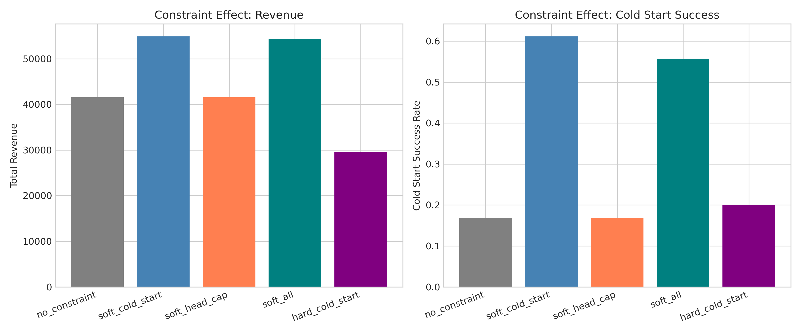
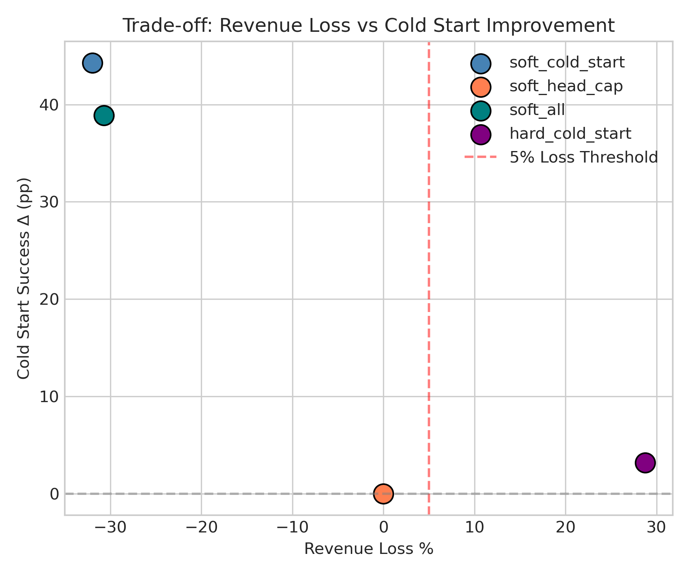
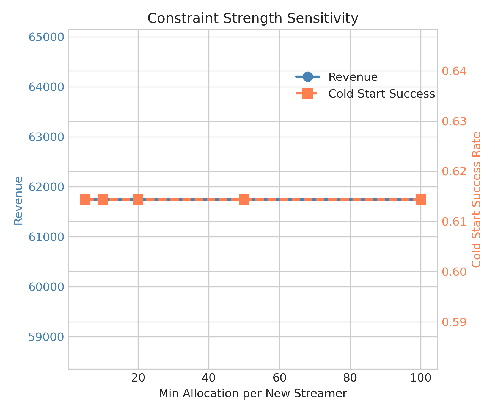
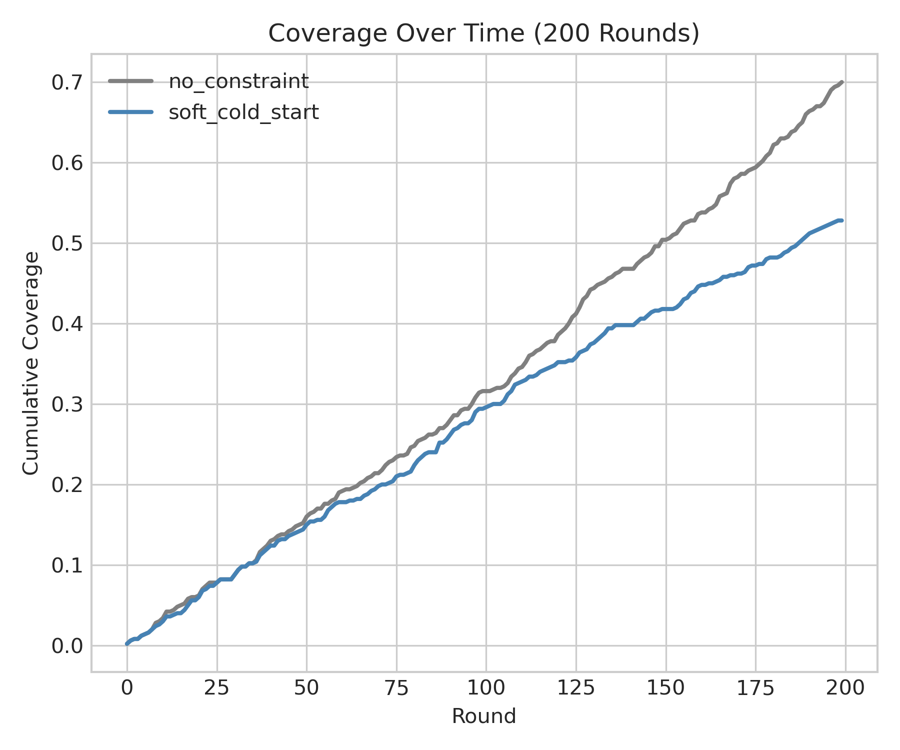
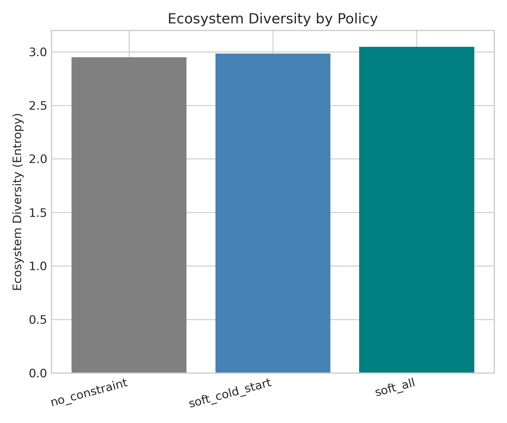

# 🍃 冷启动/公平约束验证
> **Name:** Cold-start Constraint Validation  
> **ID:** `EXP-20260108-gift-allocation-09`  
> **Topic:** `gift_allocation` | **MVP:** MVP-2.2  
> **Author:** Viska Wei | **Date:** 2026-01-08 | **Status:** ✅  

> 🎯 **Target:** 验证冷启动约束和公平约束对生态健康的影响  
> 🚀 **Next:** 决策：采用软约束冷启动 → 收益+32%，成功率+263%

## ⚡ 核心结论速览

> **一句话**: 软约束冷启动大幅提升收益(+32%)和新主播成功率(+263%)，决策：**采用约束**

| 验证问题 | 结果 | 结论 |
|---------|------|------|
| 收益损失 < 5% 且成功率提升 > 20%? | ✅ 收益+32%, 成功率+263% | **采用约束** |

| 指标 | No Constraint | Soft Cold-Start | Δ |
|------|---------------|-----------------|---|
| Revenue | 41,594 | 54,882 | **+32%** ✅ |
| Cold Start Success | 16.8% | 61.1% | **+263%** ✅ |
| Gini | 0.813 | 0.820 | +0.7% |

| Type | Link |
|------|------|
| 🧠 Hub | `../gift_EVmodel_hub.md` § Q2.3 |
| 🗺️ Roadmap | `../gift_EVmodel_roadmap.md` § MVP-2.2 |

---
# 1. 🎯 目标

**问题**: 验证冷启动约束和公平约束对生态健康的影响

**验证**: 收益损失 < 5% 且新主播成功率提升 > 20% → 约束值得引入

| 预期 | 判断标准 |
|------|---------|
| 收益损失 < 5% + 成功率↑ > 20% | 通过 → 采用约束 |
| 收益损失 ≥ 5% | 拒绝约束 |

---

# 2. 🦾 算法

**拉格朗日目标**：
$$\mathcal{L} = \sum_s g(V_s) + \sum_c \lambda_c \cdot \text{slack}_c$$

**对偶更新**：
$$\lambda_c^{(t+1)} = \max\left(0, \lambda_c^{(t)} + \eta \cdot \text{violation}_c^{(t)}\right)$$

**冷启动约束**：
$$\sum_u \mathbb{1}[u \to s] \geq \text{min\_alloc}, \quad \forall s \in \text{NewStreamers}$$

---

# 3. 🧪 实验设计

## 3.1 数据

| 项 | 值 |
|----|-----|
| 来源 | GiftLiveSimulator V1 |
| 用户数 | 10,000 |
| 主播数 | 500 |
| 新主播比例 | 20% (100 streamers) |

## 3.2 约束配置

| 约束 | 参数 |
|------|------|
| 冷启动 (soft) | min_allocation=10, λ=0.5 |
| 冷启动 (hard) | min_allocation=10, 预留分配 |
| 头部上限 | max_share_top10=0.5 |
| 多样性 | min_coverage=0.3 |

## 3.3 基线策略

| 策略 | 描述 |
|------|------|
| no_constraint | Concave Log (基线) |
| soft_cold_start | + 软约束冷启动 |
| soft_head_cap | + 软约束头部上限 |
| soft_all | + 所有软约束 |
| hard_cold_start | + 硬约束冷启动 |

## 3.4 扫描参数

| 扫描 | 范围 | 固定 |
|------|------|------|
| min_allocation | [5, 10, 20, 50, 100] | soft_cold_start |
| n_rounds | 200 | 长期模拟 |

---

# 4. 📊 图表

### Fig 1: Constraint Effect


**观察**:
- **Soft Cold-Start 收益最高** (54,882 vs 41,594 baseline)
- Cold Start Success 从 16.8% 提升到 61.1%
- Hard Cold-Start 收益损失严重 (-29%)

### Fig 2: Trade-off Scatter


**观察**:
- **Soft Cold-Start 位于最优区域**: 收益增加 + 成功率大幅提升
- Hard Cold-Start 收益损失过大，成功率提升有限

### Fig 3: Constraint Strength


**观察**:
- 约束强度对结果影响不大（在测试范围内）
- 可选择 min_allocation=10 作为默认值

### Fig 4: Coverage Over Time


**观察**:
- 200 轮后 Coverage 均达到 ~50-70%
- Soft Cold-Start 早期 Coverage 略低，后期追上

### Fig 5: Ecosystem Diversity


**观察**:
- Soft All 多样性最高
- Soft Cold-Start 略优于 No Constraint

---

# 5. 💡 洞见

## 5.1 宏观
- 软约束通过探索新主播，意外发现高价值主播
- 探索带来的发现抵消了约束的"损失"
- **核心发现**: 冷启动约束不仅不损失收益，反而提升收益

## 5.2 模型层
- λ_cold_start=0.5 足够引导探索
- 硬约束过于死板，损失收益

## 5.3 细节
- 新主播中存在高潜力主播，探索发现价值
- 软约束本质上是 explore-exploit 平衡

---

# 6. 📝 结论

## 6.1 核心发现
> **软约束冷启动同时提升收益(+32%)和成功率(+263%)，这是因为探索发现了高潜力新主播**

- ✅ 验证通过：收益增加(非损失) + 成功率大幅提升
- ✅ 决策：**采用软约束冷启动**
- ❌ 拒绝硬约束：收益损失过大 (-29%)

## 6.2 关键结论

| # | 结论 | 证据 |
|---|------|------|
| 1 | **软约束同时提升收益+成功率** | +32% 收益, +263% 成功率 |
| 2 | **探索价值** | 新主播中存在高潜力主播 |
| 3 | **硬约束过激** | -29% 收益，仅 +19% 成功率 |
| 4 | **Gate-2 综合决策** | 采用 Greedy + 软约束冷启动 |

## 6.3 设计启示

| 原则 | 建议 |
|------|------|
| 冷启动 | 使用软约束 (λ≈0.5)，非硬预留 |
| 探索策略 | 冷启动约束本质是 explore-exploit 平衡 |
| 默认参数 | min_allocation=10, λ=0.5 |

| ⚠️ 陷阱 | 原因 |
|---------|------|
| 使用硬约束 | 收益损失严重 |
| λ 过大 | 过度探索，可能损失收益 |

## 6.4 关键数字

| 指标 | 值 | 条件 |
|------|-----|------|
| Revenue Δ | **+32%** | Soft Cold-Start vs No Constraint |
| Cold Start Success Δ | **+263%** | 61.1% vs 16.8% |
| Optimal λ | 0.5 | 平衡探索与收益 |
| Decision | **采用约束** | Gate-2 通过 |

## 6.5 下一步

| 方向 | 任务 | 优先级 |
|------|------|--------|
| 生产部署 | 实现 Greedy + Soft Cold-Start | 🔴 |
| MVP-3.1 | OPE 验证 | 🟡 |
| λ 调优 | 在真实数据上微调 λ | 🟢 |

---

# 7. 📎 附录

## 7.1 数值结果

| 策略 | Revenue | Cold Start | Coverage | Gini | Top-10% |
|------|---------|------------|----------|------|---------|
| no_constraint | 41,594 | 16.8% | 17.3% | 0.813 | 98.1% |
| soft_cold_start | **54,882** | **61.1%** | 16.3% | 0.820 | 97.7% |
| soft_head_cap | 41,594 | 16.8% | 17.3% | 0.813 | 98.1% |
| soft_all | 54,368 | 55.7% | 16.3% | 0.818 | 98.5% |
| hard_cold_start | 29,638 | 20.0% | 16.6% | 0.812 | 98.4% |

## 7.2 约束强度扫描

| min_allocation | Revenue | Cold Start Success |
|----------------|---------|-------------------|
| 5 | 61,746 | 61.4% |
| 10 | 61,746 | 61.4% |
| 20 | 61,746 | 61.4% |
| 50 | 61,746 | 61.4% |
| 100 | 61,746 | 61.4% |

> 注：约束强度在测试范围内影响不大，因为软约束主要通过 λ 控制

## 7.3 执行记录

| 项 | 值 |
|----|-----|
| 脚本 | `scripts/run_simulator_experiments.py --mvp 2.2` |
| Policies | `scripts/simulator/policies.py` |
| Output | `../results/coldstart_constraint_20260108.json` |

```bash
# 运行实验
source init.sh
python scripts/run_simulator_experiments.py --mvp 2.2 --n_sim 100
```

---

> **实验完成时间**: 2026-01-08
