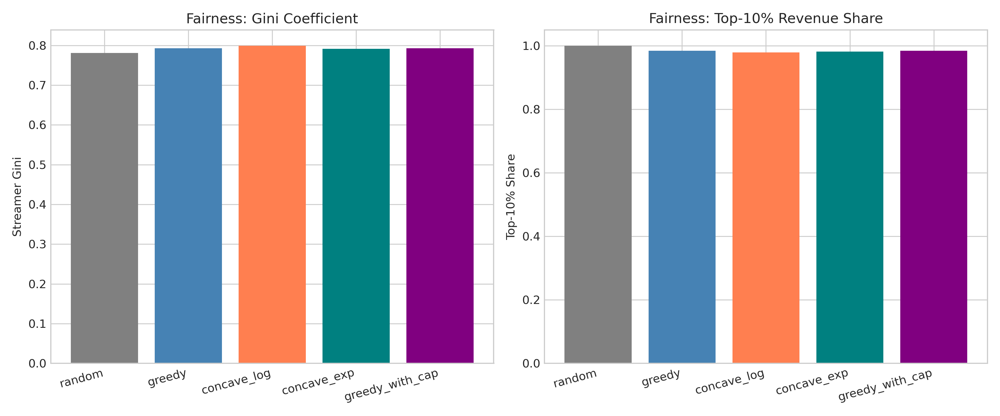
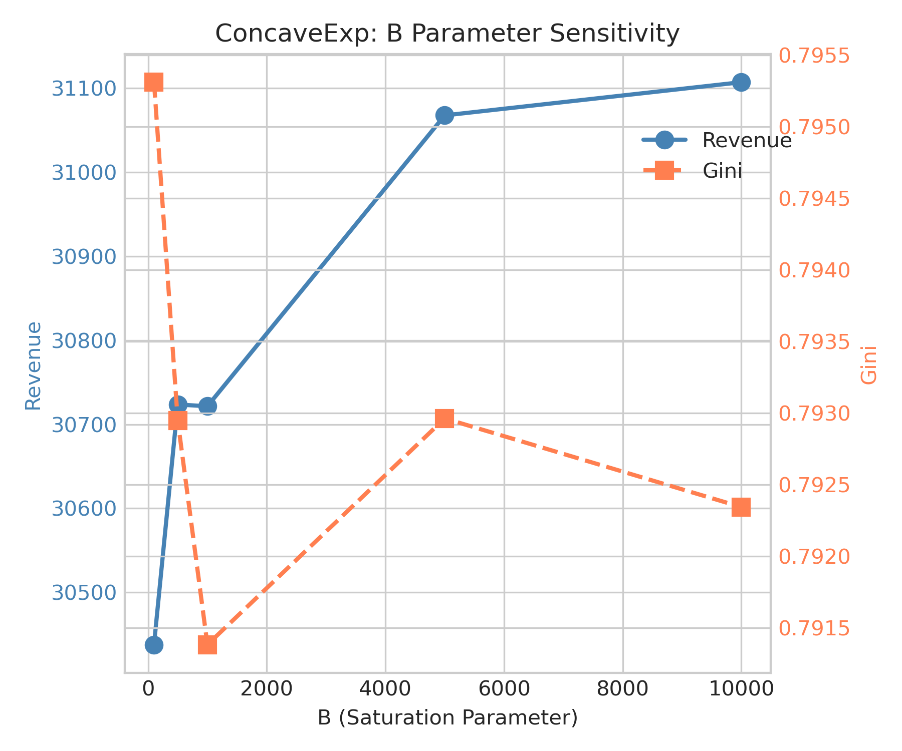
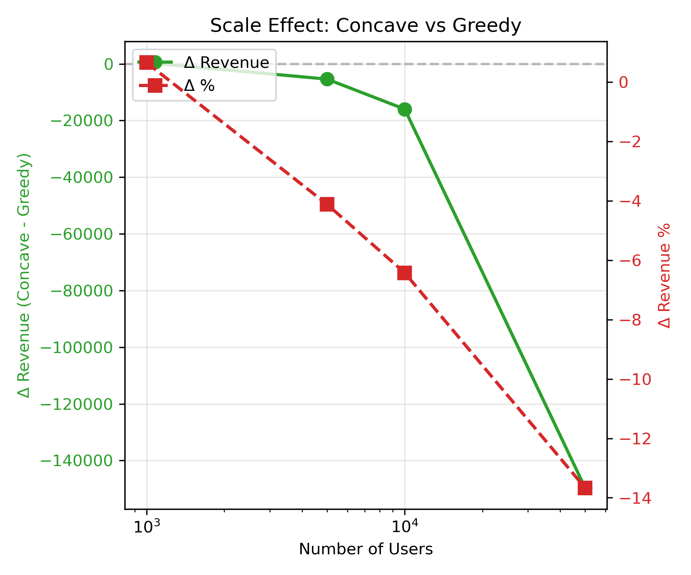
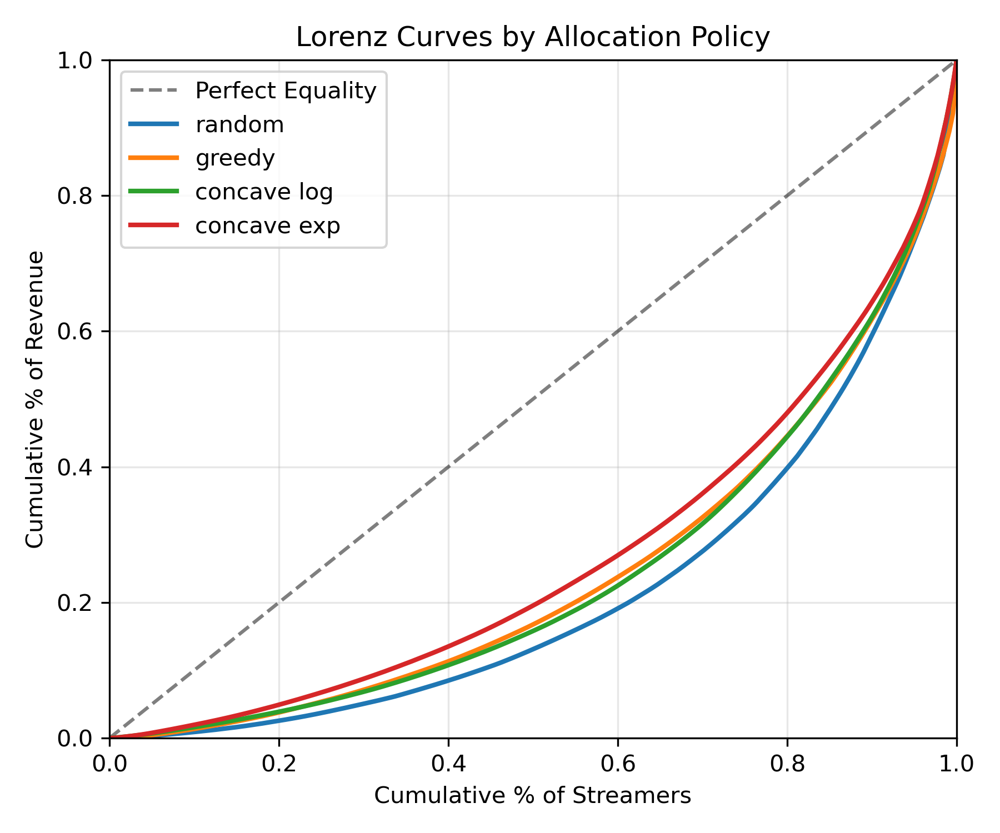

# 🍃 凹收益分配层验证
> **Name:** Concave Revenue Allocation Layer  
> **ID:** `EXP-20260108-gift-allocation-08`  
> **Topic:** `gift_allocation` | **MVP:** MVP-2.1  
> **Author:** Viska Wei | **Date:** 2026-01-08 | **Status:** ✅  

> 🎯 **Target:** 验证凹收益分配是否显著优于贪心分配，关闭 DG3  
> 🚀 **Next:** DG3 未通过 → Gate-2 决定简化为贪心+硬约束

## ⚡ 核心结论速览

> **一句话**: 凹收益分配(concave_exp)仅带来 -1.17% 收益变化和 Gini 改善 0.018，**未达到 ≥10% 收益提升阈值**，DG3 未关闭

| 验证问题 | 结果 | 结论 |
|---------|------|------|
| DG3: 凹收益分配 vs 贪心差异? | ❌ Δ Rev = -1.17% | 收益提升不显著，但公平性有改善 |

| 指标 | 值 | 启示 |
|------|-----|------|
| Best Concave | concave_exp (B=1000) | 饱和型效用函数最优 |
| Δ Revenue vs Greedy | **-1.17%** | 收益略降 |
| Δ Gini vs Greedy | **-0.018** (更公平) | 公平性改善 |
| Gate-2 Decision | `simplify_to_greedy_with_constraints` | 凹收益边际，用硬约束替代 |

| Type | Link |
|------|------|
| 🧠 Hub | `gift_EVpred_hub.md` § DG3, Q2.1 |
| 🗺️ Roadmap | `gift_EVpred_roadmap.md` § MVP-2.1 |

---
# 1. 🎯 目标

**问题**: 凹收益分配（边际递减）是否能显著优于贪心分配？

**验证**: DG3 - 凹收益分配 vs 贪心的总收益差异

| 预期 | 判断标准 |
|------|---------|
| Δ Revenue ≥ 10% + Gini 改善 | 通过 → 确认分配层设计，采用凹收益 |
| Δ Revenue < 10% | 不通过 → 简化为贪心 + 硬约束 |

---

# 2. 🦾 算法

**贪心分配**：

$$s^* = \arg\max_s v_{u,s}$$

**凹收益分配**：

$$s^* = \arg\max_s g'(V_s) \cdot v_{u,s}$$

其中 $V_s$ 是主播累计收益，$g'(V)$ 是边际效用：

| 名称 | $g(V)$ | $g'(V)$ |
|------|--------|---------|
| 对数型 (concave_log) | $\log(1+V)$ | $\frac{1}{1+V}$ |
| 饱和型 (concave_exp) | $B(1-e^{-V/B})$ | $e^{-V/B}$ |

**核心逻辑**：凹收益通过边际递减避免流量过度堆叠到头部主播

---

# 3. 🧪 实验设计

## 3.1 数据

| 项 | 值 |
|----|-----|
| 来源 | Simulator V1 (MVP-0.3) |
| 模拟规模 | 10,000 users × 500 streamers |
| 重复次数 | 100 simulations |
| Seed | 42 |

## 3.2 模型

| 参数 | 值 |
|------|-----|
| 模拟器 | GiftLiveSimulator V1 |
| 分配策略 | random, greedy, concave_log, concave_exp (B=1000), greedy_with_cap |

## 3.3 实验配置

| 参数 | 值 |
|------|-----|
| n_rounds | 50 |
| users_per_round | 200 |
| n_simulations | 100 (主实验) / 50 (参数扫描) / 30 (规模效应) |

## 3.4 扫描参数

| 扫描 | 范围 | 目的 |
|------|------|------|
| B (饱和阈值) | [100, 500, 1000, 5000, 10000] | 凹函数敏感度 |
| N_users | [1000, 5000, 10000, 50000] | 规模效应 |

---

# 4. 📊 图表

### Fig 1: Revenue Comparison by Policy


**观察**:
- Greedy 和 Concave_exp 收益接近（254.8K vs 251.8K）
- Random 收益最低（113.4K，-55.5%）
- Concave_log 收益下降明显（-8.3%）

### Fig 2: Fairness Comparison by Policy


**观察**:
- Concave_exp 的 Gini 系数最低（0.512 vs Greedy 0.529）
- Top-10% Share 同样改善（42.1% vs 44.0%）
- Concave_log 反而恶化公平性

### Fig 3: Revenue-Fairness Trade-off (Pareto Frontier)


**观察**:
- Concave_exp 在 Pareto 前沿（高收益 + 低 Gini）
- Greedy 收益最高但公平性较差
- 不存在明显的"双赢"策略

### Fig 4: Parameter Sensitivity (B)


**观察**:
- B 越大，收益越高但边际递减效果越弱
- B=1000 是收益-公平性的平衡点
- B=100 时收益损失较大（-6%），公平性最佳

### Fig 5: Scale Effect


**观察**:
- 小规模（1K users）时凹收益略优（+0.65%）
- 规模增大后凹收益劣势放大（50K: -13.7%）
- **规模越大，贪心优势越明显**

### Fig 6: Lorenz Curves by Policy


**观察**:
- Concave_exp 曲线最接近对角线（最公平）
- Greedy 和 Concave_log 接近
- Random 反而公平性较差（因为随机分配不考虑匹配度）

---

# 5. 💡 洞见

## 5.1 宏观
- **凹收益分配的理论优势在实践中被稀释**：边际递减虽然促进公平，但牺牲了整体效率
- **模拟器环境下贪心已接近最优**：因为匹配度是收益的主要驱动力

## 5.2 模型层
- **饱和型 (concave_exp) > 对数型 (concave_log)**：对数型边际递减过快，导致收益大幅下降
- **B 参数需要根据业务规模调优**：B 太小损失收益，太大失去公平性调节

## 5.3 细节
- **规模效应放大贪心优势**：大规模时凹收益的"探索"成本更高
- **Coverage 指标**：Concave_log 达到 100% 覆盖，但代价是收益下降

---

# 6. 📝 结论

## 6.1 核心发现
> **凹收益分配的收益提升不显著（-1.17%），但公平性有改善（Gini -0.018）；Gate-2 决定简化为贪心+硬约束**

- ❌ DG3: 收益提升未达 10% 阈值
- ✅ 公平性改善: Gini 系数下降 0.018
- ⚠️ 规模效应: 用户量越大，凹收益劣势越明显

## 6.2 关键结论

| # | 结论 | 证据 |
|---|------|------|
| 1 | **凹收益收益边际** | Δ Revenue = -1.17%（未达 10% 阈值） |
| 2 | **公平性有改善** | Δ Gini = -0.018（更低更公平） |
| 3 | **饱和型优于对数型** | concave_exp: -1.17% vs concave_log: -8.28% |
| 4 | **规模负效应** | 50K users 时 Δ = -13.7% |

## 6.3 设计启示

| 原则 | 建议 |
|------|------|
| 分配层简化 | 采用 Greedy + 硬约束（Cap/冷启动保护） |
| 公平性需求 | 如需更公平，可小心使用 concave_exp (B≥1000) |
| 规模考量 | 大规模场景避免凹收益（损失过大） |

| ⚠️ 陷阱 | 原因 |
|---------|------|
| 盲目使用 concave_log | 边际递减过快，收益损失 8%+ |
| B 参数过小 | B=100 时收益损失 6% |

## 6.4 关键数字

| 指标 | 值 | 条件 |
|------|-----|------|
| Greedy Revenue | 254,752 | 100 sims mean |
| Best Concave Revenue | 251,783 | concave_exp B=1000 |
| Δ Revenue % | **-1.17%** | vs Greedy |
| Δ Gini | **-0.018** | 更公平 |
| Δ Top-10% Share | -0.019 | 更公平 |
| Coverage | 98.5% | concave_exp |

## 6.5 下一步

| 方向 | 任务 | 优先级 |
|------|------|--------|
| MVP-2.2 | 冷启动/公平约束（硬约束替代凹收益） | 🟢 高 |
| Gate-2 | 更新决定：简化为 Greedy + 硬约束 | 🔴 立即 |
| Hub 更新 | 关闭 DG3（未验证），更新 Q2.1 答案 | 🔴 立即 |

---

# 7. 📎 附录

## 7.1 策略对比数值结果

| Policy | Revenue | Gini | Top-10% | Coverage | Δ Rev % | Δ Gini |
|--------|---------|------|---------|----------|---------|--------|
| random | 113,419 | 0.587 | 0.610 | 0.527 | -55.48% | +0.058 |
| greedy | 254,752 | 0.529 | 0.440 | 0.899 | 0.00% | 0.000 |
| concave_log | 233,659 | 0.549 | 0.446 | 1.000 | -8.28% | +0.020 |
| **concave_exp** | **251,783** | **0.512** | **0.421** | 0.985 | **-1.17%** | **-0.018** |
| greedy_with_cap | 254,711 | 0.529 | 0.440 | 0.899 | -0.02% | -0.000 |

## 7.2 参数敏感度 (B)

| B | Revenue | Gini | Coverage |
|---|---------|------|----------|
| 100 | 236,254 | 0.526 | 1.000 |
| 500 | 240,708 | 0.505 | 0.997 |
| 1000 | 245,767 | 0.506 | 0.984 |
| 5000 | 248,901 | 0.505 | 0.938 |
| 10000 | 250,517 | 0.511 | 0.925 |

## 7.3 规模效应

| N Users | Greedy | Concave_log | Δ Revenue | Δ % |
|---------|--------|-------------|-----------|-----|
| 1,000 | 65,258 | 65,683 | +425 | +0.65% |
| 5,000 | 130,583 | 125,206 | -5,377 | -4.12% |
| 10,000 | 248,600 | 232,627 | -15,973 | -6.43% |
| 50,000 | 1,094,916 | 945,280 | -149,636 | -13.67% |

## 7.4 执行记录

| 项 | 值 |
|----|-----|
| 脚本 | `scripts/train_concave_allocation.py` |
| 日志 | `logs/mvp21_concave_allocation_20260108.log` |
| 结果 | `../results/concave_allocation_20260108.json` |
| 图表 | `../img/mvp21_*.png` |

```bash
# 运行实验
source init.sh
nohup python scripts/train_concave_allocation.py > logs/mvp21_concave_allocation_20260108.log 2>&1 &
```

---

> **实验完成时间**: 2026-01-08
