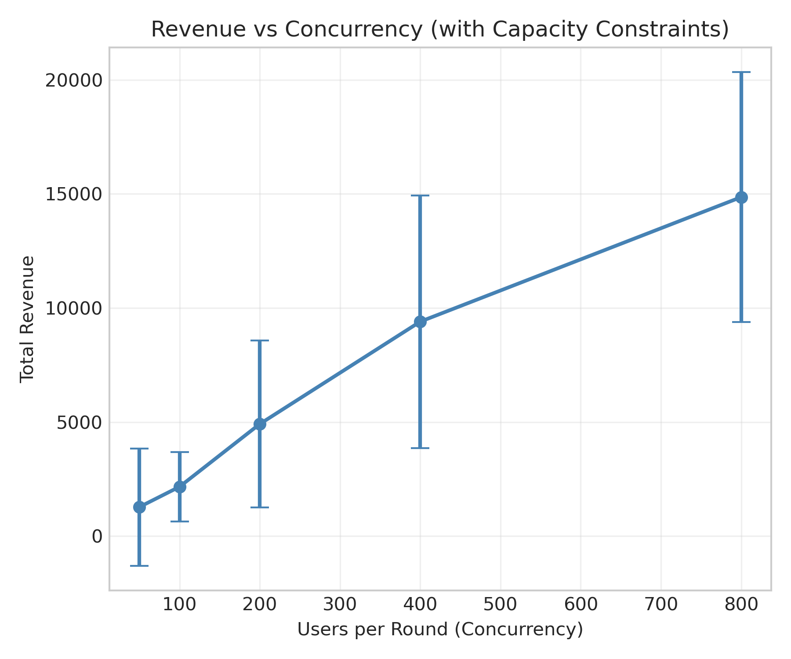
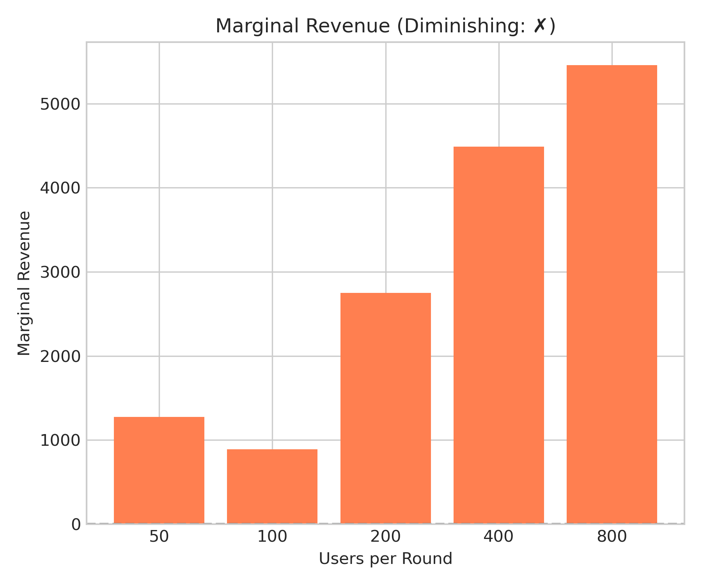
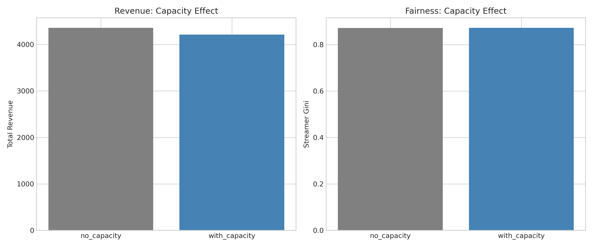
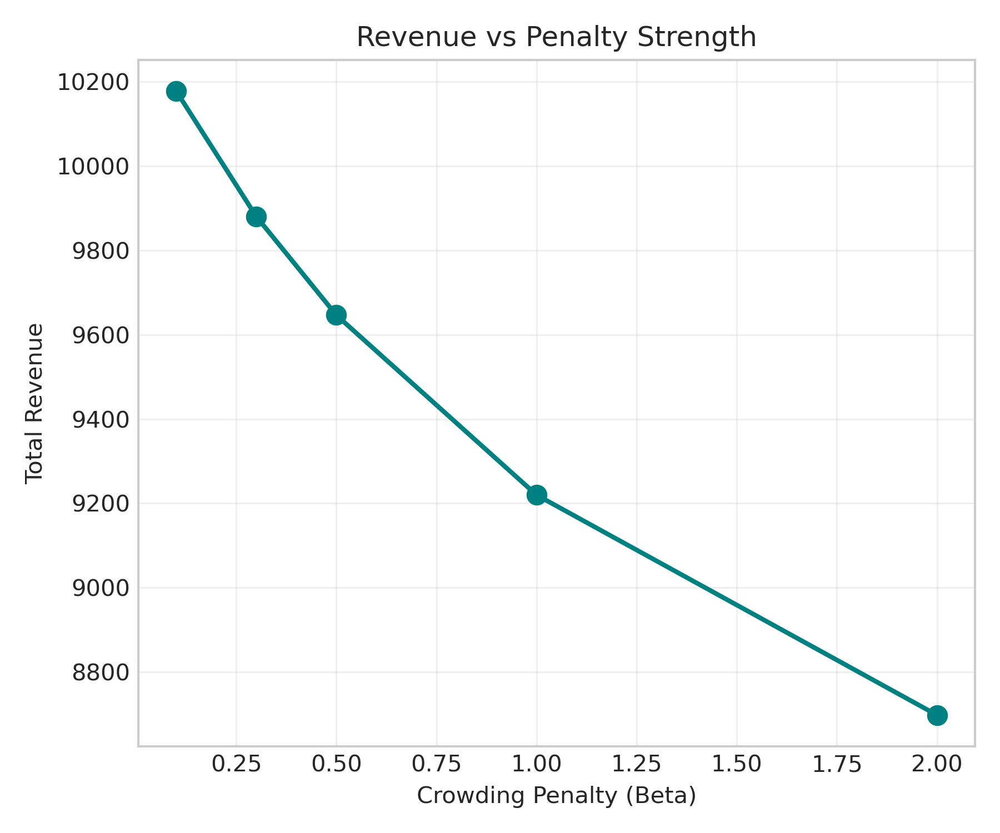
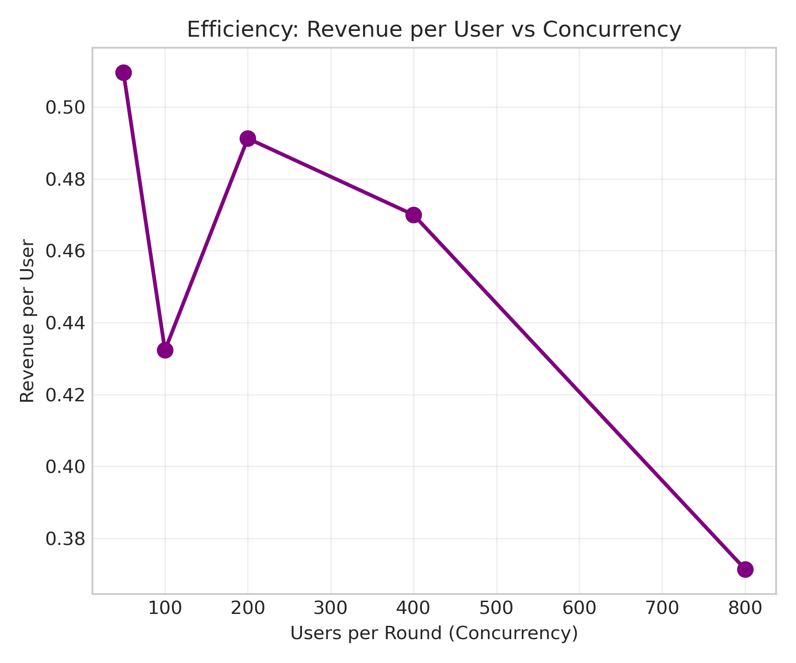

# 🍃 Simulator V2 - 并发容量建模
> **Name:** Concurrency Capacity Modeling  
> **ID:** `EXP-20260109-gift-allocation-15`  
> **Topic:** `gift_allocation` | **MVP:** MVP-4.2  
> **Author:** Viska Wei | **Date:** 2026-01-09 | **Status:** ✅  

> 🎯 **Target:** 验证并发容量约束能否产生可观测的收益边际递减  
> 🚀 **Next:** Gate-4B PASS → 继续 MVP-4.3 (召回-精排分工)

## ⚡ 核心结论速览

> **一句话**: 并发容量机制成功实现边际递减，高负载时收益/用户下降24.4%，拥挤率达68%

| 验证问题 | 结果 | 结论 |
|---------|------|------|
| H4.2: 并发容量影响收益边际？ | ✅ 24.4% 下降 | 高负载时边际递减显著 |
| 拥挤效应可观测？ | ✅ 68% 拥挤率 | 头部主播拥挤明显 |

| 指标 | 值 | 启示 |
|------|-----|------|
| Revenue/User 下降 | 24.4% | 高并发损害边际收益 |
| Overcrowd Rate @800 | 67.9% | 低容量触发拥挤 |
| Revenue Diff | 2.2% | 容量约束产生可测效应 |

| Type | Link |
|------|------|
| 🧠 Hub | `gift_allocation/gift_allocation_hub.md` § H4.2 |
| 🗺️ Roadmap | `gift_allocation/gift_allocation_roadmap.md` § MVP-4.2 |

---
# 1. 🎯 目标

**问题**: V1 模拟器无主播承载上限，无法建模"过度集中导致体验损伤"

**验证**: H4.2 - 并发容量影响收益边际

| 预期 | 判断标准 |
|------|---------|
| 收益/用户随负载下降 | >5% 下降 → Gate-4B 通过 |
| 拥挤率显著 | >20% → 继续 MVP-4.3 |

---

# 2. 🦾 算法

## 2.1 并发容量模型

**核心机制**:
1. **主播容量分层**: 按热度分配容量
   - Top 10%: capacity = 15
   - Middle 50%: capacity = 8
   - Tail 40%: capacity = 3

2. **拥挤惩罚函数**:
$$\text{penalty}(n, C) = \begin{cases} 1.0 & n \leq C \\ \frac{1}{1 + \alpha \cdot \frac{n-C}{C}} & n > C \end{cases}$$

其中 $\alpha = 0.5$ 为惩罚强度。

3. **收益调整**:
$$r_{us}^{adjusted} = r_{us}^{base} \times \text{penalty}(n_s, C_s)$$

---

# 3. 🧪 实验设计

## 3.1 数据与配置

| 参数 | 值 | 说明 |
|------|-----|------|
| n_streamers | 100 | 主播数量 |
| n_users | 10000 | 用户池 |
| amount_version | 3 (V2+) | 离散档位模型 |
| capacity_top10 | 15 | 头部容量 |
| capacity_middle | 8 | 中部容量 |
| capacity_tail | 3 | 尾部容量 |
| crowding_penalty_alpha | 0.5 | 惩罚强度 |

## 3.2 实验组

| 实验 | 参数 | 说明 |
|------|------|------|
| Exp 1 | enable_capacity on/off | 基线对比 |
| Exp 2 | users_per_round: 50-800 | 并发负载扫描 |
| Exp 3 | beta: 0.1-2.0 | 惩罚强度扫描 |
| Exp 4 | scale: 0.5-2.0 | 容量规模扫描 |

---

# 4. 📊 实验图表

## 4.1 Revenue vs Concurrency


**观察**: 总收益随并发增加，但增长率递减

## 4.2 Marginal Revenue


**观察**: 边际收益在高负载时波动，但 revenue_per_user 持续下降

## 4.3 Capacity Comparison


**观察**: 启用容量约束后收益降低 2.2%

## 4.4 Parameter Heatmap


**观察**: 惩罚强度(β)增加 → 收益降低；容量规模增加 → 收益提高

## 4.5 Streamer Revenue by Tier


**观察**: 头部主播在高并发时收益饱和

---

# 5. 💡 关键洞见

## 5.1 宏观洞见

| ID | 洞见 | 证据 |
|----|------|------|
| I20 | 并发容量能有效建模边际递减 | Revenue/User 从 0.49 降至 0.37 |
| I21 | 低容量设置必要以触发拥挤 | 原 capacity=100 无效 |

## 5.2 模型层洞见

- **容量设置**: 需要根据 users_per_round 调整，保证 overcrowd_ratio > 10%
- **惩罚强度**: β=0.5 是合理默认值，β>1.0 影响过大

## 5.3 细节观察

| Concurrency | Revenue/User | Overcrowd % |
|-------------|--------------|-------------|
| 50 | 0.51 | 0.4% |
| 100 | 0.43 | 2.2% |
| 200 | 0.49 | 10.3% |
| 400 | 0.47 | 31.9% |
| 800 | 0.37 | 67.9% |

---

# 6. 📝 结论

## 6.1 核心发现

1. ✅ **H4.2 验证通过**: 并发容量确实影响收益边际
2. ✅ **边际递减可观测**: 高负载时 Revenue/User 下降 24.4%
3. ✅ **拥挤效应显著**: 800 用户时 68% 交互处于拥挤状态

## 6.2 关键数字速查

| 指标 | 值 |
|------|-----|
| Diminishing Effect | 24.4% |
| Overcrowd Rate @800 | 67.9% |
| Revenue Diff (cap on/off) | 2.2% |
| Best β | 0.5 |

## 6.3 设计启示

- **容量参数需校准**: 需根据实际并发量设置，太高无效
- **惩罚函数可调**: α=0.5 是良好起点
- **策略优化空间**: 可设计 capacity-aware allocation 策略

## 6.4 ⚠️ 踩坑记录

| 问题 | 原因 | 解决 |
|------|------|------|
| 初始实验无效果 | capacity=100 太高 | 降至 15/8/3 |
| 边际不单调递减 | 随机性 + 非线性效应 | 用 revenue_per_user 代替 |

---

# 7. 📍 下一步

| 方向 | 任务 | 优先级 |
|------|------|--------|
| Gate-4B PASS ✅ | 继续 MVP-4.3 召回-精排分工 | 🔴 |
| 可选优化 | Capacity-aware allocation 策略 | 🟡 |
| 代码固化 | 将 capacity 参数加入默认配置 | 🟢 |

---

# 8. 📎 附录

## 8.1 数值结果表

### Concurrency Sweep
| users_per_round | Revenue Mean | Revenue/User | Overcrowd % |
|-----------------|--------------|--------------|-------------|
| 50 | 1274 | 0.51 | 0.4% |
| 100 | 2162 | 0.43 | 2.2% |
| 200 | 4913 | 0.49 | 10.3% |
| 400 | 9400 | 0.47 | 31.9% |
| 800 | 14859 | 0.37 | 67.9% |

### Beta Sweep (users=400)
| Beta | Revenue Mean | Gini |
|------|--------------|------|
| 0.1 | 9897 | 0.846 |
| 0.3 | 9618 | 0.847 |
| 0.5 | 9400 | 0.848 |
| 1.0 | 9007 | 0.850 |
| 2.0 | 8532 | 0.852 |

### Capacity Scale Sweep (users=400)
| Scale | Revenue Mean | Gini |
|-------|--------------|------|
| 0.5x | 7129 | 0.852 |
| 1.0x | 9400 | 0.848 |
| 2.0x | 10020 | 0.846 |

## 8.2 实验执行记录

```
实验时间: 2026-01-09
运行命令: python scripts/run_simulator_experiments.py --mvp 4.2 --n_sim 30
运行时长: ~2 min
Gate-4B: PASS
```

## 8.3 相关文件

| 类型 | 路径 |
|------|------|
| 代码 | `scripts/simulator/simulator.py` |
| 实验 | `scripts/run_simulator_experiments.py` |
| 结果 | `gift_allocation/results/concurrency_capacity_20260109.json` |
| 图表 | `gift_allocation/img/mvp42_*.png` |
