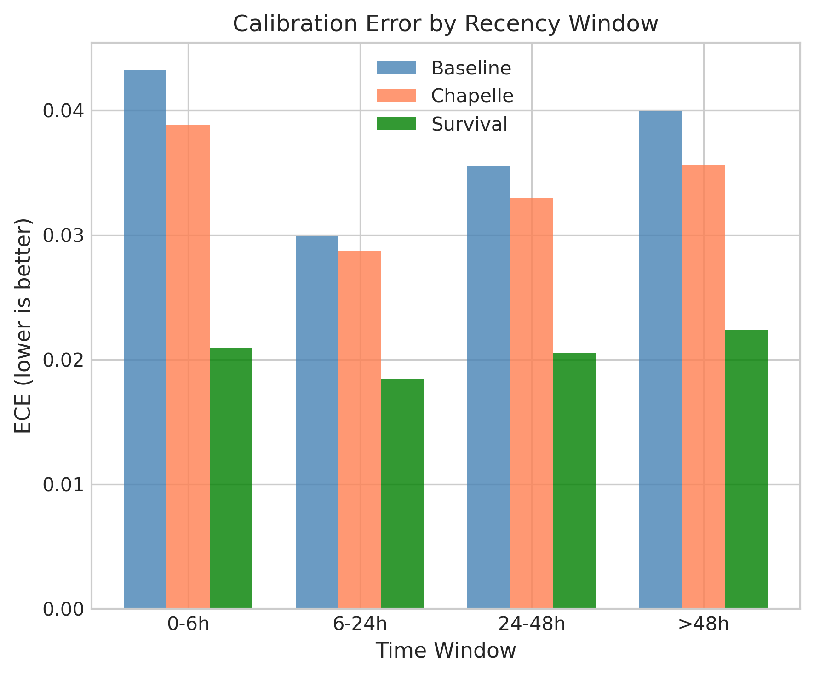
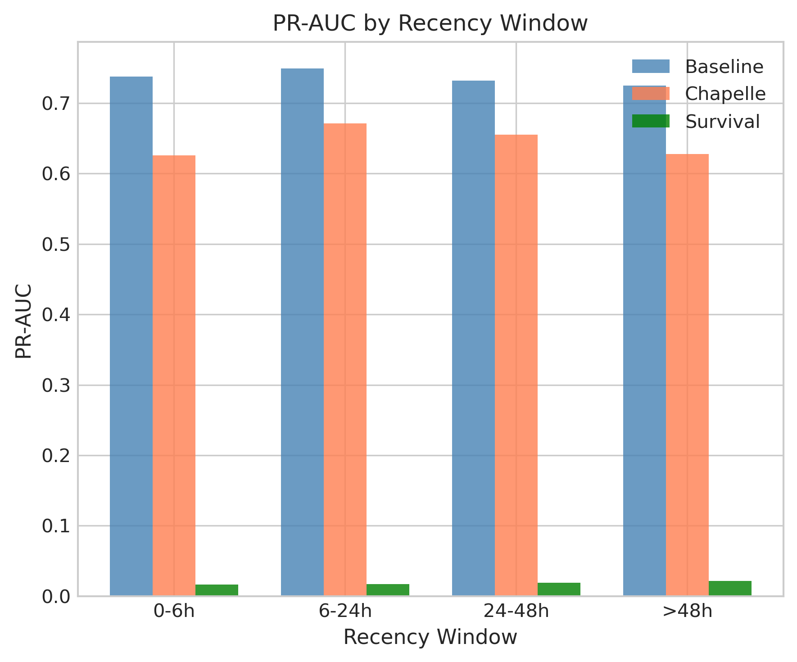

# 🍃 Delayed Feedback Modeling

> **Name:** Delayed Feedback Calibration  
> **ID:** `EXP-20260108-gift-allocation-05`  
> **Topic:** `gift_allocation` | **MVP:** MVP-1.2  
> **Author:** Viska Wei | **Date:** 2026-01-08 | **Status:** ⏳

> 🎯 **Target:** 验证延迟反馈建模（生存分析/Chapelle方法）是否能改善打赏预测的校准性能  
> 🚀 **Next:** If ECE改善≥0.02 → 确认延迟建模路线；Else → 简单窗口截断

## ⚡ 核心结论速览

> **一句话**: TODO - 待实验完成

| 验证问题 | 结果 | 结论 |
|---------|------|------|
| DG2: 延迟校正的增益有多大？ | ⏳ | 待验证 |

| 指标 | Chapelle | Survival | Baseline (无校正) |
|------|----------|----------|------------------|
| ECE | TODO | TODO | 0.018 (已有) |
| 近期样本PR-AUC | TODO | TODO | TODO |

| Type | Link |
|------|------|
| 🧠 Hub | `experiments/gift_allocation/gift_allocation_hub.md` § DG2 |
| 🗺️ Roadmap | `experiments/gift_allocation/gift_allocation_roadmap.md` § MVP-1.2 |

---

# 1. 🎯 目标

**问题**: 打赏行为存在延迟反馈——用户可能在进入直播间后一段时间才打赏。近期样本若简单当负例，会系统性低估打赏概率。

**验证**: DG2 - 延迟校正的增益有多大？

| 预期 | 判断标准 |
|------|---------|
| ECE 改善 ≥ 0.02 | 通过 → 确认延迟建模，纳入主模型 |
| ECE 改善 < 0.02 | 简单窗口截断足够，不引入复杂性 |
| 近期样本预测稳定 | 通过 → 模型在不同时间窗口下稳定 |

**核心假设**:
- K2 (Hub): 延迟反馈不能简单当负例，会系统性低估打赏概率

---

# 2. 🦾 算法

## 2.1 问题定义

设：
- $T$：点击到打赏的延迟时间（打赏事件发生）
- $C$：删失时间（用户离开/观察窗口结束）
- 观测到：$\min(T, C)$ 及 indicator $\delta = \mathbf{1}[T \leq C]$

**延迟导致的偏差**：
- 近期样本中，部分未打赏是因为观察窗口不足（右删失）
- 直接当负例会低估 $\Pr(Y > 0)$

## 2.2 方法 A: Chapelle 延迟校正 (Chapelle 2014)

**软标签加权**：
$$w_i = 
\begin{cases}
1 & \text{if } \delta_i = 1 \text{ (observed gift)} \\
1 - F(H - t_i) & \text{if } \delta_i = 0 \text{ (right-censored)}
\end{cases}$$

其中 $F(d)$ 是延迟分布的 CDF，$H$ 是观察窗口，$t_i$ 是样本距窗口结束的时间。

**训练**:
- 用 $w_i$ 作为样本权重/软标签
- 使用加权损失函数

## 2.3 方法 B: 生存分析

**风险函数建模**：
$$h(t|x) = h_0(t) \cdot e^{\beta^T x}$$

**条件打赏概率**：
$$\Pr(T \leq H | x) = 1 - \exp\left(-\int_0^H h(t|x) dt\right)$$

**参数化形式** (Weibull):
$$h(t|x) = \frac{k}{\lambda(x)} \left(\frac{t}{\lambda(x)}\right)^{k-1}$$

---

# 3. 🧪 实验设计

## 3.1 数据

| 项 | 值 |
|----|-----|
| 来源 | KuaiLive |
| 路径 | `data/KuaiLive/` |
| 样本 | click 全量 + timestamp |
| 关键字段 | click_time, gift_time (if any), watch_duration |
| 延迟定义 | gift_time - click_time |

**延迟分布估计**:
- 从历史打赏样本中估计 $T$ 的分布
- 预期：Weibull 或 LogNormal

## 3.2 模型

| 方法 | 模型 | 说明 |
|------|------|------|
| Baseline | LightGBM (binary) | 无延迟校正，直接用观察标签 |
| Chapelle | LightGBM (weighted) | 软标签加权 |
| Survival | Cox / Weibull AFT | 参数化生存模型 |

## 3.3 评估

| 类别 | 指标 | 说明 |
|------|------|------|
| 校准 | ECE | 期望校准误差 |
| 校准 | Brier Score | 概率预测准确性 |
| 稳定性 | 近期样本PR-AUC | 最近24h/48h样本的PR-AUC |
| 排序 | PR-AUC | 整体精确率-召回率曲线 |

**分组评估**:
- 按距窗口距离分组：[0-6h], [6-24h], [24-48h], [>48h]
- 检验近期样本是否被低估

## 3.4 通过门槛

| 指标 | 门槛 | 决策 |
|------|------|------|
| ECE 改善 | ≥ 0.02 | → 采用延迟校正 |
| 近期样本 PR-AUC 提升 | ≥ 0.03 | → 确认近期偏差存在 |

---

# 4. 📊 图表

> 待实验完成后填写

### Fig 1: Delay Distribution

### Fig 2: ECE by Time Window

### Fig 3: Calibration Curve Comparison

### Fig 4: PR-AUC by Recency

---

# 5. 💡 洞见

> 待实验完成后填写

---

# 6. 📝 结论

> 待实验完成后填写

## 6.1 核心发现

> TODO

## 6.2 关键数字

| 指标 | Baseline | Chapelle | Survival | 最优 |
|------|----------|----------|----------|------|
| ECE | TODO | TODO | TODO | TODO |
| 近期PR-AUC | TODO | TODO | TODO | TODO |
| 整体PR-AUC | TODO | TODO | TODO | TODO |

## 6.3 下一步

| 方向 | 任务 | 优先级 |
|------|------|--------|
| If 延迟校正有效 | 集成到主模型 | 🔴 |
| 无论结果 | MVP-0.3 Simulator构建 | 🟡 |

---

# 7. 📎 附录

## 7.1 执行记录

| 项 | 值 |
|----|-----|
| 脚本 | `scripts/train_delay_modeling.py` |
| 日志 | `logs/delay_modeling_20260108.log` |
| 结果 JSON | `experiments/gift_allocation/results/delay_modeling_20260108.json` |

## 7.2 参考文献

| 论文 | 要点 |
|------|------|
| Chapelle (2014) | Modeling Delayed Feedback in Display Advertising |
| WeightedFeedback | 广告CVR延迟校正方法 |

## 7.3 相关原则

- P4 (Hub): 新数据近期样本不能当负例 → 延迟校正或删失处理

---

> **实验创建时间**: 2026-01-08
