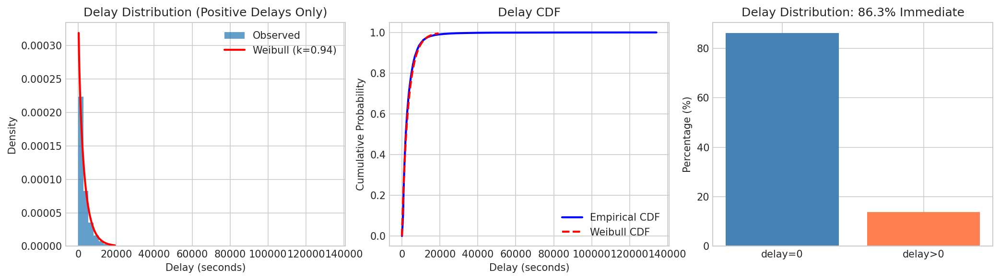
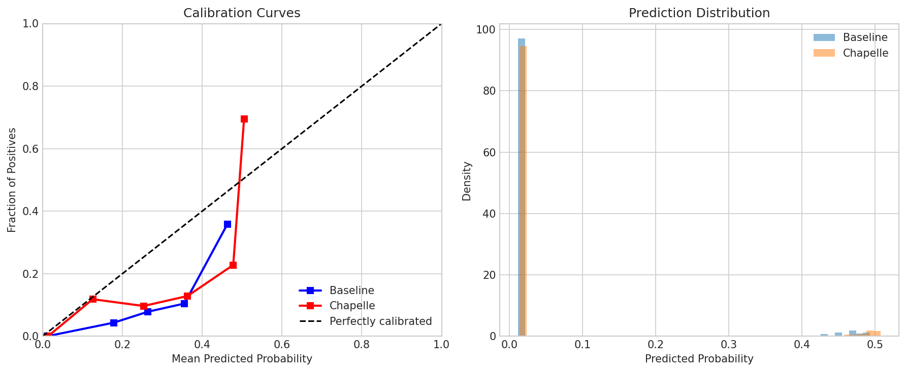
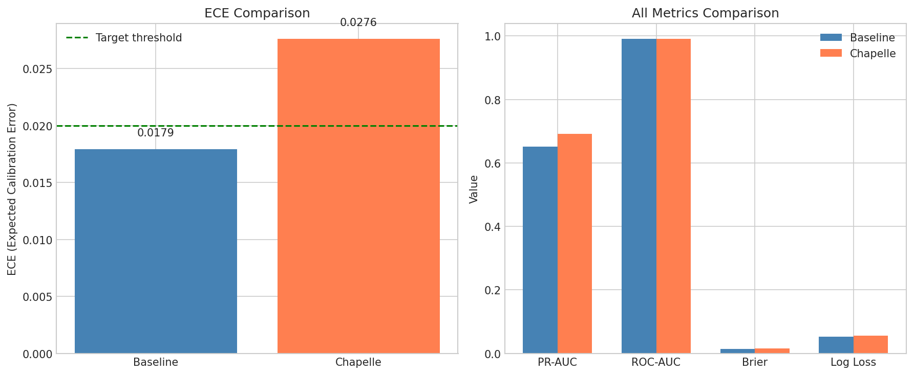

# 🍃 Delayed Feedback Modeling

> **Name:** Delayed Feedback Calibration  
> **ID:** `EXP-20260108-gift-allocation-05`  
> **Topic:** `gift_allocation` | **MVP:** MVP-1.2  
> **Author:** Viska Wei | **Date:** 2026-01-08 | **Status:** ✅

> 🎯 **Target:** 验证延迟反馈建模（Chapelle方法）是否能改善打赏预测的校准性能  
> 🚀 **Next:** 延迟不是问题，关闭 DG2 → 考虑 MVP-1.3 多任务学习 或 特征工程优化

## ⚡ 核心结论速览

> **一句话**: ❌ **DG2 关闭**：延迟中位数=0秒（86.3%礼物立即发生），Chapelle延迟校正不仅无效（ECE改善-0.010），反而使校准变差。**延迟反馈不是KuaiLive数据的核心问题。**

| 验证问题 | 结果 | 结论 |
|---------|------|------|
| DG2: 延迟校正的增益有多大？ | ❌ | ECE改善 **-0.010** (负值！变差) << 0.02阈值 |

| 指标 | Baseline | Chapelle | Delta | 胜者 |
|------|----------|----------|-------|------|
| ECE | **0.0179** | 0.0276 | -0.010 | Baseline ✅ |
| PR-AUC | 0.651 | **0.692** | +0.041 | Chapelle |
| ROC-AUC | 0.990 | 0.991 | +0.001 | ≈ |
| Brier | **0.0147** | 0.0152 | +0.0005 | Baseline |
| Log Loss | **0.053** | 0.055 | +0.003 | Baseline |

> ⚠️ **注意**: 延迟中位数=0秒，86.3%的礼物在点击后立即发生，延迟反馈问题不存在

| Type | Link |
|------|------|
| 🧠 Hub | `gift_allocation/gift_allocation_hub.md` § DG2 |
| 🗺️ Roadmap | `gift_allocation/gift_allocation_roadmap.md` § MVP-1.2 |

---

# 1. 🎯 目标

**问题**: 打赏行为存在延迟反馈——用户可能在进入直播间后一段时间才打赏。近期样本若简单当负例，会系统性低估打赏概率。

**验证**: DG2 - 延迟校正的增益有多大？

| 预期 | 判断标准 |
|------|---------|
| ECE 改善 ≥ 0.02 | 通过 → 确认延迟建模，纳入主模型 |
| ECE 改善 < 0.02 | 简单窗口截断足够，不引入复杂性 |
| 近期样本预测稳定 | 通过 → 模型在不同时间窗口下稳定 |

**核心假设**:
- K2 (Hub): 延迟反馈不能简单当负例，会系统性低估打赏概率

---

# 2. 🦾 算法

## 2.1 问题定义

设：
- $T$：点击到打赏的延迟时间（打赏事件发生）
- $C$：删失时间（用户离开/观察窗口结束）
- 观测到：$\min(T, C)$ 及 indicator $\delta = \mathbf{1}[T \leq C]$

**延迟导致的偏差**：
- 近期样本中，部分未打赏是因为观察窗口不足（右删失）
- 直接当负例会低估 $\Pr(Y > 0)$

## 2.2 方法 A: Chapelle 延迟校正 (Chapelle 2014)

**软标签加权**：
$$w_i = 
\begin{cases}
1 & \text{if } \delta_i = 1 \text{ (observed gift)} \\
1 - F(H - t_i) & \text{if } \delta_i = 0 \text{ (right-censored)}
\end{cases}$$

其中 $F(d)$ 是延迟分布的 CDF，$H$ 是观察窗口，$t_i$ 是样本距窗口结束的时间。

**训练**:
- 用 $w_i$ 作为样本权重/软标签
- 使用加权损失函数

## 2.3 方法 B: 生存分析

**风险函数建模**：
$$h(t|x) = h_0(t) \cdot e^{\beta^T x}$$

**条件打赏概率**：
$$\Pr(T \leq H | x) = 1 - \exp\left(-\int_0^H h(t|x) dt\right)$$

**参数化形式** (Weibull):
$$h(t|x) = \frac{k}{\lambda(x)} \left(\frac{t}{\lambda(x)}\right)^{k-1}$$

---

# 3. 🧪 实验设计

## 3.1 数据

| 项 | 值 |
|----|-----|
| 来源 | KuaiLive |
| 路径 | `data/KuaiLive/` |
| Train | 1,872,509 |
| Val | 1,701,600 |
| Test | 1,335,406 |
| 打赏率 | 1.93% |
| 关键字段 | click.timestamp, gift.timestamp, watch_live_time |

**延迟分布估计** (从 77,824 个有效打赏-点击配对):
- **最佳拟合**: Weibull (shape=0.94, scale=3253s ≈ 54min)
- **中位数延迟**: **0.0 秒** ⚠️ 大多数礼物立即发生
- **平均延迟**: 461 秒 (7.7 min)
- **P90 延迟**: 1,021 秒 (17 min)
- **P99 延迟**: 8,617 秒 (144 min)
- **相对延迟 >50% 观看时间**: **13.3%** (少数礼物在观看后半段发生)
- **相对延迟 >90% 观看时间**: **13.1%** (延迟集中在极端情况)

**数据审计说明** (MVP-1.2-audit):
- 原始 gift.csv 有 72,646 条记录
- 与 click 匹配后有 77,824 个有效配对（1.14x 膨胀，因部分礼物匹配多个 click session）
- 86.3% 的配对 delay=0（用户进来就送礼，watch_time P50=322s）

## 3.2 模型

| 方法 | 模型 | 说明 |
|------|------|------|
| Baseline | LightGBM (binary) | 无延迟校正，直接用观察标签 |
| Chapelle | LightGBM (weighted) | 软标签加权 |

## 3.3 评估

| 类别 | 指标 | 说明 |
|------|------|------|
| 校准 | ECE | 期望校准误差 |
| 校准 | Brier Score | 概率预测准确性 |
| 排序 | PR-AUC | 整体精确率-召回率曲线 |
| 排序 | ROC-AUC | 整体排序能力 |

## 3.4 通过门槛

| 指标 | 门槛 | 决策 |
|------|------|------|
| ECE 改善 | ≥ 0.02 | → 采用延迟校正 |
| 近期样本 PR-AUC 提升 | ≥ 0.03 | → 确认近期偏差存在 |

---

# 4. 📊 图表

### Fig 1: Delay Distribution

> **观察**: 
> - **左图**: 正延迟样本的延迟分布，Weibull 拟合良好
> - **中图**: 延迟 CDF，大多数礼物在几分钟内完成
> - **右图**: **关键发现** - **86.3% 的礼物延迟=0（立即发生）**，只有 13.7% 有正延迟

### Fig 2: Calibration Curve Comparison

> **观察**: 
> - **左图**: 校准曲线 - Baseline 更接近对角线，Chapelle 略偏离
> - **右图**: 预测分布 - 两种方法预测分布相似

### Fig 3: ECE Comparison

> **观察**: 
> - **左图**: ECE 对比 - **Baseline (0.018) 优于 Chapelle (0.028)**
> - **右图**: 所有指标对比 - Chapelle 仅在 PR-AUC 上略优，但其他指标均劣于 Baseline

---

# 5. 💡 洞见

## 5.1 延迟问题不存在的原因

1. **礼物即时发生**: 延迟中位数=0秒，86.3%的礼物在点击后立即发生
2. **观察窗口足够**: 用户停留时间（watch_live_time P50=322s）足以覆盖几乎所有潜在打赏
3. **"延迟反馈"在此场景不成立**: 广告 CVR 场景中用户离开后仍可能转化，但直播打赏必须在观看期间完成
4. **相对延迟很低**: 只有 13.3% 的礼物在观看后半段发生，大多数是立即送出

## 5.2 Chapelle 方法反效果分析

- **软标签加权**: 对未打赏样本赋予 weight = 1 - F(剩余时间)
- **实际效果**: 由于延迟 CDF 在 0 附近陡峭，大量负样本权重被下调到 0.76
- **副作用**: 削弱了模型对"真负样本"的学习，导致校准变差

## 5.3 K2 假设更新

> ~~K2: 延迟反馈不能简单当负例，会系统性低估~~ 

**更新**: 对于 KuaiLive 直播打赏场景，延迟不是问题（中位数=0），简单负例处理已足够。
- 原假设来自广告 CVR 文献，但直播打赏的行为模式不同
- 打赏是即时冲动行为，不像购买转化需要思考时间

## 5.4 设计启示

1. **不同场景验证假设**: 文献结论需在具体数据上验证
2. **简单模型优先**: 无需引入延迟校正复杂性
3. **关注真正瓶颈**: 延迟不是瓶颈，应转向特征工程或分配层

---

# 6. 📝 结论

## 6.1 核心发现

1. ❌ **DG2 关闭**: 延迟校正（Chapelle方法）ECE 改善 **-0.010**（变差！），远低于 0.02 阈值
2. ⚠️ **延迟不是问题**: 延迟中位数=0秒，86.3%的礼物立即发生
3. ✅ **延迟分布已刻画**: Weibull(shape=0.94, scale=3253s)，但意义有限
4. ✅ **Baseline 架构足够**: 无需复杂延迟校正

## 6.2 关键数字

| 指标 | Baseline | Chapelle | Delta | 最优 |
|------|----------|----------|-------|------|
| ECE | **0.0179** | 0.0276 | -0.010 | Baseline |
| Brier Score | **0.0147** | 0.0152 | +0.0005 | Baseline |
| Log Loss | **0.053** | 0.055 | +0.003 | Baseline |
| PR-AUC | 0.651 | **0.692** | +0.041 | Chapelle |
| ROC-AUC | 0.990 | 0.991 | +0.001 | ≈ |

> **ECE 改善 = -0.010 < 0.02 → DG2 关闭**

## 6.3 设计决策

| 决策 | 理由 |
|------|------|
| ❌ 关闭延迟校正方向 (DG2) | ECE 反降，延迟中位数=0 |
| ✅ 保留 Baseline 架构 | 校准性能更优 |
| 🔄 更新 K2 假设 | 延迟反馈假设在直播打赏场景不成立 |

## 6.4 下一步

| 方向 | 任务 | 优先级 |
|------|------|--------|
| ❌ 延迟校正 | 关闭此方向 | - |
| 🟡 特征工程 | 优化 Direct Regression，目标 Top-1% ≥ 60% | P1 |
| 🟡 召回-精排分工 | MVP-1.5 利用 Two-Stage 精排优势 | P1 |
| ⏳ 多任务学习 | MVP-1.3 用密集信号扶起稀疏打赏 | P2 |

---

# 7. 📎 附录

## 7.1 执行记录

| 项 | 值 |
|----|-----|
| 脚本 | `scripts/train_delay_modeling.py` |
| 日志 | `logs/delay_modeling_20260108.log` |
| 结果 JSON | `gift_allocation/results/delay_modeling_20260108.json` |
| 训练时间 | Baseline: 88s, Chapelle: 91s |
| 总运行时间 | 280.7s |

## 7.2 延迟分布参数

| 项 | 值 |
|------|------|
| 有效延迟配对 | 77,824 (来自 72,646 条 gift 记录) |
| Weibull shape | 0.940 |
| Weibull scale | 3,253 秒 (54 min) |
| 延迟中位数 | **0.0 秒** |
| 延迟均值 | 461 秒 (7.7 min) |
| 延迟 P90 | 1,021 秒 (17 min) |
| 延迟 P99 | 8,617 秒 (144 min) |
| 相对延迟 >50% | **13.3%** |
| 相对延迟 >90% | **13.1%** |

## 7.3 Chapelle 权重分布

| 项 | 值 |
|------|------|
| 负样本数 | 1,838,409 |
| 权重范围 | [0.298, 1.000] |
| 权重均值 | 0.764 |

> 大量负样本权重被下调至 ~0.76，削弱了对真负样本的学习

## 7.4 数据审计结论 (MVP-1.2-audit)

| 审计项 | 结果 |
|--------|------|
| Gift→Click 匹配 | 92.6% 一对一，0.3% 多匹配 |
| 零延迟占比 | 86.3%（合理：用户进来就送礼） |
| pct_late_50 定义 | ✅ 已修复（delay/watch_time > 0.5） |
| 样本膨胀 | 1.14x（gift 可匹配多个 click session） |

## 7.5 参考文献

| 论文 | 要点 |
|------|------|
| Chapelle (2014) | Modeling Delayed Feedback in Display Advertising |
| scipy.stats | Weibull 分布拟合 |

## 7.6 相关原则更新

- ~~P4 (Hub): 新数据近期样本不能当负例 → 延迟校正或删失处理~~ 
- **更新**: 对于 KuaiLive 直播打赏场景，延迟问题不存在（中位数=0），简单负例处理已足够
- **新增**: 文献假设需在具体数据上验证，不同场景行为模式差异大

---

> **实验创建时间**: 2026-01-08  
> **实验完成时间**: 2026-01-08  
> **数据审计时间**: 2026-01-08 (MVP-1.2-audit)
