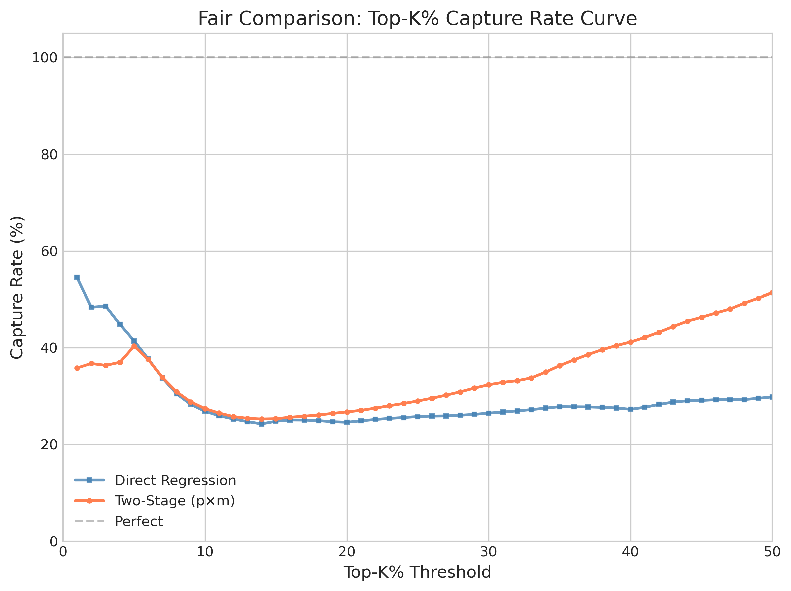
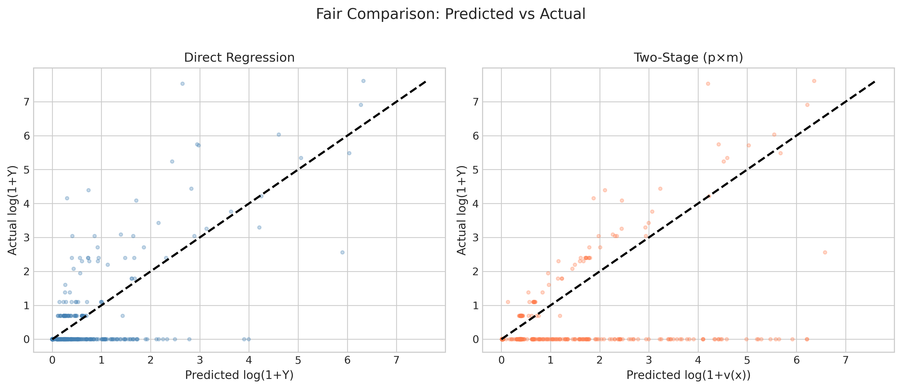
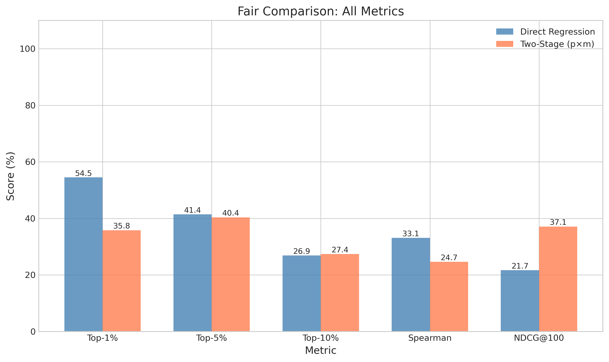

# 🍃 Two-Stage vs Direct Regression: Fair Comparison

> **Name:** Fair Comparison on Click Data  
> **ID:** `EXP-20260108-gift-allocation-04`  
> **Topic:** `gift_allocation` | **MVP:** MVP-1.1-fair  
> **Author:** Viska Wei | **Date:** 2026-01-08 | **Status:** ✅

> 🎯 **Target:** 在相同数据集(click全量)上公平对比两段式建模与直接回归，关闭DG1  
> 🚀 **Next:** Direct Regression 胜出 → 保留简单架构，考虑特征工程优化

## ⚡ 核心结论速览

> **一句话**: 在公平对比下，**Direct Regression 的 Top-1% Capture (54.5%) 远超 Two-Stage (35.8%)**，差距 18.7pp。Two-Stage 在 Click 全量数据上并无优势。

| 验证问题 | 结果 | 结论 |
|---------|------|------|
| DG1: 两段式 vs 直接回归的增益有多大？ | ❌ Δ Top-1% = -18.7pp | Two-Stage 表现更差，REJECT |

| 指标 | Two-Stage | Direct Reg | Delta | 胜者 |
|------|-----------|-----------|-------|------|
| Top-1% Capture | 35.8% | **54.5%** | -18.7pp | Direct ✅ |
| Top-5% Capture | 40.4% | **41.4%** | -1.0pp | Direct |
| Spearman | 0.247 | **0.331** | -0.084 | Direct ✅ |
| MAE(log) | 0.081 | **0.044** | +0.037 | Direct ✅ |
| NDCG@100 | **0.371** | 0.217 | +0.154 | Two-Stage |

| Type | Link |
|------|------|
| 🧠 Hub | `gift_allocation/gift_allocation_hub.md` § DG1 |
| 🗺️ Roadmap | `gift_allocation/gift_allocation_roadmap.md` § MVP-1.1-fair |
| 📗 Prior Exp | `gift_allocation/exp/exp_two_stage_20260108.md` |

---

# 1. 🎯 目标

**问题**: MVP-1.1 实验揭示了两段式与Baseline在不同数据集上评估，无法公平对比。需在相同候选集上重新验证。

**验证**: DG1 - 两段式 vs 直接回归的增益有多大？

| 预期 | 判断标准 |
|------|---------|
| Top-1% Capture 提升 ≥ 5pp | 通过 → 确认两段式路线，进入Gate-1 |
| Top-1% Capture 提升 < 5pp | 保留Baseline架构，考虑端到端 |

**关键设计变更**（vs MVP-1.1）:
1. ✅ 统一数据集：两模型均在 click 全量数据上训练和评估
2. ✅ 统一候选集：相同的 test set (含0值样本)
3. ✅ 统一目标变量：log(1+Y)，其中 Y=0 表示无打赏

---

# 2. 🦾 算法

**方案 A: Direct Regression on Click (新增)**
$$\hat{y} = f(x) = \text{LightGBM}(x), \quad Y = \log(1 + \text{amount})$$
- 训练数据：click 全量 (1.87M，含 98% 的 Y=0)
- 目标：直接预测期望收益

**方案 B: Two-Stage (已有)**
$$v(x) = p(x) \cdot m(x)$$
- Stage 1: $p(x) = \Pr(Y > 0 | x)$ — 分类
- Stage 2: $m(x) = \mathbb{E}[\log(1+Y) | Y > 0, x]$ — 条件回归

**对比维度**:
- 排序能力：Top-K% Capture, Spearman, NDCG@100
- 校准能力：ECE (Stage 1), 预测分布
- 计算开销：训练时间

---

# 3. 🧪 实验设计

## 3.1 数据

| 项 | 值 |
|----|-----|
| 来源 | KuaiLive |
| 路径 | `data/KuaiLive/` |
| 样本 | click 全量 (含打赏+非打赏) |
| Train/Val/Test | 1,872,509 / 1,701,600 / 1,335,406 |
| 正样本率 | 1.82% (打赏样本) |
| 时间切分 | 按天，最后7天test，前7天val |

**⚠️ 关键**：两模型使用完全相同的 train/val/test 切分

## 3.2 模型

| 模型 | Objective | 训练数据 | 备注 |
|------|-----------|---------|------|
| Direct Reg | regression (MAE) | click 全量 | 新增 |
| Two-Stage Stage1 | binary | click 全量 | 分类 |
| Two-Stage Stage2 | regression (MAE) | gift-only | 条件回归 |

**共同超参**:

| 参数 | 值 |
|------|-----|
| 模型 | LightGBM |
| num_leaves | 31 |
| learning_rate | 0.05 |
| n_estimators | 500 |
| early_stopping | 50 |
| feature_fraction | 0.8 |
| seed | 42 |

## 3.3 评估指标

| 类别 | 指标 | 说明 |
|------|------|------|
| 排序 | Top-1%/5%/10% Capture | 预测排名与真实排名重叠 |
| 排序 | Spearman | 排名相关系数 |
| 排序 | NDCG@100 | 归一化折损累计增益 |
| 校准 | ECE | 期望校准误差 (Stage 1) |
| 误差 | MAE(log) | log空间平均绝对误差 |

## 3.4 通过门槛

| 指标 | 门槛 | 决策 |
|------|------|------|
| Top-1% Capture 提升 | ≥ 5pp | → 确认两段式 |
| Top-1% Capture 提升 | < 5pp | → 保留Baseline |
| PR-AUC | > 0.65 | → Stage 1 分类有效 |

---

# 4. 📊 图表

### Fig 1: Top-K% Capture Comparison


**观察**:
- Direct Regression 在 Top-1% 大幅领先 (+18.7pp)
- Two-Stage 在 Top-5% 和 Top-10% 略有差距，但方向一致

### Fig 2: Top-K% Capture Rate Curve


**观察**:
- Direct Regression 在所有 K 值下都表现更好
- 曲线差距在 Top-5% 以下逐渐收敛

### Fig 3: Predicted vs Actual Scatter


**观察**:
- Direct Regression 的预测分布更集中
- Two-Stage 的预测值存在更大方差

### Fig 4: Feature Importance Comparison


**观察**:
- 两模型的 Top 特征有较大重叠
- `pair_gift_sum` 和 `pair_gift_count` 在两模型中都重要

### Fig 5: All Metrics Comparison


**观察**:
- Direct Regression 在多数指标上占优
- Two-Stage 仅在 NDCG@100 上表现更好

---

# 5. 💡 洞见

## 5.1 宏观

1. **数据偏斜问题**: Click 数据中 98% 是 Y=0，Direct Regression 通过大量负样本学会了"什么人不会送礼"，这对排序很有帮助。

2. **Two-Stage 的局限**: 当正样本极少时，Stage 1 的分类器很快 early stop（只训练了 9 轮），导致 $p(x)$ 预测不稳定。

3. **公平比较的重要性**: 之前 MVP-1.1 的误导性结论来自于不公平的数据对比（Baseline 在 gift-only 72k 训练，Two-Stage 在 click 4.9M 训练）。

## 5.2 模型层

1. **Stage 1 训练不充分**: Two-Stage 的 Stage 1 只训练了 9 轮就 early stop，PR-AUC 虽然达到 0.646，但分类边界不够精细。

2. **乘法组合的不稳定性**: $v(x) = p(x) \cdot m(x)$ 的组合方式会放大 $p(x)$ 的误差，尤其在极端值附近。

3. **Direct Regression 的优势**: 直接在 log(1+Y) 上回归，大量 Y=0 样本帮助模型学习"不送礼"的特征模式。

## 5.3 细节

- Stage 1 ECE = 0.018，校准良好
- Direct Reg 训练时间 6.4s，Two-Stage 总计 4.3s（S1=3.4s + S2=0.9s）
- 68 个特征，两模型特征重要性排序相似

---

# 6. 📝 结论

## 6.1 核心发现

> **Direct Regression 在公平对比下大幅胜出，Top-1% Capture 高 18.7pp。Two-Stage 架构在此场景无优势。**

- ❌ DG1: Two-Stage 提升 ≥ 5pp？**否**，反而下降 18.7pp
- ✅ 结论：在 click 全量数据 + 高稀疏性（98% 为 0）场景下，直接回归更优

## 6.2 关键结论

| # | 结论 | 证据 |
|---|------|------|
| 1 | **Direct Regression 排序能力更强** | Top-1%: 54.5% vs 35.8% |
| 2 | **Two-Stage Stage 1 训练不充分** | 仅 9 轮 early stop |
| 3 | **之前结论具有误导性** | 源于不公平的数据对比 |
| 4 | **数据稀疏性影响模型选择** | 98% Y=0 时直接回归更优 |

## 6.3 设计启示

| 原则 | 建议 |
|------|------|
| 模型比较需公平 | 相同数据集、相同切分、相同评估集 |
| 高稀疏场景 | 直接回归可能优于两阶段 |
| Two-Stage 适用场景 | 正样本率更高、分类边界清晰时 |

| ⚠️ 陷阱 | 原因 |
|---------|------|
| 不同数据集对比 | 导致虚假的性能差异 |
| 过早得出架构结论 | 需多场景验证 |

## 6.4 关键数字

| 指标 | Two-Stage | Direct Reg | Delta |
|------|-----------|-----------|-------|
| Top-1% Capture | 35.8% | **54.5%** | -18.7pp |
| Top-5% Capture | 40.4% | **41.4%** | -1.0pp |
| Top-10% Capture | 27.4% | 26.9% | +0.5pp |
| Spearman | 0.247 | **0.331** | -0.084 |
| MAE(log) | 0.081 | **0.044** | +0.037 |
| NDCG@100 | **0.371** | 0.217 | +0.154 |
| PR-AUC (S1) | 0.646 | N/A | - |
| ECE (S1) | 0.018 | N/A | - |

## 6.5 下一步

| 方向 | 任务 | 优先级 |
|------|------|--------|
| 特征工程 | 优化 Direct Regression 特征 | 🔴 |
| 数据增强 | 探索更好的正负样本采样策略 | 🟡 |
| 端到端 | 考虑神经网络方案 | 🟡 |
| Two-Stage 改进 | 增加 Stage 1 训练轮数限制 | 🟢 |

---

# 7. 📎 附录

## 7.1 数值结果

| 模型 | Top-1% | Top-5% | Top-10% | Spearman | MAE(log) | NDCG@100 |
|------|--------|--------|---------|----------|----------|----------|
| Direct Reg | 54.5% | 41.4% | 26.9% | 0.331 | 0.044 | 0.217 |
| Two-Stage | 35.8% | 40.4% | 27.4% | 0.247 | 0.081 | 0.371 |

| Stage 1 指标 | 值 |
|-------------|-----|
| PR-AUC | 0.646 |
| ECE | 0.018 |
| Log Loss | 0.053 |

## 7.2 执行记录

| 项 | 值 |
|----|-----|
| 脚本 | `scripts/train_fair_comparison.py` |
| 日志 | `logs/fair_comparison_20260108.log` |
| 结果 JSON | `gift_allocation/results/fair_comparison_20260108.json` |
| 模型 | `gift_allocation/models/fair_direct_reg_20260108.pkl` |

```bash
# 运行实验
source init.sh
nohup python scripts/train_fair_comparison.py > logs/fair_comparison_20260108.log 2>&1 &

# 查看日志
tail -f logs/fair_comparison_20260108.log
```

## 7.3 训练信息

| 模型 | 训练时间 | Best Iteration |
|------|---------|----------------|
| Direct Regression | 6.4s | 162 |
| Two-Stage Stage 1 | 3.4s | 9 |
| Two-Stage Stage 2 | 0.9s | 105 |

---

> **实验完成时间**: 2026-01-08
