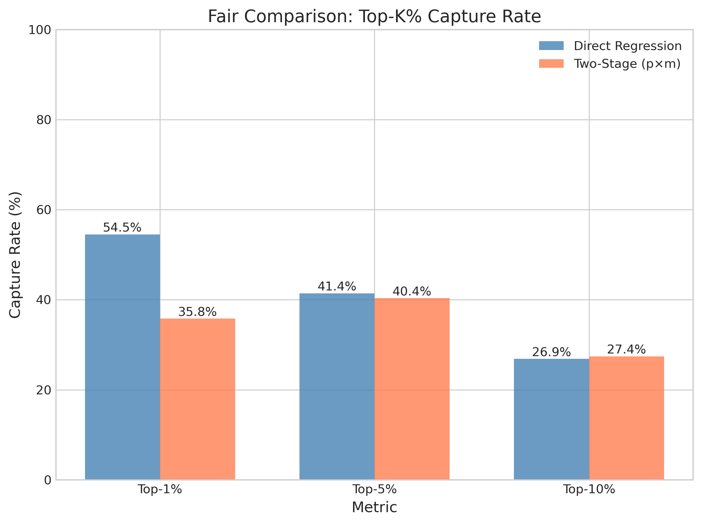
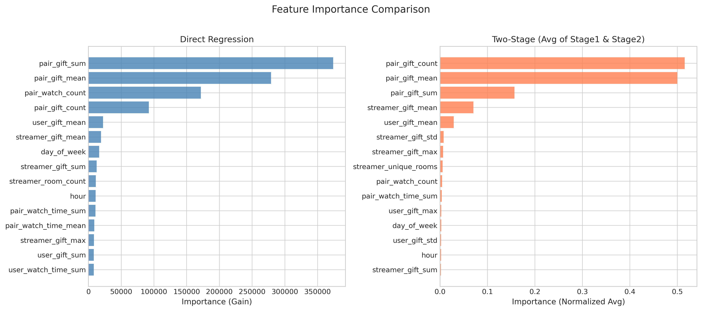

# 🍃 Two-Stage vs Direct Regression: Fair Comparison

> **Name:** Fair Comparison on Click Data  
> **ID:** `EXP-20260108-gift-allocation-04`  
> **Topic:** `gift_allocation` | **MVP:** MVP-1.1-fair  
> **Author:** Viska Wei | **Date:** 2026-01-08 | **Status:** ⏳

> 🎯 **Target:** 在相同数据集(click全量)上公平对比两段式建模与直接回归，关闭DG1  
> 🚀 **Next:** If PR-AUC提升>5% → 确认两段式路线；Else → 保留Baseline架构

## ⚡ 核心结论速览

> **一句话**: TODO - 待实验完成

| 验证问题 | 结果 | 结论 |
|---------|------|------|
| DG1: 两段式 vs 直接回归的增益有多大？ | ⏳ | 待验证 |

| 指标 | Two-Stage | Direct Reg (Click) | Delta |
|------|-----------|-------------------|-------|
| Top-1% Capture | TODO | TODO | TODO |
| PR-AUC (Stage 1) | 0.646 (已有) | N/A | - |
| Spearman | TODO | TODO | TODO |

| Type | Link |
|------|------|
| 🧠 Hub | `experiments/gift_allocation/gift_allocation_hub.md` § DG1 |
| 🗺️ Roadmap | `experiments/gift_allocation/gift_allocation_roadmap.md` § MVP-1.1-fair |
| 📗 Prior Exp | `experiments/gift_allocation/exp/exp_two_stage_20260108.md` |

---

# 1. 🎯 目标

**问题**: MVP-1.1 实验揭示了两段式与Baseline在不同数据集上评估，无法公平对比。需在相同候选集上重新验证。

**验证**: DG1 - 两段式 vs 直接回归的增益有多大？

| 预期 | 判断标准 |
|------|---------|
| Top-1% 捕获率提升 ≥ 5% | 通过 → 确认两段式路线，进入Gate-1 |
| Top-1% 捕获率提升 < 5% | 保留Baseline架构，考虑端到端 |

**关键设计变更**（vs MVP-1.1）:
1. ✅ 统一数据集：两模型均在 click 全量数据上训练和评估
2. ✅ 统一候选集：相同的 test set (含0值样本)
3. ✅ 统一目标变量：log(1+Y)，其中 Y=0 表示无打赏

---

# 2. 🦾 算法

**方案 A: Direct Regression on Click (新增)**
$$\hat{y} = f(x) = \text{LightGBM}(x), \quad Y = \log(1 + \text{amount})$$
- 训练数据：click 全量 (4.9M，含 98% 的 Y=0)
- 目标：直接预测期望收益

**方案 B: Two-Stage (已有)**
$$v(x) = p(x) \cdot m(x)$$
- Stage 1: $p(x) = \Pr(Y > 0 | x)$ — 分类
- Stage 2: $m(x) = \mathbb{E}[\log(1+Y) | Y > 0, x]$ — 条件回归

**对比维度**:
- 排序能力：Top-K% Capture, Spearman, NDCG@100
- 校准能力：ECE (Stage 1), 预测分布
- 计算开销：训练时间

---

# 3. 🧪 实验设计

## 3.1 数据

| 项 | 值 |
|----|-----|
| 来源 | KuaiLive |
| 路径 | `data/KuaiLive/` |
| 样本 | click 全量 (含打赏+非打赏) |
| Train/Val/Test | ~1.87M / ~1.70M / ~1.34M |
| 正样本率 | 1.93% (打赏样本) |
| 时间切分 | 按天，最后7天test，前7天val |

**⚠️ 关键**：两模型使用完全相同的 train/val/test 切分

## 3.2 模型

| 模型 | Objective | 训练数据 | 备注 |
|------|-----------|---------|------|
| Direct Reg | regression (MAE) | click 全量 | 新增 |
| Two-Stage Stage1 | binary | click 全量 | 已有 |
| Two-Stage Stage2 | regression (MAE) | gift-only | 已有 |

**共同超参**:
| 参数 | 值 |
|------|-----|
| 模型 | LightGBM |
| num_leaves | 31 |
| learning_rate | 0.05 |
| n_estimators | 500 |
| early_stopping | 50 |
| feature_fraction | 0.8 |

## 3.3 评估指标

| 类别 | 指标 | 说明 |
|------|------|------|
| 排序 | Top-1%/5%/10% Capture | 预测排名与真实排名重叠 |
| 排序 | Spearman | 排名相关系数 |
| 排序 | NDCG@100 | 归一化折损累计增益 |
| 校准 | ECE | 期望校准误差 (Stage 1) |
| 误差 | MAE(log) | log空间平均绝对误差 |

## 3.4 通过门槛

| 指标 | 门槛 | 决策 |
|------|------|------|
| Top-1% Capture 提升 | ≥ 5% | → 确认两段式 |
| Top-1% Capture 提升 | < 5% | → 保留Baseline |
| PR-AUC | > 0.65 | → Stage 1 分类有效 |

---

# 4. 📊 图表

> 待实验完成后填写

### Fig 1: Top-K% Capture Comparison (Fair)

### Fig 2: Predicted vs Actual Distribution

### Fig 3: Feature Importance Comparison

### Fig 4: Calibration Comparison

---

# 5. 💡 洞见

> 待实验完成后填写

---

# 6. 📝 结论

> 待实验完成后填写

## 6.1 核心发现

> TODO

## 6.2 关键数字

| 指标 | Two-Stage | Direct Reg | Delta |
|------|-----------|-----------|-------|
| Top-1% Capture | TODO | TODO | TODO |
| Top-5% Capture | TODO | TODO | TODO |
| Spearman | TODO | TODO | TODO |
| MAE(log) | TODO | TODO | TODO |

## 6.3 下一步

| 方向 | 任务 | 优先级 |
|------|------|--------|
| If 两段式胜出 | MVP-1.2 延迟反馈建模 | 🔴 |
| If Baseline胜出 | 考虑端到端或更简单方案 | 🔴 |

---

# 7. 📎 附录

## 7.1 执行记录

| 项 | 值 |
|----|-----|
| 脚本 | `scripts/train_fair_comparison.py` |
| 日志 | `logs/fair_comparison_20260108.log` |
| 结果 JSON | `experiments/gift_allocation/results/fair_comparison_20260108.json` |

## 7.2 参考代码

- 已有 Two-Stage: `scripts/train_two_stage.py`
- 已有 Baseline (gift-only): `scripts/train_baseline_lgb.py`

---

> **实验创建时间**: 2026-01-08
