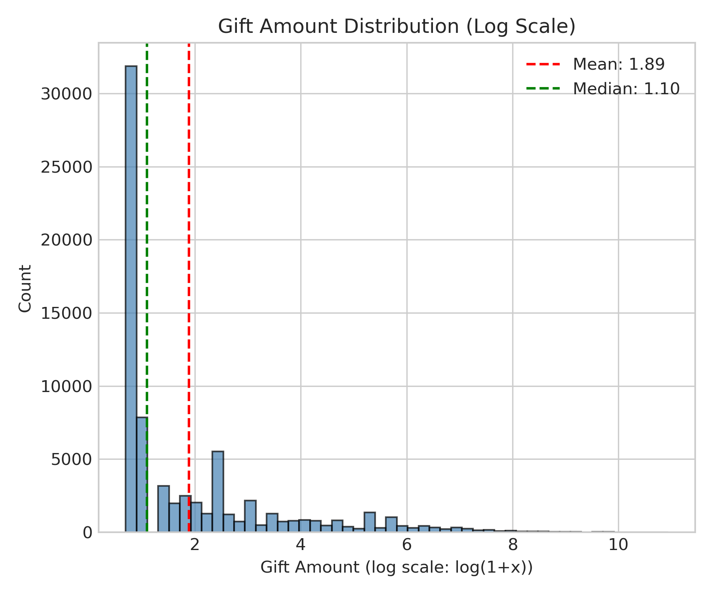
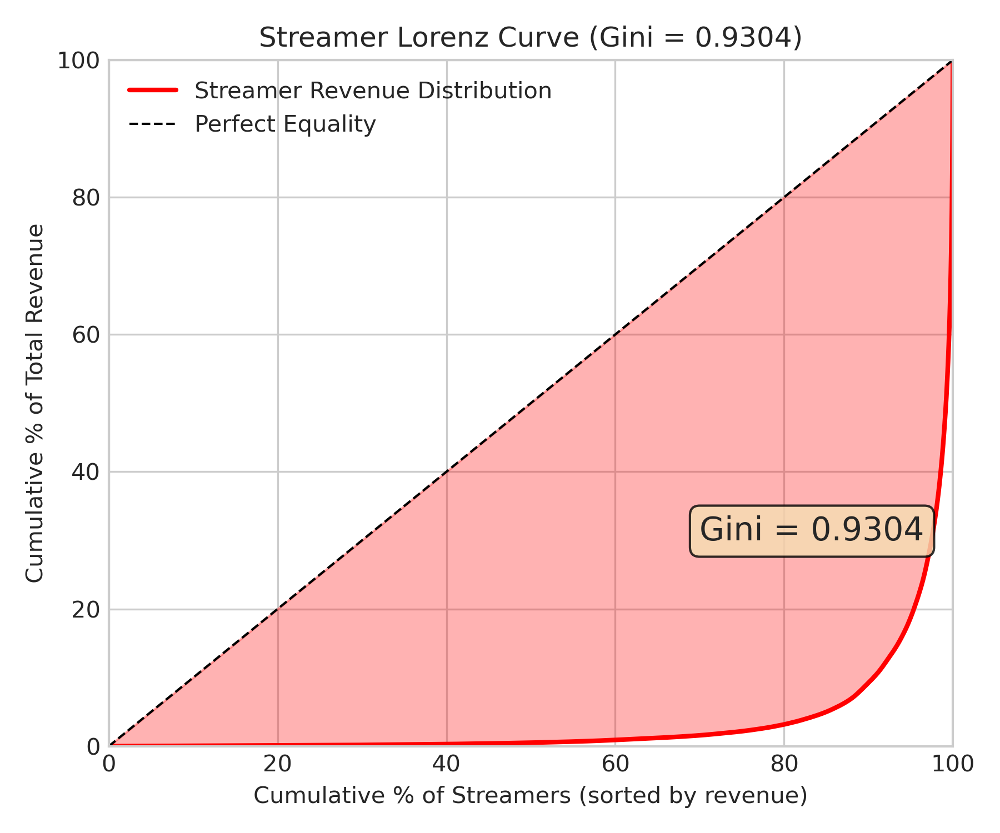
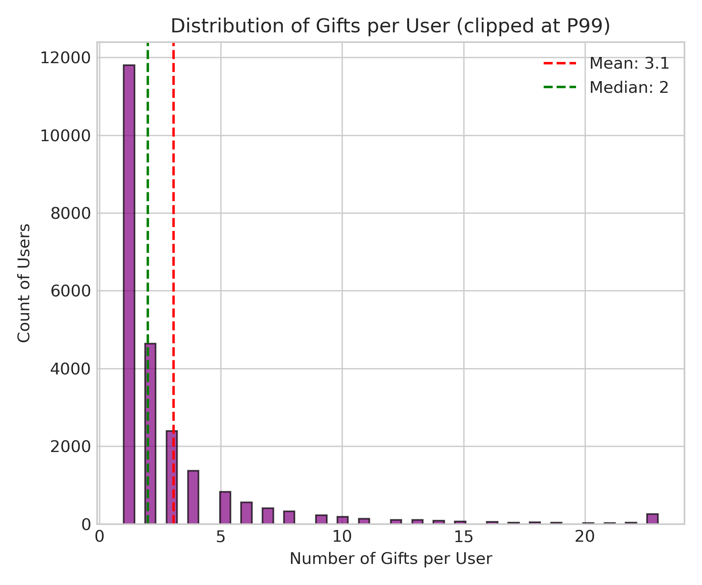
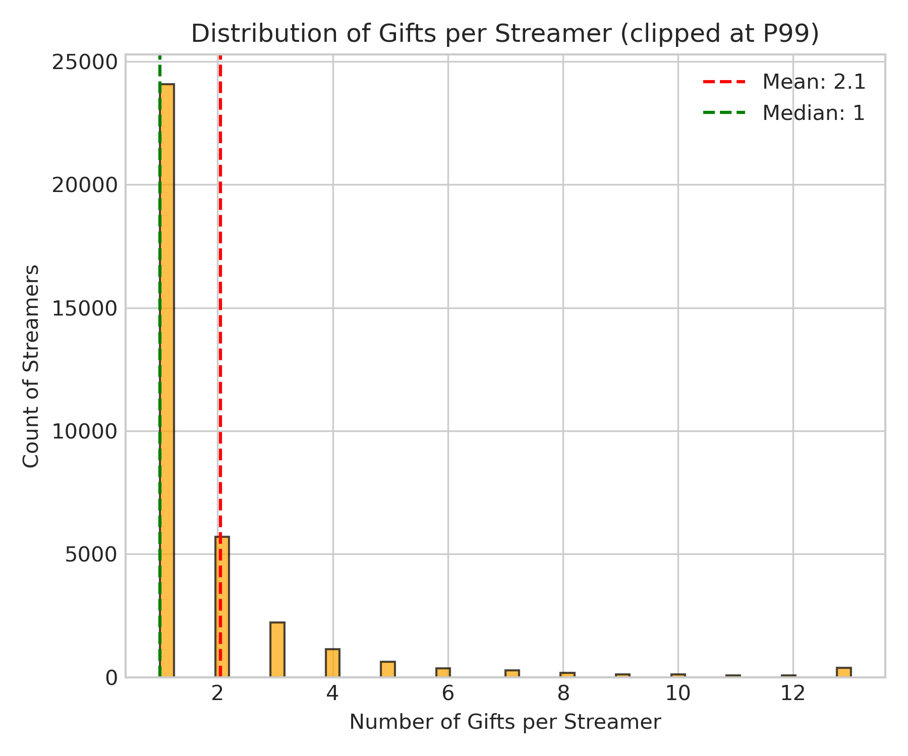

# 🍃 KuaiLive 数据探索性分析
> **Name:** KuaiLive EDA  
> **ID:** `EXP-20260108-gift-allocation-01`  
> **Topic:** `gift_allocation` | **MVP:** MVP-0.1  
> **Author:** Viska Wei | **Date:** 2026-01-08 | **Status:** ✅  

> 🎯 **Target:** 对 KuaiLive 数据集进行全面探索，理解打赏行为的分布特征  
> 🚀 **Next:** 确认两段式建模必要性（先判断是否打赏，再预测打赏金额）

## ⚡ 核心结论速览

> **一句话**: 打赏金额呈极端重尾分布（Gini=0.94），Top 1% 用户贡献 60% 收益，建议采用两段式建模

| 验证问题 | 结果 | 结论 |
|---------|------|------|
| H1.1: 打赏行为极稀疏（打赏率 < 1%）? | ⚠️ 1.48% (per-click) | 打赏行为稀疏，需不均衡处理 |
| H1.2: 打赏金额呈重尾分布（Pareto 型）? | ✅ Gini=0.94, P50=2, P99=1488 | 极端重尾，需 log 变换或分位数回归 |
| H1.3: 打赏存在时间延迟特性? | ⚠️ 待验证 | 需更细粒度的 session 级分析 |

| 指标 | 值 | 启示 |
|------|-----|------|
| User Gini | 0.942 | 金主集中度极高 |
| Streamer Gini | 0.930 | 头部主播效应明显 |
| Matrix Density | 0.0064% | 极稀疏，需负采样策略 |

| Type | Link |
|------|------|
| 🧠 Hub | `experiments/gift_allocation/gift_allocation_hub.md` § H1.1, H1.2 |
| 🗺️ Roadmap | `experiments/gift_allocation/gift_allocation_roadmap.md` § MVP-0.1 |

---
# 1. 🎯 目标

**问题**: KuaiLive 数据集中打赏行为的分布特征是什么？是否支持两段式建模假设？

**验证**: H1.1 (打赏稀疏性), H1.2 (金额重尾分布), H1.3 (时间延迟性)

| 预期 | 判断标准 |
|------|---------|
| 打赏率 < 1% | 通过 → 需采用不均衡处理技术 |
| Gini > 0.8 | 通过 → 确认两段式建模必要性 |
| 金额极值显著 | 通过 → 需 log 变换或分位数回归 |

---

# 2. 🦾 算法

> 📌 本实验为 EDA，无算法部分

**Gini 系数计算**：

$$
G = \frac{\sum_{i=1}^{n}(2i - n - 1)x_i}{n\sum_{i=1}^{n}x_i}
$$

其中 $x_i$ 为按升序排列的用户/主播总打赏金额。

---

# 3. 🧪 实验设计

## 3.1 数据

| 项 | 值 |
|----|-----|
| 来源 | KuaiLive 公开数据集 |
| 路径 | `data/KuaiLive/` |
| 打赏记录 | 72,646 条 |
| 观看记录 | 4,909,515 条 |
| 用户数 | 23,772 |
| 主播数 | 452,621 (有打赏的 35,370) |

**数据字段**：
- `gift.csv`: user_id, live_id, streamer_id, timestamp, gift_price
- `click.csv`: user_id, live_id, streamer_id, timestamp, watch_live_time

## 3.2 分析维度

| 维度 | 指标 |
|------|------|
| 金额分布 | Mean, Median, P90, P95, P99, Max |
| 用户集中度 | Gini, Top-K% share |
| 主播集中度 | Gini, Top-K% share |
| 稀疏性 | Matrix density, Cold start ratio |
| 时间模式 | Peak hour |

## 3.3 训练

> N/A (EDA 类实验)

## 3.4 扫描参数

> N/A

---

# 4. 📊 图表

### Fig 1: Gift Amount Distribution (Log Scale)


**观察**:
- 打赏金额经 log(1+x) 变换后近似正态分布
- Mean ≈ 2.1, Median ≈ 1.1（log scale）
- 长尾效应在 log scale 下被压缩，便于建模

---

### Fig 2: Gift Amount Distribution (Raw)


**观察**:
- 原始分布极度右偏，大量小额打赏
- 图已在 P99 处截断，仍有大量极值
- Mean=82.7 远大于 Median=2，典型重尾分布

---

### Fig 3: Gift Amount Percentiles


**观察**:
- P50=2, P90=88, P99=1488
- P99/P50 = 744x，极端不均
- 建议：对金额取 log 或分位数分箱

---

### Fig 4: User Lorenz Curve


**观察**:
- **Gini = 0.9420**，极高集中度
- Top 10% 用户贡献 93% 收益
- Top 1% 用户贡献 60% 收益
- 设计启示：需重点识别高价值用户（"金主"）

---

### Fig 5: Streamer Lorenz Curve


**观察**:
- **Gini = 0.9304**，头部主播效应显著
- Top 10% 主播获得 91% 收益
- 设计启示：推荐系统应考虑主播承接能力

---

### Fig 6: Gifts per User Distribution


**观察**:
- 平均每用户打赏 3.06 次
- 大量用户仅打赏 1-2 次（低频行为）
- Median=1，极度右偏

---

### Fig 7: Gifts per Streamer Distribution


**观察**:
- 平均每主播收到 2.05 次打赏
- 大量主播仅收到 1 次打赏
- 长尾分布，头部主播打赏次数远超平均

---

### Fig 8: Hourly Pattern


**观察**:
- 打赏高峰时段：12:00 (午间) 和 20:00-22:00 (晚间)
- 凌晨低谷：02:00-06:00
- 时间特征可作为建模输入

---

### Fig 9: User-Streamer Interaction Matrix


**观察**:
- 仅展示 Top 100 用户 × Top 100 主播
- 交互极度稀疏，矩阵密度 0.0064%
- 需采用负采样或隐式反馈建模

---

# 5. 💡 洞见

## 5.1 宏观
- **两段式建模必要性确认**：打赏行为稀疏 + 金额重尾，建议先预测"是否打赏"，再预测"打赏多少"
- **金主识别是核心**：1% 用户贡献 60% 收益，精准识别金主可大幅提升 GMV

## 5.2 模型层
- **金额变换**：log(1+Y) 变换后分布接近正态，适合 MSE 损失
- **稀疏处理**：矩阵密度 0.0064%，需使用负采样或加权损失
- **冷启动**：92.2% 主播无打赏记录，需考虑 content-based 特征

## 5.3 细节
- **数据说明**：user.csv 仅包含有打赏行为的用户，因此"用户打赏率"在本数据集内为 100%
- **真实稀疏性**：按 click 计算，打赏率 = 72,646 / 4,909,515 = 1.48%
- **时间戳**：毫秒级 Unix 时间戳，可提取小时/星期特征

---

# 6. 📝 结论

## 6.1 核心发现
> **打赏行为极度集中，金额分布极端重尾，确认两段式建模架构**

- ✅ H1.2: 打赏金额呈重尾分布（Gini=0.94 > 0.8）
- ⚠️ H1.1: 打赏率约 1.48%（按 click 计算），需谨慎定义
- ⚠️ H1.3: 时间延迟性需 session 级分析，本次 EDA 未深入验证

## 6.2 关键结论

| # | 结论 | 证据 |
|---|------|------|
| 1 | **金主集中** | Top 1% 用户 → 60% 收益 |
| 2 | **头部主播** | Top 1% 主播 → 53% 收益 |
| 3 | **极端稀疏** | 矩阵密度 0.0064% |
| 4 | **金额重尾** | P99/P50 = 744x |

## 6.3 设计启示

| 原则 | 建议 |
|------|------|
| 两段式建模 | Stage 1: 打赏概率预测；Stage 2: 金额预测 |
| 金额变换 | 使用 log(1+Y) 或分位数回归 |
| 负采样 | 由于稀疏性高，需设计负采样策略 |
| 金主识别 | 可单独建模高价值用户分类器 |

| ⚠️ 陷阱 | 原因 |
|---------|------|
| 直接预测金额 | 重尾分布导致 MSE 被极值主导 |
| 忽略稀疏性 | 0.0064% 密度下需特殊处理 |
| 冷启动 | 92% 主播无打赏数据 |

## 6.4 关键数字

| 指标 | 值 | 条件 |
|------|-----|------|
| Gift Rate (per-click) | 1.48% | 72,646 / 4,909,515 |
| User Gini | 0.942 | 基于总打赏金额 |
| Streamer Gini | 0.930 | 基于总收益 |
| Top 1% User Share | 59.9% | 收益占比 |
| Top 1% Streamer Share | 53.4% | 收益占比 |
| Amount P50 | 2 | 单次打赏 |
| Amount P99 | 1,488 | 单次打赏 |
| Amount Max | 56,246 | 单次打赏 |
| Matrix Density | 0.0064% | User-Streamer |
| Cold Start Streamer Ratio | 92.2% | 无打赏记录 |

## 6.5 下一步

| 方向 | 任务 | 优先级 |
|------|------|--------|
| 基线模型 | MVP-0.2: 实现 PopRank + Random 基线 | 🔴 |
| 两段式 | MVP-0.3: Stage1 打赏概率模型 | 🔴 |
| 金额建模 | MVP-0.4: log 变换 + MSE 对比分位数回归 | 🟡 |

---

# 7. 📎 附录

## 7.1 数值结果

| 指标 | 值 |
|------|-----|
| total_gift_records | 72,646 |
| unique_gift_users | 23,772 |
| unique_gift_streamers | 35,370 |
| unique_click_users | 23,772 |
| amount_mean | 82.68 |
| amount_std | 652.68 |
| amount_median | 2.0 |
| amount_p90 | 88.0 |
| amount_p95 | 298.0 |
| amount_p99 | 1,488.2 |
| amount_max | 56,246.0 |
| user_gini | 0.9420 |
| streamer_gini | 0.9304 |
| matrix_density | 0.0064% |
| cold_start_streamer_ratio | 92.2% |
| peak_hour | 12 |

## 7.2 执行记录

| 项 | 值 |
|----|-----|
| 脚本 | `scripts/eda_kuailive.py` |
| 输出目录 | `experiments/gift_allocation/img/` |
| 数值结果 | `experiments/gift_allocation/results/eda_stats_20260108.json` |
| 日志 | `logs/eda_kuailive.log` |

```bash
# 执行命令
python3 scripts/eda_kuailive.py 2>&1 | tee logs/eda_kuailive.log
```

## 7.3 调试（如有）

| 问题 | 解决 |
|------|------|
| seaborn style warning | 使用 try/except 兼容新旧版本 |

---

> **实验完成时间**: 2026-01-08
