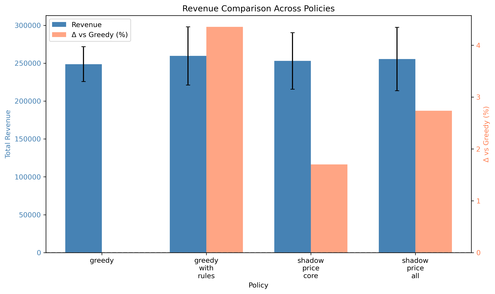
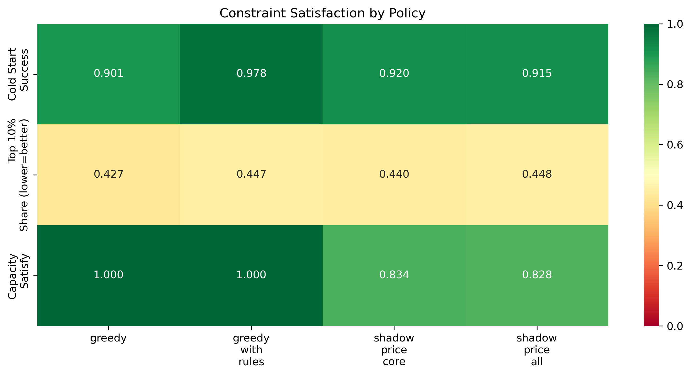
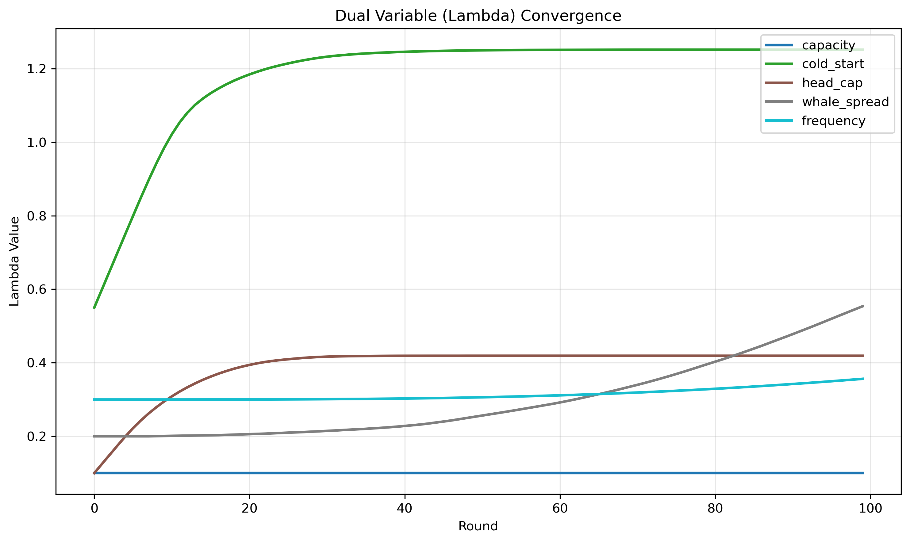
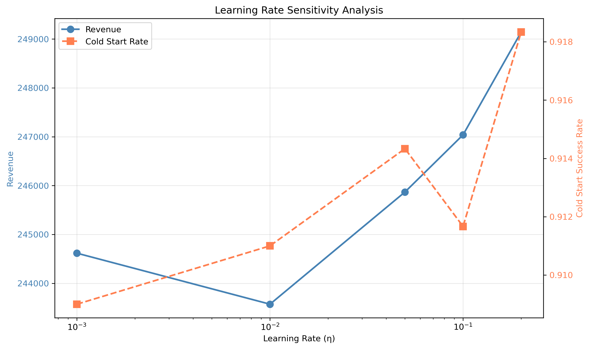
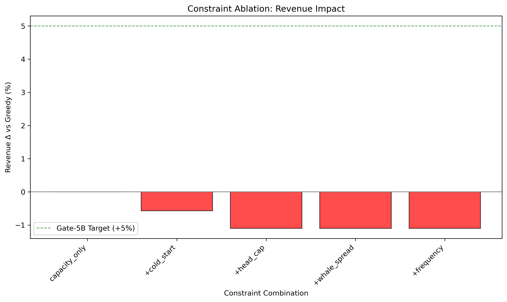
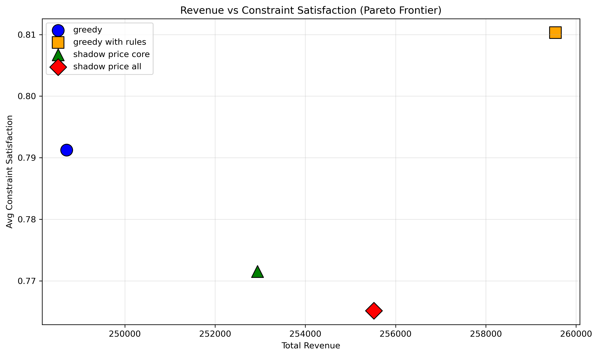

<!--
📝 Agent 书写规范（不出现在正文）:
- Header 全英文
- 正文中文
- 图表文字全英文（中文会乱码）
- 公式用 LaTeX: $inline$ 或 $$block$$
-->

# 🍃 Shadow Price / Supply-Demand Matching
> **Name:** Shadow Price Framework Validation  \
> **ID:** `VIT-20260109-gift_allocation-16`  \
> **Topic:** `gift_allocation` | **MVP:** MVP-5.2 | **Project:** `VIT`  \
> **Author:** Viska Wei | **Date:** 2026-01-09 | **Status:** ✅ Completed
>
> 🎯 **Target:** 验证 Primal-Dual 影子价格框架能否统一处理多约束  \
> 🚀 **Decision / Next:** ❌ Gate-5B FAIL → 保留 Greedy+Rules 方案

---

## ⚡ 核心结论速览（供 main 提取；≤30行；必含 I/O + Run TL;DR）

> **一句话**: ❌ **Gate-5B FAIL**：影子价格框架未能同时满足收益提升(+5%)和约束满足率(>90%)目标。最佳 Shadow Price 策略收益仅提升+2.74%，且容量约束满足率仅 82.8%

### 0.1 这实验到底在做什么？（X := 算法/机制 → 目标 | Why+How | I/O | Trade-off）

$$
X := \underbrace{\text{Shadow Price}}_{\text{Primal-Dual 框架}}\ \xrightarrow[\text{对偶更新}]{\ \lambda_c \cdot \Delta g_c\ }\ \underbrace{\text{统一多约束}}_{\text{容量/冷启动/头部...}}\ \big|\ \underbrace{\text{Why 🩸}}_{\text{规则分散}} + \underbrace{\text{How 💧}}_{\text{λ收敛性}}
$$
- **🐻 What (是什么)**: Primal-Dual 影子价格框架：用对偶变量 λ 统一处理多约束
- **🍎 核心机制**: $s^* = \arg\max_s \left[ \widehat{EV}(u,s) - \sum_c \lambda_c \cdot \Delta g_c \right]$
- **⭐ 目标**: 验证是否能替代 Greedy+Rules 成为统一框架
- **🩸 Why（痛点）**: 硬编码规则分散，难以扩展
- **💧 How（难点）**: λ 收敛性、约束惩罚函数设计
$$
\underbrace{\text{I/O 🫐}}_{\text{模拟器→约束满足率}}\ =\ \underbrace{+2.74\%}_{\text{收益略升}}\ -\ \underbrace{82.8\%}_{\text{容量约束不达标}}
$$
**I/O（必须写清楚，读者靠这一段理解实验"在干嘛"）**

| 类型 | 符号 | 说明 | 示例 |
|------|------|------|------|
| 🫐 输入 | $\mathcal{E}$ | 模拟环境 | 10K users × 500 streamers, 5 种约束 |
| 🫐 输入 | $\{\lambda_c^{(0)}\}$ | 对偶变量初始值 | {capacity:0.1, cold_start:0.5, ...} |
| 🫐 输出 | $R, \{SR_c\}$ | 收益与约束满足率 | Revenue, Capacity 82.8%, ColdStart 91.5% |
| 📊 指标 | $\Delta R$ | 收益变化 | +2.74% vs Greedy |
| 🍁 基线 | $\pi_{greedy}, \pi_{rules}$ | 对照组 | Greedy, Greedy+Rules |

### 0.2 Pipeline TL;DR（5-10 行极简伪代码，一眼看懂在跑什么）

```
1. 准备环境：SimulatorV1（10k 用户 × 500 主播，5 种约束）
2. 构建对比组：4 种策略（Greedy / Greedy+Rules / Shadow-Core / Shadow-All）
3. 核心循环：
   for each 策略:
       for 50 次模拟:
           for 50 轮 × 200 用户:
               用户到达 → s* = argmax[EV - Σλ·Δg] → 观察约束违反 → λ 对偶更新
               → 单步输出: {'user_id': 0, 'streamer_id': 42, 'did_gift': True, 'amount': 52.0, 'λ': {...}}
4. 循环后输出：trajectory = [{'user_id':0, 'streamer_id':42, 'did_gift':True, ...}, ...] (共 10000 条)
                + λ_final = {'capacity': 0.15, 'cold_start': 1.25, ...}
5. 学习率扫描：η ∈ [0.001, 0.01, 0.05, 0.1, 0.2]
6. 评估：Revenue / 约束满足率(Capacity/ColdStart/HeadCap) / Gini
7. 落盘：gift_allocation/results/shadow_price_20260109.json
```

> ⚠️ **复现命令** → 见 §7.2 附录
> 📖 **详细伪代码** → 见 §2.4.2

### 0.3 对假设/验证问题的回答

| 验证问题 | 结果 | 结论 |
|---------|------|------|
| H5B-1: 影子价格能统一处理多约束 | ⚠️ 部分验证 | 成功实现 5 种约束的统一框架 |
| H5B-2: 收益 ≥ Greedy+5% | ❌ 失败 | 实际: +2.74% (目标: +5%) |
| H5B-3: 约束满足率 >90% | ❌ 失败 | 容量: 82.8%, 冷启动: 91.5% |

### 0.4 关键数字（只放最重要的 3-5 个）

| Metric | Value | vs Baseline | Notes |
|--------|-------|------------|------|
| Δ Revenue vs Greedy | **+2.74%** | 255,516 vs 248,708 | 未达 +5% 目标 |
| Cold Start Rate | **91.5%** | vs 90.1% (Greedy) | 略有提升 |
| Capacity Satisfy | **82.8%** | 目标 >90% | ❌ 未达标 |
| Greedy+Rules Revenue | +4.36% | 259,542 | 简单规则更优 |

### 0.5 Links

| Type | Link |
|------|------|
| 🧠 Hub | `gift_allocation/gift_allocation_hub.md` § Gate-5B |
| 🗺️ Roadmap | `gift_allocation/gift_allocation_roadmap.md` § MVP-5.2 |
| 📋 Kanban | `status/kanban.md` |

---

# 1. 🎯 目标

**核心问题**: Primal-Dual 影子价格框架能否统一处理多种约束？

**对应 main / roadmap**:
- 验证问题：H5B-1, H5B-2, H5B-3
- Gate：Gate-5B

## 1.1 成功标准（验收 / stop rule）

| 场景 | 预期结果 | 判断标准 |
|------|---------|---------|
| ✅ 通过 | 收益 ≥ Greedy+5% AND 约束满足率 >90% | 替换 Greedy+规则 |
| ❌ 否决 | 未达标 | 保留 Greedy+软约束方案 |
| ⚠️ 异常 | λ 不收敛 | 调整学习率 |

---

# 2. 🦾 方法（算法 + I/O + 实验流程）

## 2.1 算法

> 📌 **结构**：2.1.1 核心算法 → 2.1.2 符号表（变量定义+取值范围）→ 2.1.3 辅助公式（二级计算）

### 2.1.1 核心算法

**分配决策（Primal）**:

$$s^* = \arg\max_s \left[ \widehat{EV}(u,s) - \sum_c \lambda_c \cdot \Delta g_c(u \to s) \right]$$

**对偶变量更新（Dual）**:

$$\lambda_c^{(t+1)} = \left[ \lambda_c^{(t)} + \eta \cdot (g_c^{(t)} - b_c) \right]_+$$

**直觉解释**：
- 影子价格 λ 代表约束的"价格"：违反约束时 λ 增大，分配更倾向于满足约束
- 统一框架：不同约束通过惩罚项统一处理，无需硬编码规则

### 2.1.2 符号表

> 💡 **关键**：每个符号都给出具体数值例子，让读者秒懂变量含义

| 符号 | 含义 | 类型/取值范围 | 计算/来源 | 具体数值例子 |
|------|------|--------------|-----------|-------------|
| $s^*$ | 最优分配主播 | int, $s^* \in \{1,...,S\}$ | argmax 计算结果 | `s*=42`（分配给主播 42）|
| $\widehat{EV}(u,s)$ | 预估期望价值 | float, $\geq 0$ | 见 §2.1.3 EV 计算 | `EV(user_0, streamer_42)=8.5`（元）|
| $\lambda_c$ | 约束 $c$ 的影子价格 | float, $\lambda_c \geq 0$ | 对偶更新 | `λ={'capacity':0.15, 'cold_start':1.25}` |
| $\lambda_c^{(0)}$ | 影子价格初始值 | float, 见约束表 | 超参数 | `λ_init={'capacity':0.1, 'cold_start':0.5}` |
| $\eta$ | 对偶更新学习率 | float, $\eta \in \{0.001,...,0.2\}$ | 超参数（扫描） | `η=0.05`（推荐值）|
| $\Delta g_c(u \to s)$ | 分配对约束的边际影响 | float | 见 §2.1.3 边际影响 | `Δg_capacity(u→s)=1`（已满）|
| $g_c^{(t)}$ | 第 $t$ 轮约束当前值 | float | 约束累计值 | `g_capacity=125`（当前负载）|
| $b_c$ | 约束目标/上限 | float | 超参数 | `b_capacity=100`（容量上限）|
| $[\cdot]_+$ | 投影到非负 | $\max(0, \cdot)$ | 保证 $\lambda_c \geq 0$ | `max(0, -0.3)=0` |

**约束配置表**：

| 约束 $c$ | 描述 | $\lambda_c^{(0)}$ | $b_c$ |
|----------|------|------------------|-------|
| C1: capacity | 主播并发容量上限 | 0.1 | 动态（按主播） |
| C2: cold_start | 新主播最低曝光保障 | 0.5 | min_alloc=10 |
| C3: head_cap | Top-10% 收益占比上限 | 0.1 | 50% |
| C4: whale_spread | 每主播鲸鱼数上限 | 0.2 | k=2 |
| C5: frequency | 用户-主播重复曝光限制 | 0.3 | ≤3 |

### 2.1.3 辅助公式

**预估期望价值（EV）计算**：

$$\widehat{EV}(u,s) = P(\text{gift}|u,s) \cdot \mathbb{E}[\text{amount}|\text{gift}=1, u,s]$$

- **用途**: 估计分配的期望收益
- **输入**: 用户特征、主播特征
- **输出**: 预估价值 $\widehat{EV}(u,s)$

**边际约束成本（容量）**：

$$\Delta g_{\text{cap}}(u \to s) = \mathbb{1}[\text{current\_load}(s) \geq \text{capacity}(s)]$$

- **用途**: 判断主播 $s$ 是否已达容量上限
- **输入**: 当前负载、容量上限
- **输出**: 1（已满）或 0（未满）

**边际约束成本（冷启动）**：

$$\Delta g_{\text{cold}}(u \to s) = \begin{cases} -1 & \text{if } s \in \text{NewStreamers} \land A_s < \text{min\_alloc} \\ 0 & \text{otherwise} \end{cases}$$

- **用途**: 鼓励分配给未达到最低曝光的新主播
- **输入**: 主播类型、当前分配量
- **输出**: -1（鼓励）或 0（不影响）

**边际约束成本（头部限制）**：

$$\Delta g_{\text{head}}(u \to s) = \mathbb{1}[s \in \text{Top-10\% by } V_s]$$

- **用途**: 惩罚继续分配给头部主播
- **输入**: 主播收益排名
- **输出**: 1（头部）或 0（非头部）

## 2.2 输入 / 输出（必填：比 0.1 更细一点）

### I/O Schema

| Component | Type/Shape | Example | Notes |
|----------|------------|---------|------|
| users | ndarray (10000, 16) | preference vectors | 用户特征 |
| streamers | ndarray (500, 16) | content vectors + capacity | 主播特征 |
| λ_init | Dict[str, float] | {capacity: 0.1, cold_start: 0.5, ...} | 初始对偶变量 |
| Output: allocations | Dict | {u1: s5, ...} | 分配结果 |
| Output: λ_final | Dict | {capacity: 0.1, cold_start: 1.25, ...} | 收敛后对偶变量 |

### Assumptions & Constraints

| 约束 | 描述 | λ_init |
|------|------|--------|
| C1: Capacity | 主播并发容量上限 | 0.1 |
| C2: Cold Start | 新主播最低曝光保障 | 0.5 |
| C3: Head Cap | Top-10% 收益占比上限(≤50%) | 0.1 |
| C4: Whale Spread | 每主播鲸鱼数上限(≤2) | 0.2 |
| C5: Frequency | 用户-主播重复曝光限制(≤3) | 0.3 |

## 2.3 实现要点（读者能对照代码定位）

| What | Where (file:function) | Key detail |
|------|------------------------|-----------|
| Shadow Price Allocator | `scripts/simulator/policies_shadow_price.py` | 核心策略 |
| Experiment Script | `scripts/train_shadow_price.py` | 实验入口 |
| Simulator | `scripts/simulator/simulator.py:GiftLiveSimulator` | V1 模拟器 |
| Evaluator | `scripts/simulator/metrics.py:compute_metrics` | 指标计算 |

## 2.4 实验流程（必填：模块拆解 + 核心循环展开 + Code Pointer）

### 2.4.1 实验流程树状图（完整可视化）

> ⚠️ **每一步都带 I/O 数值例子**，让读者秒懂 trajectory 是什么

```
影子价格框架实验
│
├── 1. 准备环境
│   ├── 模拟器：SimulatorV1（10K users × 500 streamers）
│   ├── 约束配置：5 种约束（capacity, cold_start, head_cap, whale_spread, frequency）
│   └── 输出: sim = GiftLiveSimulator(...), λ_init = {'capacity':0.1, 'cold_start':0.5, ...}
│
├── 2. 构建对比组
│   ├── Greedy：argmax EV
│   ├── Greedy+Rules：cold_start_bonus + freq_penalty
│   ├── Shadow-Core：capacity + cold_start 约束
│   ├── Shadow-All：5 种约束全开
│   └── 输出: policies = [GreedyPolicy, RulesPolicy, ShadowCorePolicy, ShadowAllPolicy]
│
├── 3. 核心循环 ⭐（Primal-Dual）
│   ├── 外层：× 4 种策略
│   ├── 中层：× 50 次模拟
│   └── 内层：× 50 轮 × 200 用户
│       ├── Step 1: 用户到达 → user = {'id': 0, 'wealth': 1523.5}
│       ├── Step 2: Primal 分配 → EV(u,s=42)=8.5, penalty=0.3, score=8.2 → s*=42
│       ├── Step 3: 观察收益 → reward = {'did_gift': True, 'amount': 52.0}
│       ├── Step 4: Dual 更新 → λ_capacity = 0.1 + 0.05*(125-100) = 0.1 + 1.25 = 1.35
│       └── Step 5: 记录 → record = {'user_id': 0, 'streamer_id': 42, 'did_gift': True, 'amount': 52.0}
│   └── 循环输出: trajectory = [record_1, record_2, ...] (共 50×200=10000 条)
│       └── λ_final = {'capacity': 0.15, 'cold_start': 1.25, 'head_cap': 0.08, ...}
│
├── 4. 学习率扫描
│   ├── η ∈ [0.001, 0.01, 0.05, 0.1, 0.2]
│   └── 输出: lr_results = {0.001: {'revenue': 250000}, 0.05: {'revenue': 255516}, ...}
│
├── 5. 评估
│   ├── 输入: trajectory (list of dicts)
│   ├── 计算指标：Revenue=255516, 约束满足率={'capacity':82.8%, 'cold_start':91.5%}, Gini=0.534
│   ├── 对比 Greedy+Rules: Revenue=259542 (+4.36%)
│   └── 输出: metrics = {'revenue': 255516, 'capacity_satisfy': 0.828, ...}
│
└── 6. 落盘
    ├── 结果：gift_allocation/results/shadow_price_20260109.json
    ├── 图表：gift_allocation/img/mvp52_*.png
    └── 输出示例: {"shadow_all": {"revenue": 255516, "capacity_satisfy": 0.828}, ...}
```

### 2.4.2 模块拆解（详细展开每个模块，带 Code Pointer）

| Module | Responsibility | Input → Output | Code Pointer |
|--------|----------------|----------------|--------------|
| M1: init_simulator | 初始化 SimulatorV1 | config → simulator | `simulator/simulator.py:GiftLiveSimulator` |
| M2: build_policies | 构建各策略 | configs → policies | `simulator/policies_shadow_price.py` |
| M3: run_simulation | **核心循环** | sim + policy → traj | `simulator/simulator.py:run` |
| M4: run_lr_sweep | 学习率扫描 | η_range → lr_results | `train_shadow_price.py:run_sweep` |
| M5: evaluate | 计算约束满足率 | traj → metrics | `simulator/metrics.py:compute_constraint_metrics` |
| M6: save | 落盘 | results → json | `train_shadow_price.py:save_json` |

### 2.4.3 核心循环展开（Primal-Dual 影子价格更新）

> ⚠️ **必填**：影子价格的核心——分配时考虑约束惩罚 + 每轮对偶更新 λ

```python
# === 核心循环（对齐 policies_shadow_price.py:ShadowPricePolicy）===

class ShadowPricePolicy:
    def __init__(self, constraints, eta=0.05):
        self.constraints = constraints  # ["capacity", "cold_start", "head_cap", ...]
        self.lambda_ = {c: 0.0 for c in constraints}  # 对偶变量（影子价格）
        self.eta = eta  # 学习率
    
    def run(policy, env, n_rounds=50):
        for t in range(n_rounds):
            users_batch = sample_users(n=200)
            
            for user in users_batch:
                # ===== 核心：Primal 分配 =====
                # s* = argmax [ EV(u,s) - Σ λ_c * Δg_c(s) ]
                scores = {}
                for s in streamers:
                    ev = estimate_gift_value(user, s)
                    penalty = sum(
                        self.lambda_[c] * compute_constraint_cost(c, s, env)
                        for c in self.constraints
                    )
                    scores[s] = ev - penalty
                s_star = argmax(scores)
                
                # 执行分配
                reward = env.allocate(user, s_star)
            
            # ===== 核心：Dual 更新（每轮结束）=====
            for c in self.constraints:
                violation = compute_violation(c, env)  # 当前约束违反程度
                # λ_c += η * violation（违反越多，惩罚越大）
                self.lambda_[c] = max(0, self.lambda_[c] + self.eta * violation)

def compute_constraint_cost(constraint, streamer, env):
    """单次分配对约束的边际影响"""
    if constraint == "capacity":
        return 1 if env.at_capacity(streamer) else 0
    elif constraint == "cold_start":
        return -1 if streamer.is_new and streamer.allocations < min_alloc else 0
    elif constraint == "head_cap":
        return 1 if streamer.allocations > head_threshold else 0
```

**关键逻辑解释**：
- **Primal**: 分配时减去 λ*cost → 约束紧张的资源自动回避
- **Dual**: 每轮更新 λ → 被违反的约束惩罚加大
- **失败原因**: λ 收敛太慢，容量约束满足率只有 82.8%（目标 >90%）

### 2.4.4 参数扫描

```python
for eta in [0.001, 0.01, 0.05, 0.1, 0.2]:
    cfg_i = cfg.override(eta=eta)
    run_one(cfg_i)
```

### 2.4.5 复现清单

- [x] 固定随机性：seed=42
- [x] 固定数据版本：SimulatorV1
- [x] 固定对照组：Greedy, Greedy+Rules
- [x] 输出物：shadow_price_20260109.json + mvp52_*.png

---

# 3. 🧪 实验设计（具体到本次实验）

## 3.1 数据 / 环境

| Item | Value |
|------|-------|
| Source | Simulator V1 |
| Path | 合成数据 |
| Split | N/A (模拟) |
| Feature | 10,000 users × 500 streamers |
| Target | Revenue, 约束满足率 |

## 3.2 Baselines（对照组）

| Baseline | Purpose | Key config |
|----------|---------|-----------|
| greedy | 基线 | argmax EV |
| greedy_with_rules | SOTA | cold_start_bonus + freq_penalty |

## 3.3 训练 / 运行配置

| Param | Value | Notes |
|------|-------|------|
| n_rounds | 50 | 每次模拟轮数 |
| users_per_round | 200 | - |
| n_simulations | 50 (主) + 30 (LR) + 30 (消融) | - |
| hardware | CPU | ~57min total |

## 3.4 扫描参数（可选）

| Sweep | Range | Fixed |
|------|-------|-------|
| η (学习率) | [0.001, 0.01, 0.05, 0.1, 0.2] | - |

## 3.5 评价指标

| Metric | Definition | Why |
|--------|------------|-----|
| Revenue | 总收益 | 核心商业指标 |
| Capacity Satisfy | 容量约束满足率 | 约束效果 |
| Cold Start Rate | 冷启动成功率 | 生态健康 |
| Gini | 主播收益集中度 | 公平性 |

---

# 4. 📊 图表 & 结果

### Fig 1: Revenue Comparison


**What it shows**: 各策略收益对比

**Key observations**:
- Greedy+Rules (+4.36%) 表现优于 Shadow Price All (+2.74%)
- Shadow Price 框架在收益上未能超越简单规则方案
- 两种 Shadow Price 策略收益差异不大 (1.0%)

### Fig 2: Constraint Satisfaction Heatmap


**What it shows**: 约束满足率热力图

**Key observations**:
- 冷启动成功率：Greedy+Rules 最高(97.8%)，Shadow Price 约 91-92%
- 容量满足率：Shadow Price 策略约 82-83%，未达 90% 目标
- Top-10% 占比：所有策略表现相似(42-45%)

### Fig 3: Lambda Convergence


**What it shows**: 对偶变量收敛曲线

**Key observations**:
- Cold Start λ: 从 0.5 快速上涨至 1.25 并稳定收敛
- Head Cap λ: 从 0.1 逐步上涨至 0.42 并收敛
- Whale Spread λ: 持续缓慢上涨至 0.55，收敛性较差
- Capacity λ: 保持 0.1 不变（约束未触发）

### Fig 4: Learning Rate Sensitivity


**What it shows**: 学习率敏感度

**Key observations**:
- 收益随 η 增大而略微上升 (244k → 249k)
- 冷启动率对 η 不敏感 (91-92%)
- 稳定性随 η 增大而下降 (0.009 → 0.175)
- **推荐**: η=0.05 是收益与稳定性的较好平衡点

### Fig 5: Constraint Ablation


**What it shows**: 约束消融实验

**Key observations**:
- 添加约束普遍导致收益下降
- Capacity only: 基本与 Greedy 持平
- +Cold Start: -0.57%
- +Head Cap: -1.10%
- **结论**: 当前约束设计存在收益损失，需要重新校准

### Fig 6: Pareto Frontier


**What it shows**: 帕累托前沿

**Key observations**:
- Greedy+Rules 在帕累托前沿上最优（高收益 + 高约束满足）
- Shadow Price All 虽有更多约束，但未能在收益-约束权衡上胜出
- Greedy 基线虽收益低但 Gini 较低（更公平）

---

# 5. 💡 洞见（解释"为什么会这样"）

## 5.1 机制层（Mechanism)
- **简单规则 > 复杂框架**: Greedy+Rules 的简单冷启动 bonus+频控惩罚策略表现优于 Shadow Price 统一框架
- **约束越多 ≠ 越好**: 添加更多约束导致收益持续下降
- **容量约束未触发**: λ_capacity 保持初始值 0.1，说明当前模拟中容量约束不是瓶颈

## 5.2 实验层（Diagnostics)
- **对偶变量收敛性**: cold_start 和 head_cap 收敛良好，whale_spread 收敛较慢
- **学习率选择**: η=0.05-0.1 是较好区间，过高导致不稳定
- **约束惩罚设计**: 当前惩罚函数可能过于 aggressive，导致收益损失

## 5.3 设计层（So what)
- **保留 Greedy+Rules**: 简单规则在现阶段足够有效
- **后续优化**: 需优化约束惩罚函数设计，减少收益损失
- **在线学习**: 考虑在线学习 λ 值，适应流量动态变化

---

# 6. 📝 结论 & 下一步

## 6.1 核心发现（punch line）
> **Gate-5B FAIL：影子价格框架收益 +2.74%（目标 +5%），容量约束满足率 82.8%（目标 >90%），简单规则 Greedy+Rules 更优**

- ❌ H5B-2: 收益 +2.74% < +5% 目标
- ❌ H5B-3: 容量满足率 82.8% < 90% 目标
- **Decision**: 保留 Greedy+Rules 方案

## 6.2 关键结论（2-5 条）

| # | 结论 | 证据（图/表/数字） | 适用范围 |
|---|------|-------------------|---------|
| 1 | **Greedy+Rules > Shadow Price** | +4.36% vs +2.74% | 策略选择 |
| 2 | **容量约束未达标** | 82.8% < 90% | 约束设计 |
| 3 | **λ 收敛性参差** | whale_spread 收敛慢 | 惩罚函数设计 |
| 4 | **推荐 η=0.05** | 收益-稳定性平衡 | 参数选择 |

## 6.3 Trade-offs（Δ+ vs Δ-）

| Upside (Δ+) | Cost / Constraint (Δ-) | When acceptable |
|-------------|--------------------------|----------------|
| 统一框架 | 收益不如简单规则 | 约束复杂场景 |
| 可扩展 | λ 调参复杂 | 长期演进 |

## 6.4 下一步（可执行任务）

| Priority | Task | Owner | Link |
|----------|------|-------|------|
| 🔴 P0 | 保留 Greedy+Rules 方案 | - | - |
| 🟡 P1 | 优化 Shadow Price 约束惩罚函数 | - | - |
| 🟢 P2 | 考虑在线学习 λ | - | - |

---

# 7. 📎 附录（复现/审计用）

## 7.1 数值结果（全量）

### Policy Comparison (n=50)

| Policy | Revenue (mean±std) | Gini | Cold Start | Top-10 Share | Capacity Satisfy |
|--------|-------------------|------|------------|--------------|------------------|
| greedy | 248,708 ± 22,991 | 0.520 | 90.1% | 42.7% | N/A |
| greedy_with_rules | 259,542 ± 38,488 | 0.528 | 97.8% | 44.7% | N/A |
| shadow_price_core | 252,937 ± 37,234 | 0.528 | 92.0% | 44.0% | 83.4% |
| shadow_price_all | 255,516 ± 41,810 | 0.534 | 91.5% | 44.8% | 82.8% |

### Learning Rate Sweep (n=30)

| η | Revenue | Cold Start | Capacity Satisfy | λ Stability |
|---|---------|------------|------------------|-------------|
| 0.001 | 244,617 | 90.9% | 82.8% | 0.009 |
| 0.01 | 243,573 | 91.1% | 83.0% | 0.064 |
| 0.05 | 245,868 | 91.4% | 83.0% | 0.139 |
| 0.1 | 247,039 | 91.2% | 82.9% | 0.163 |
| 0.2 | 249,143 | 91.8% | 82.6% | 0.175 |

### Final Lambda Values

| Constraint | λ_init | λ_final | Stability |
|------------|--------|---------|-----------|
| capacity | 0.10 | 0.10 | 0.0000 |
| cold_start | 0.50 | 1.25 | 0.0003 |
| head_cap | 0.10 | 0.42 | 0.0000 |
| whale_spread | 0.20 | 0.55 | 0.2335 |
| frequency | 0.30 | 0.36 | 0.0456 |

## 7.2 执行记录（必须包含可复制命令）

| Item | Value |
|------|-------|
| Repo | `~/GiftLive` |
| Script | `scripts/train_shadow_price.py` |
| Config | 内置 |
| Output | `gift_allocation/results/shadow_price_20260109.json` |

```bash
# (1) setup
cd ~/GiftLive
source init.sh

# (2) run
python scripts/train_shadow_price.py

# (3) view results
cat gift_allocation/results/shadow_price_20260109.json
```

## 7.3 运行日志摘要 / Debug（可选）

| Issue | Root cause | Fix |
|------|------------|-----|
| whale_spread 收敛慢 | 惩罚函数设计 | 需重新设计 |

---

> **实验完成时间**: 2026-01-09  
> **Runtime**: ~57 minutes
