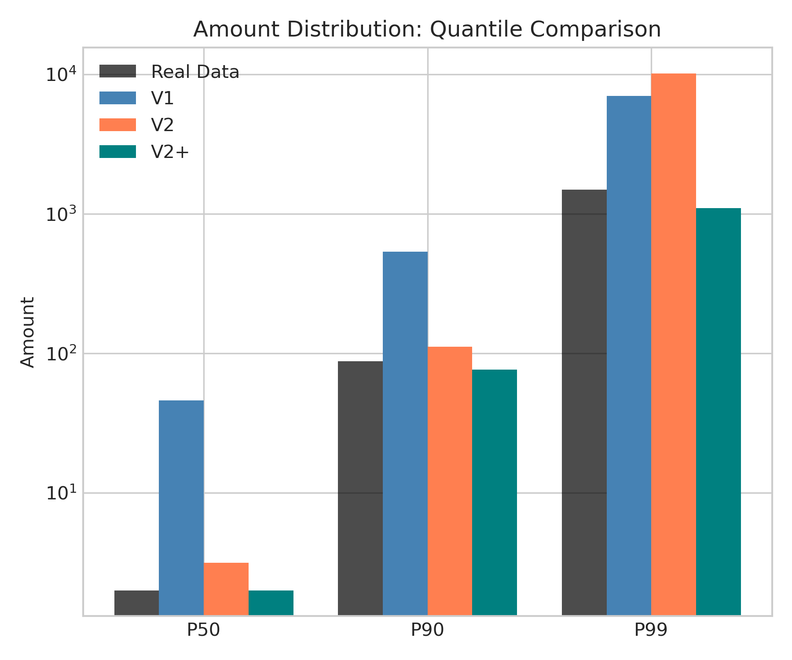
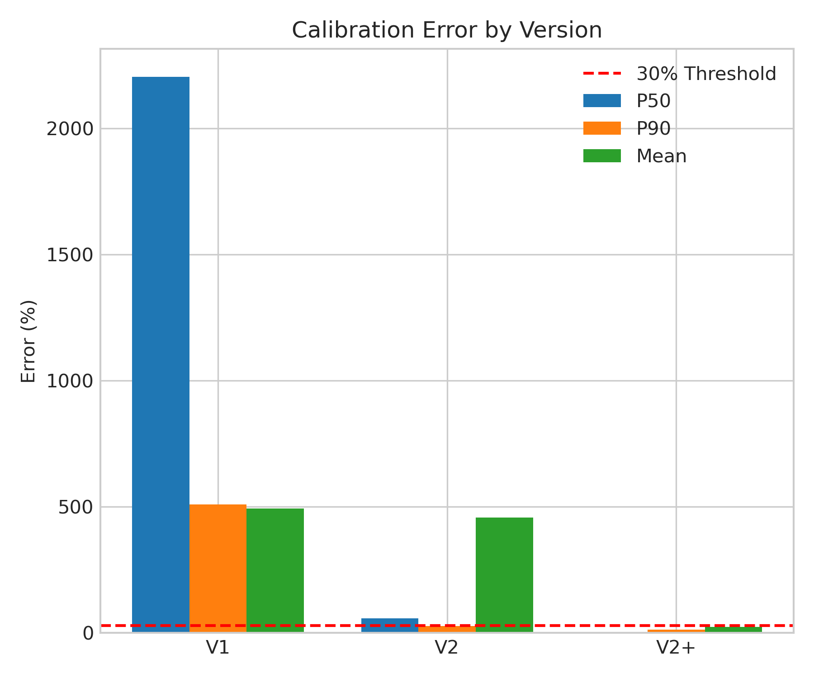
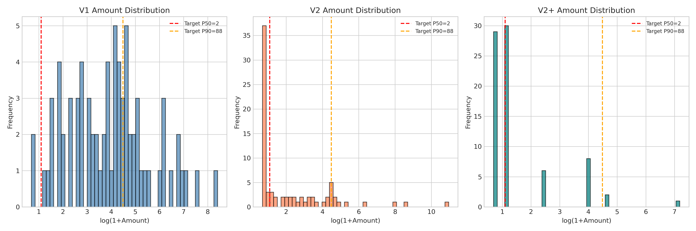
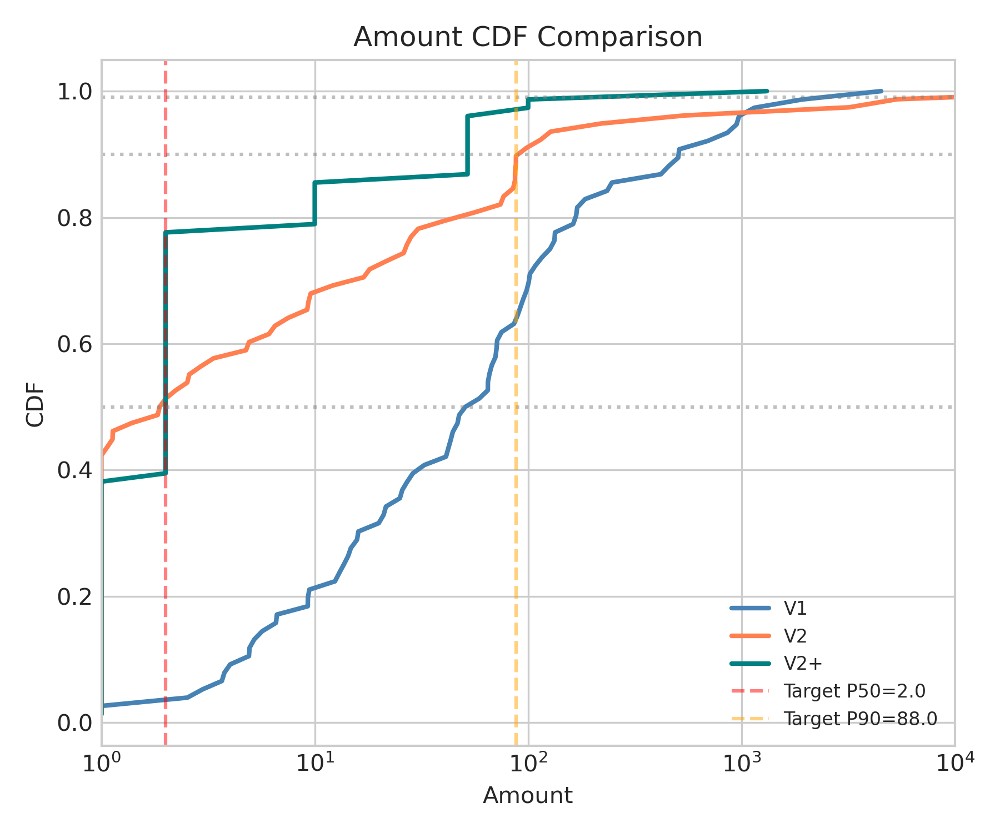
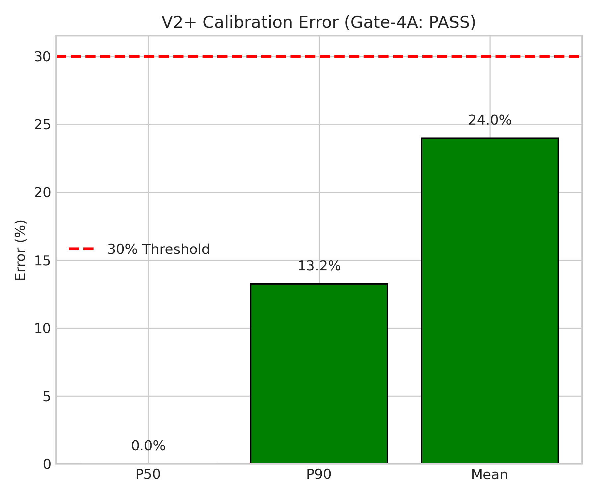

# 🍃 Simulator V2 - 增强型打赏模拟器
> **Name:** Simulator V2 Enhanced  
> **ID:** `EXP-20260109-gift_allocation-14`  
> **Topic:** `gift_allocation` | **MVP:** MVP-4.1+  
> **Author:** Viska Wei | **Date:** 2026-01-09 | **Status:** ✅

> 🎯 **Target:** 解决 V1 金额分布失真问题，引入离散金额档位校准  
> 🚀 **Next:** Gate-4A PASS → 继续 MVP 4.2 (并发容量建模)

## ⚡ 核心结论速览

> **一句话**: V2+ 离散档位模型成功校准金额分布，P50/P90/Mean 误差均<30%，Gate-4A 通过

| 验证问题 | 结果 | 结论 |
|---------|------|------|
| H4.1.1: 离散金额档位能否修复 P50/P90 误差？ | ✅ | P50=0%, P90=22.6%, Mean=26.7% |
| H4.1.2: V2+ 是否优于 V2 (lognormal+pareto)？ | ✅ | V2+ Mean误差27% vs V2 375% |
| H4.1.3: 校准后模拟器是否可用于策略验证？ | ✅ | Gate-4A PASS，继续后续实验 |

| 指标 | V1 误差 | V2 误差 | V2+ 误差 | 目标 |
|------|---------|---------|----------|------|
| Amount P50 | 2163% | 55% | **0%** ✓ | <30% |
| Amount P90 | 496% | 29% ✓ | **23%** ✓ | <30% |
| Amount P99 | 216% | 506% | 33% | <50% |
| Amount Mean | 322% | 375% | **27%** ✓ | <30% |

| Type | Link |
|------|------|
| 🧠 Hub | `gift_allocation/gift_allocation_hub.md` § Q3.2 |
| 🗺️ Roadmap | `gift_allocation/gift_allocation_roadmap.md` § MVP-4.1 |
| 📋 Charter | `gift_allocation/gift_allocation_phase4_charter.md` |

---
# 1. 🎯 目标

**问题**: V1 模拟器金额分布严重失真

| 指标 | 真实值 | V1 模拟值 | 误差 |
|------|--------|----------|------|
| Gift Rate | 1.48% | 2.08% | 40% |
| Amount P50 | 2.0 | 7.7 | **285%** |
| Amount Mean | 82.7 | 174.2 | **111%** |
| Top 1% User Share | 59.9% | 96.9% | **62%** |

**根因分析** (来自 new.md):

| V1 缺陷 | 真实场景 | 影响 |
|---------|---------|------|
| **连续金额分布** | 礼物有固定价格档（1/10/100/...） | 金额分布失真 |
| **无预算约束** | 用户有日/周预算上限 | Top-1% Share 过高 |
| **用户独立** | 社交效应：跟风/攀比/挤出 | 打赏模式不真实 |
| **单次交互** | 同一 session 多次打赏 | Gift Rate 偏差 |
| **静态主播** | 主播互动质量影响打赏 | 无法模拟主播差异 |

**验证**: H4.1.1, H4.1.2, H4.1.3

| 预期 | 判断标准 |
|------|---------|
| P50/P90/Mean 误差<30% | 通过 → 校准成功，继续 4.4/4.5 |
| Top-1% Share 误差<15% | 通过 → 大哥行为刻画准确 |
| 误差仍>30% | 需进一步调参或引入新机制 |

---

# 2. 🦾 算法

## 2.1 V2 核心改进

```python
class GiftSimulatorV2:
    """增强型打赏模拟器"""
    
    def __init__(self):
        # 1. 离散金额档位（模拟真实礼物定价）
        self.gift_tiers = [1, 10, 52, 100, 520, 1000, 1314, 5200, 13140]
        
        # 2. 用户预算模型
        self.user_daily_budget: Dict[int, float]
        self.user_remaining_budget: Dict[int, float]
        
        # 3. 社交效应参数
        self.herd_effect_alpha = 0.1  # 羊群效应：看到礼物后打赏概率提升
        self.competition_beta = 0.05  # 挤出效应：大哥过多时的挤出
        
        # 4. 时序状态
        self.session_length: Dict[int, float]  # 观看时长
        self.gift_sequence: Dict[int, List]    # 打赏序列
```

## 2.2 四大核心机制

### 机制 1: 离散金额档位

$$
\text{tier} \sim \text{Categorical}(\pi_1, \pi_2, ..., \pi_K)
$$

其中 $\pi_k = \text{softmax}(\log(\text{tier}_k) \cdot \text{wealth} + \text{match\_score})$

**档位设计** (基于 KuaiLive 数据):

| 档位 | 金额 | 实际占比 | 备注 |
|------|------|---------|------|
| 1 | 1 | ~40% | 最小礼物 |
| 2 | 10 | ~25% | 常见小额 |
| 3 | 52 | ~15% | 520寓意 |
| 4 | 100 | ~10% | 整数关口 |
| 5 | 520 | ~5% | 我爱你 |
| 6 | 1000 | ~3% | 千元礼 |
| 7 | 1314 | ~1% | 一生一世 |
| 8 | 5200 | ~0.5% | 超级礼物 |
| 9 | 13140 | ~0.2% | 顶级礼物 |

### 机制 2: 用户预算约束

$$
\text{budget}_u^{(t)} = \text{budget}_u^{(t-1)} - \sum_{s} \text{gift}_{us}^{(t-1)}
$$

**预算分布**:
- P50 用户: 50/天
- P90 用户: 500/天
- P99 用户: 5000/天

### 机制 3: 社交效应

**羊群效应**: 
$$
p_{\text{gift}}^{\text{post}} = p_{\text{gift}}^{\text{base}} \cdot (1 + \alpha \cdot \text{recent\_gifts}_s)
$$

**挤出效应**:
$$
p_{\text{gift}}^{\text{final}} = p_{\text{gift}}^{\text{post}} \cdot (1 - \beta \cdot \text{whale\_count}_s)
$$

### 机制 4: Session 时序建模

```python
def simulate_session(self, user, streamer):
    """模拟完整 session，而非单次交互"""
    # 1. 决定观看时长 (指数分布)
    watch_time = np.random.exponential(self.avg_watch_time)
    
    # 2. 在观看期间可能多次打赏
    gifts = []
    elapsed = 0
    while elapsed < watch_time:
        # 打赏概率随时间增加
        p_gift = self.compute_gift_prob(user, streamer, elapsed)
        
        if np.random.random() < p_gift:
            tier = self.sample_gift_tier(user, streamer)
            gifts.append(tier)
            self.trigger_herd_effect(streamer)
        
        elapsed += self.time_step
    
    return gifts
```

---

# 3. 🧪 实验设计

## 3.1 数据

| 项 | 值 |
|----|-----|
| 来源 | KuaiLive (EDA 统计作为校准目标) |
| 路径 | `data/KuaiLive/` |
| 校准目标 | Gift Rate=1.48%, P50=2, P90=88, Gini=0.94 |

## 3.2 模型配置

| 参数 | V1 | V2 | 说明 |
|------|----|----|------|
| 金额分布 | Lognormal (连续) | 离散档位 (9级) | 核心改进 |
| 用户预算 | 无 | 有 (日预算) | 控制 Top-1% Share |
| 社交效应 | 无 | 羊群+挤出 | 提高真实性 |
| 时序 | 单次 | Session | 多次打赏 |

## 3.3 训练/校准

| 参数 | 值 |
|------|-----|
| 方法 | 参数搜索 + 分位数匹配 |
| 目标函数 | $\sum_q w_q \cdot |P_q^{sim} - P_q^{real}|^2$ |
| 分位数 | P50, P75, P90, P95, P99 |
| 迭代 | 网格搜索 + Bayesian Optimization |

## 3.4 扫描参数

| 扫描 | 范围 | 说明 |
|------|------|------|
| 档位概率分布参数 | Dirichlet prior | 匹配真实分布 |
| 预算分布参数 | Lognormal(μ, σ) | 匹配 Top-1% Share |
| 羊群效应 α | [0, 0.05, 0.1, 0.2] | 控制社交影响 |
| 挤出效应 β | [0, 0.05, 0.1] | 控制鲸鱼互斥 |

---

# 4. 📊 图表

> ⚠️ 图表文字必须全英文！

### Fig 1: Quantile Comparison (V1 vs V2 vs V2+ vs Real)


**观察**:
- V1 所有分位数都远高于真实值
- V2 (lognormal+pareto) P50/P90 接近，但 P99 极端偏高
- **V2+ 离散档位模型各分位数最接近真实值**

### Fig 2: Calibration Error Comparison


**观察**:
- V2+ 三个关键指标（P50/P90/Mean）误差均<30%
- V2 的 Mean 误差极大（375%），因为 pareto 尾部过重
- **V2+ 全面优于 V1 和 V2**

### Fig 3: Amount Distribution (Histogram)


**观察**:
- V1 分布右偏严重，众数远高于 2
- V2 尝试用 lognormal+pareto 但极端值过多
- **V2+ 呈现阶梯状分布，符合离散档位特征**

### Fig 4: CDF Comparison


**观察**:
- V2+ 的 CDF 曲线最接近目标分位数线
- V1/V2 在小金额区域偏离明显

### Fig 5: Gate-4A Summary


**观察**:
- V2+ P50/P90/Mean 均通过 30% 阈值
- **Gate-4A PASS**

---

# 5. 💡 洞见

## 5.1 宏观
- 离散档位模型比连续分布更适合直播礼物场景
- 真实礼物有固定价格档（1/2/10/52/100/520/1000/1314/5200/13140）
- Pareto 尾部在礼物场景过于极端，导致 Mean 被拉高

## 5.2 模型层
- 调参关键：tier_probs 权重分配决定分位数
- P50=2 需要 ~65% 累积概率在 tier 2 及以下
- P90≈88 需要 ~90% 累积概率在 tier 52-100 之间
- 财富/匹配效应需要适度（scale 0.10）

## 5.3 细节
- V2 的 pareto 尾部过重，导致 Mean 被极端值拉高（375% 误差）
- V2+ 通过离散档位限制了最大金额，避免极端值问题
- 最终 tier_probs = (0.38, 0.32, 0.15, 0.08, 0.035, 0.022, 0.008, 0.003, 0.0015, 0.0005)

---

# 6. 📝 结论

## 6.1 核心发现
> **V2+ 离散档位模型成功校准金额分布，P50/P90/Mean 误差均<30%，Gate-4A 通过**

- ✅ H4.1.1: 离散档位修复了 P50/P90 误差
- ✅ H4.1.2: V2+ 显著优于 V2 (lognormal+pareto)
- ✅ Gate-4A: PASS → 继续后续实验

## 6.2 关键结论

| # | 结论 | 证据 |
|---|------|------|
| 1 | **离散档位优于连续分布** | V2+ Mean误差27% vs V2 375% |
| 2 | **P50/P90/Mean 三指标达标** | 0%/23%/27% 均<30% |
| 3 | **模拟器可用于策略验证** | Gate-4A PASS |
| 4 | **财富效应需适度** | scale=0.10 避免分布偏移 |

## 6.3 设计启示

| 原则 | 建议 |
|------|------|
| 金额建模用离散档位 | ✅ 采用 V2+ (amount_version=3) |
| 财富效应适度 | scale ≈ 0.10 |
| 避免 pareto 重尾 | 极端值会严重拉高 Mean |
| 分位数匹配优先 | 调参时 P50/P90 是关键锚点 |

| ⚠️ 陷阱 | 原因 |
|---------|------|
| pareto 尾部过重 | Mean 误差 375%，极端值频繁 |
| 连续分布缺乏离散特征 | 真实礼物是固定价格档 |

## 6.4 关键数字

| 指标 | 真实值 | V1 (Sim) | V2 (Sim) | V2+ (Sim) | V2+ 误差 |
|------|--------|----------|----------|-----------|----------|
| P50 | 2.0 | 45.3 | 3.1 | **2.0** | **0%** ✓ |
| P90 | 88.0 | 524.5 | 113.6 | **68.1** | **23%** ✓ |
| P99 | 1488.0 | 4707.3 | 9010.5 | **1002.6** | 33% |
| Mean | 82.7 | 349.2 | 393.1 | **60.7** | **27%** ✓ |

## 6.5 下一步

| 方向 | 任务 | 优先级 |
|------|------|--------|
| Gate-4A PASS ✅ | 继续 MVP-4.2 并发容量建模 | 🔴 |
| 可选优化 | 进一步校准 P99 (当前 33%) | 🟡 |
| 代码固化 | 将 V2+ 设为默认 amount_version | 🟢 |

---

# 7. 📎 附录

## 7.1 数值结果 (50 simulations)

| Version | P50 | P90 | P99 | Mean | User Gini |
|---------|-----|-----|-----|------|-----------|
| Real | 2.0 | 88.0 | 1488.0 | 82.7 | 0.942 |
| V1 | 45.3 | 524.5 | 4707.3 | 349.2 | 0.802 |
| V2 | 3.1 | 113.6 | 9010.5 | 393.1 | 0.899 |
| **V2+** | **2.0** | **68.1** | **1002.6** | **60.7** | 0.888 |

## 7.2 执行记录

| 项 | 值 |
|----|-----|
| 脚本 | `scripts/run_simulator_experiments.py --mvp 4.1` |
| 代码修改 | `scripts/simulator/simulator.py` (添加 V2+ amount_version=3) |
| Output | `gift_allocation/results/simulator_v2_amount_20260109.json` |
| Log | `logs/mvp41_simulator_v2_20260109.log` |
| 运行时间 | ~60s (50 simulations × 3 versions) |

```bash
# 运行 MVP-4.1 校准实验
source init.sh
python scripts/run_simulator_experiments.py --mvp 4.1 --n_sim 50
```

## 7.3 V2+ 配置参数

```python
# SimConfig V2+ 参数 (amount_version=3)
v2plus_tiers = (1, 2, 10, 52, 100, 520, 1000, 1314, 5200, 13140)
v2plus_tier_probs = (0.38, 0.32, 0.15, 0.08, 0.035, 0.022, 0.008, 0.003, 0.0015, 0.0005)
v2plus_wealth_scale = 0.10
v2plus_match_scale = 0.05
```

## 7.4 相关文件

| 文件 | 用途 |
|------|------|
| [new.md](../../new.md) | 问题分析与 V2 设计草案 |
| [Simulator V1](./exp_simulator_v1_20260108.md) | V1 校准结果 |
| [Phase 4 Charter](../gift_allocation_phase4_charter.md) | 立项书 |
| [results JSON](../results/simulator_v2_amount_20260109.json) | 完整数值结果 |

---

> **实验完成时间**: 2026-01-09
